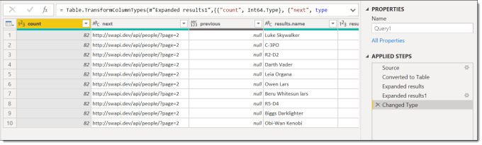
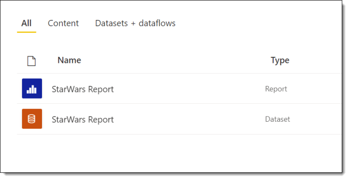
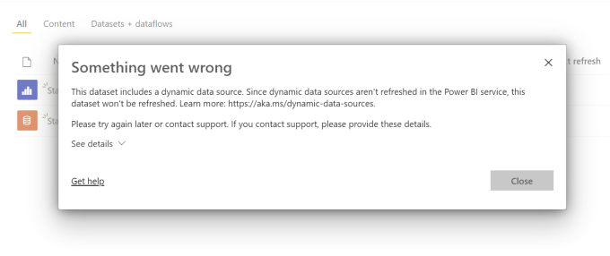
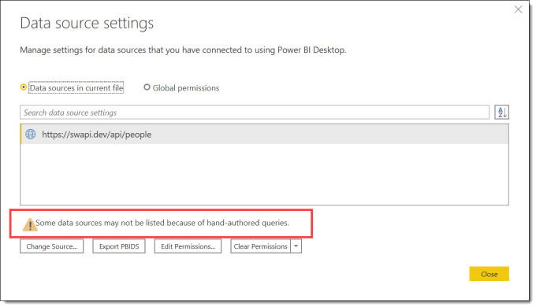

---
title: Power Query – Dynamic Data Source and Web.Contents()
description: This is the first post in a series to create a Star Wars report. This post handles the issue of using a parameter as the url in a web Power Query. This type of data source is referred to as a Dynamic Data Source. It will not refresh in the Power BI service unless you do some tricks. Fetching Data...
slug: power-query-dynamic-data-source-and-web-content
date: 2021-05-04 13:01:31+0000
lastmod: 2025-02-13 12:11:12+0000
image: cover.png
categories:
    - M
    - Power BI
    - Power Query
---

This is the first post in a series to create a Star Wars report. This post handles the issue of using a parameter as the url in a web Power Query. This type of data source is referred to as a Dynamic Data Source. It will not refresh in the Power BI service unless you do some tricks.

### Star Wars Series

Starting on May 4th a series using Star Wars data had to be done. Its based off an api that has some great data that is paged in 10 row blocks. I’m looking to create complete report from queries to modelling to visuals and theme etc.

The data comes from [https://swapi.dev/api/](https://swapi.dev/api/)

- [Handling Dynamic Data sources](https://hatfullofdata.blog/power-query-dynamic-data-source-and-web-contents/)
- Fetching number of pages
- Using next page url

### Fetching Data

I started by looking at the people table. In a new Power BI report I select Web from Get Data and use the url https://swapi.dev/api/people/ and click OK. This throws you straight into Power Query where is has created a few steps to get you a table of data.



It only gives 10 rows of data, which does include the url to the next 10 rows and also how many rows there are in total. So I use a technique I’ve blogged about before and create a URL parameter, change the source step to use the URL and then convert the query into a function.

Look here for more details [https://hatfullofdata.blog/power-query-fetch-web-data/](https://hatfullofdata.blog/power-query-fetch-web-data/)

### Test Refresh

Then as a test I invoke the function to fetch the first 10 rows into a table, close and apply Power Query and then publish my report to the Power BI service.



Then I do the important test, does it refresh? When I click on refresh it fails, and when I click on the small red triangle it gives an error stating the dataset uses a dynamic data source and these can’t be refreshed.



Part of the error includes a URL [https://aka.ms/dynamic-data-sources](https://aka.ms/dynamic-data-sources) , so I go and look at the web page. And it explains how you can identify if you have a dynamic data source that won’t refresh by looking in the Data source settings in Power Query. Sure enough, when I look, it gives a message which I now know means a dynamic data source so refresh won’t work. I assume hand-authored queries means dynamic data sources.



This doesn’t tell me how to to fix it though. So off onto the internet I go and search around my favourite Power Query bloggers and sure enough Chris Webb comes up trumps with a few posts.

- [Chris Webb’s BI Blog: Web.Contents(), M Functions And Dataset Refresh Errors In Power BI Chris Webb’s BI Blog (crossjoin.co.uk)](https://blog.crossjoin.co.uk/2016/08/23/web-contents-m-functions-and-dataset-refresh-errors-in-power-bi/)

- [Chris Webb’s BI Blog: Using The RelativePath And Query Options With Web.Contents() In Power Query And Power BI M Code Chris Webb’s BI Blog (crossjoin.co.uk)](https://blog.crossjoin.co.uk/2016/08/16/using-the-relativepath-and-query-options-with-web-contents-in-power-query-and-power-bi-m-code/)

The second post was the one I used the most in modifying my query. It also includes searching for cow data, which I think is superb!

### Removing the Dynamic Data Source

So the Web.Contents used in the source of my function needs the base url to stay the same and then any dynamic parts put into the options. The base url must be a valid web address you can authenticate to as anonymous and the shorter the better as it makes the function more flexible. I delete the invoked function query and the function from my report.

So for the Star Wars data the base url is – https://swapi.dev/api

The people part and the page=1 can be added in as part of the options. So the new solution has 2 parameters, TableName and PageNum and they are both text. Then we have to edit the source step by hand to write the second parameter of Web.Con (the whole hand-crafted fix to get rid of hand-crafted error is just amusing). The options are a record so put inside square brackets [ .. ]. The query is another record so is a nested [ .. ].

Web.Contents options allow for two things to be set, a relative path, eg People and query parameters eg Page=1. APIs are fussy so make sure you get the case right in the query part. This is my final code for the Source step. (This is the reason I blog, so in 6 months time I know I have a working example piece of code.)

```xml
Source = Json.Document(Web.Contents("https://swapi.dev/api/",
        [
            RelativePath=TableName,
            Query=[page=PageNum]
        ]
    )),
```

Then I right click on the query and create a function. Invoking this function creates a table ready now to close and apply back into Power BI desktop. I publish and try a refresh and YES! it works. I now have a function that will take a table name and page number and give 10 rows of data.

In the next post we will use this function to get all the data for a table.

## More Power Query Posts

- [Custom Handwritten Function](https://hatfullofdata.blog/power-query-handwritten-function/)

- [Multi-step Function](https://hatfullofdata.blog/power-query-multi-step-function/)

- [Replace Values for Whole Table](https://hatfullofdata.blog/power-query-replace-values-for-whole-table/)

- [AI Insights Error](https://hatfullofdata.blog/power-query-ai-insights-error/)

- [VBA to Edit a Parameter Value](https://hatfullofdata.blog/excel-power-query-vba-to-edit-a-parameter-value/)

- [Dynamic Data Source and Web.Contents()](https://hatfullofdata.blog/power-query-dynamic-data-source-and-web-content/)

- [Get Previous Row Data](https://hatfullofdata.blog/power-query-get-previous-row-data/)

- [Creating New Parameters](https://hatfullofdata.blog/power-query-creating-new-parameters/)

- [Fixing Missing Columns Dynamically](https://hatfullofdata.blog/power-query-fixing-missing-columns-dynamically/)

- [Handling Null Values Properly](https://hatfullofdata.blog/power-query-handling-null-values/)

