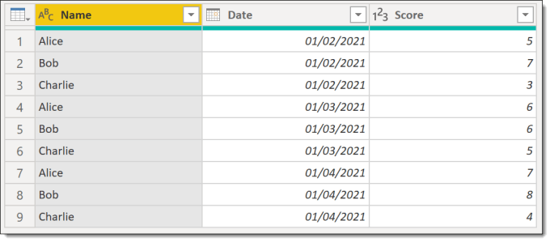
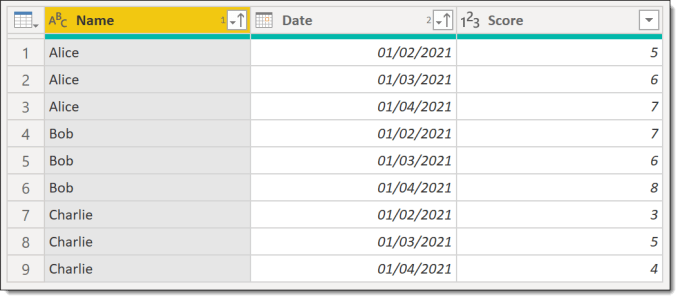
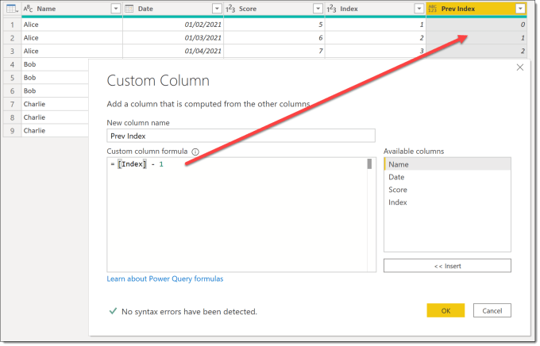
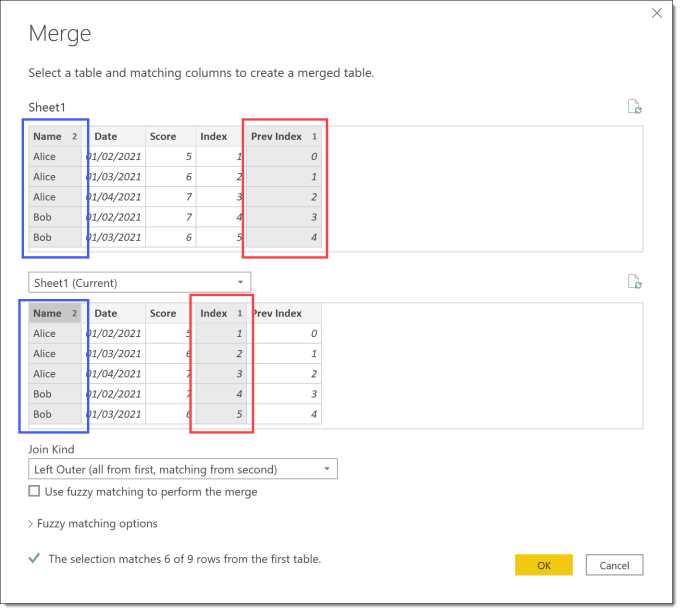
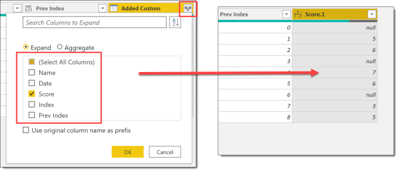
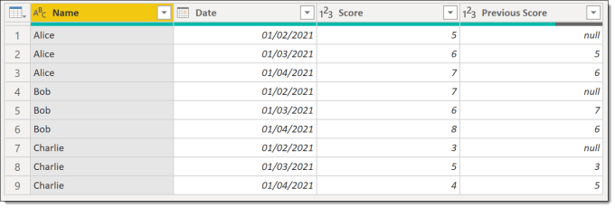

Occasionally I get asked a question via Twitter or LinkedIn that prompts me to write a post. The question asked was how to get previous row data. In this post I will describe how to get a value from the previous row that matches a criteria. The example data is peoples scores on different dates. I want to know if they are improving. For this I need their previous score.

### Starting Data

### Getting Previous Row Data

The first step is to sort the data. You need the previous score to be in the previous row, so we sort by name and then date.

Then from the Add Column ribbon we add an Index column. And then a custom column, “Prev Index” which is Index-1

Now we can merge a table to itself (yes a touch head screwy but its fine it works) by linking Prev Index to Index. This though will give Bob Alice’s last score as his previous score so we add the Name column to the merge as well. Holding down the Ctrl key will allow you to select multiple columns and make sure at the bottom of the dialog you have some matching rows..

This creates a column that contains tables. Press the expand button and only select the Score column. Click OK to give a column of the previous scores ready to rename.

I then rename Score.1 to Previous Score and use Choose Columns to remove Index and Previous Index to end up with a table of name, date, score and previous score.

## More Power Query Posts

- [Custom Handwritten Function](https://hatfullofdata.blog/power-query-handwritten-function/)

- [Multi-step Function](https://hatfullofdata.blog/power-query-multi-step-function/)

- [Replace Values for Whole Table](https://hatfullofdata.blog/power-query-replace-values-for-whole-table/)

- [AI Insights Error](https://hatfullofdata.blog/power-query-ai-insights-error/)

- [VBA to Edit a Parameter Value](https://hatfullofdata.blog/excel-power-query-vba-to-edit-a-parameter-value/)

- [Dynamic Data Source and Web.Contents()](https://hatfullofdata.blog/power-query-dynamic-data-source-and-web-content/)

- [Get Previous Row Data](https://hatfullofdata.blog/power-query-get-previous-row-data/)

- [Creating New Parameters](https://hatfullofdata.blog/power-query-creating-new-parameters/)

- [Fixing Missing Columns Dynamically](https://hatfullofdata.blog/power-query-fixing-missing-columns-dynamically/)

- [Handling Null Values Properly](https://hatfullofdata.blog/power-query-handling-null-values/)

