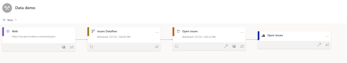
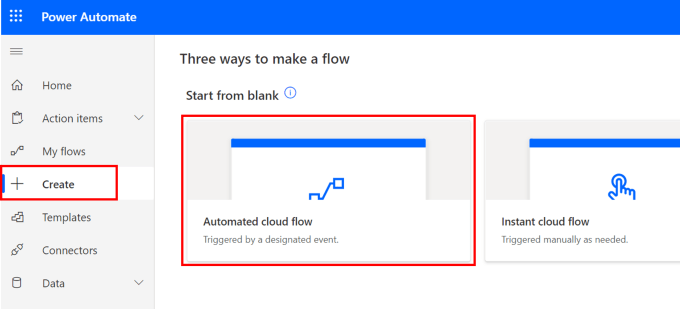
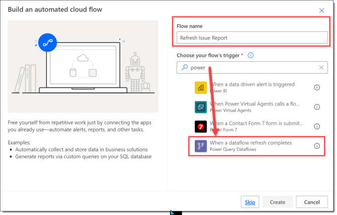
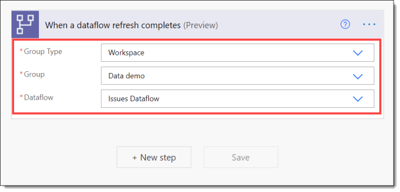
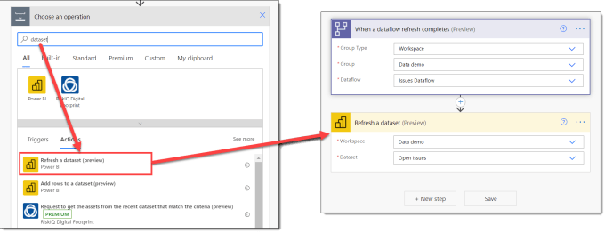
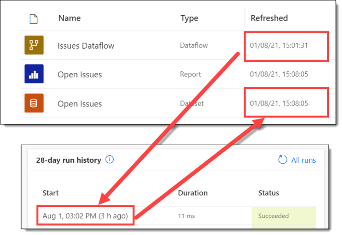

I have a report, Open Issues, that has a Power BI dataflow as a data source. If I just use scheduled refreshes, my options are limited. I need to be refreshing datasets automatically after the dataflow has finished so my reports are up to date as soon as possible to avoid a situation where I schedule the dataflow to refresh at 10am and the next slot available might be 10:30am, for example. This can be done using Power Automate.

### Create a flow in Power Automate

Head to Power Automate at [https://flow.microsoft.com/](https://flow.microsoft.com/)and click on Create on the left hand side menu. The flow will be triggered by the dataflow refresh finishing. This means it is automated so click on Automated cloud flow.

A dialog appears asking for details of the flow. You need to enter in a name for the flow. Then in the search box enter in power to find relevant triggers. Select When a dataflow refresh completes and click Create.

After you click Create the flow editor appears with the trigger already added. For Group Type select Workspace. Then you can select the workspace name for Group. Then you can select the Dataflow.

We then need to refresh the connected report dataset. So we click New step. In the Choose an operation dialog, we type dataset into the search box. This will find you the action Refresh a dataset. We click on the action to add it to the flow.

Then you need to select the Workspace and Dataset in the action. The flow is complete, so we can click Save.

### Testing the Flow

The flow triggers when the dataflow finishes refreshing. If we refresh the dataflow that will test the flow. I clicked refresh on the dataflow at 3pm and it triggered the flow which then refreshed the dataset.

In the workspace we can see the date and time of the refreshes and if the flow has worked correctly the dataset should be refreshed just after the dataflow. If you look at the history of the flow runs there should be a matching flow run just after the dataflow finished refreshing.

### When refreshing datasets automatically fails

It is worth pointing out that if the dataset refresh fails the flow will not reflect that and will show succeeded in the flow runs. So it is worth checking that the dataset can refresh successfully.

### Conclusion

This idea can be extended to refresh multiple datasets over multiple workspaces that are connected to the dataflow. This simplifies the process of scheduling refreshes. It also could allow for notifications to interested report owners to be told of the refreshes etc.

## More Power Automate Posts

- [Creating Adaptive Cards](https://hatfullofdata.blog/microsoft-flow-creating-adaptive-cards/)

- [Refreshing Datasets Automatically with Power BI Dataflows](https://hatfullofdata.blog/refreshing-datasets-automatically-with-dataflow/)

- [Power Automate Child Flow](https://hatfullofdata.blog/power-automate-child-flow/)

- [Get data from a Power BI dataset](https://hatfullofdata.blog/power-automate-get-data-from-a-power-bi-dataset/)

- [Power Automate Button in a Power BI Report](https://hatfullofdata.blog/power-automate-button-in-a-power-bi-report/)

- [Write Me a Flow](https://hatfullofdata.blog/power-automate-write-me-a-flow/)

- [Power Automate and DevOps series](https://hatfullofdata.blog/connecting-power-automate-to-devops/)

- [Power Automate and Power BI Rest API series](https://hatfullofdata.blog/power-automate-and-power-bi-rest-api/)

- [Save a File to OneLake Lakehouse](https://hatfullofdata.blog/power-automate-save-a-file-to-onelake-lakehouse/)

- [Trigger Microsoft Fabric Data Pipeline using Power Automate](https://hatfullofdata.blog/trigger-microsoft-fabric-data-pipeline/)

## More Power BI Posts

- [Conditional Formatting Update](https://hatfullofdata.blog/power-bi-conditional-formatting-update/)

- [Data Refresh Date](https://hatfullofdata.blog/power-bi-data-refresh-date/)

- [Using Inactive Relationships in a Measure](https://hatfullofdata.blog/power-bi-inactive-relationships-in-a-measure/)

- [DAX CrossFilter Function](https://hatfullofdata.blog/power-bi-dax-crossfilter-function/)

- [COALESCE Function to Remove Blanks](https://hatfullofdata.blog/power-bi-coalesce-function-to-remove-blanks/)

- [Personalize Visuals](https://hatfullofdata.blog/power-bi-personalize-visuals/)

- [Gradient Legends](https://hatfullofdata.blog/power-bi-gradient-legends/)

- [Endorse a Dataset as Promoted or Certified](https://hatfullofdata.blog/power-bi-endorse-a-dataset/)

- [Q&A Synonyms Update](https://hatfullofdata.blog/power-bi-qa-synonyms-update/)

- [Import Text Using Examples](https://hatfullofdata.blog/power-bi-import-text-using-examples/)

- [Paginated Report Resources](https://hatfullofdata.blog/paginated-report-resources/)

- [Refreshing Datasets Automatically with Power BI Dataflows](https://hatfullofdata.blog/refreshing-datasets-automatically-with-dataflow/)

- [Charticulator](https://hatfullofdata.blog/charticulator-simple-custom-chart/)

- [Dataverse Connector – July 2022 Update](https://hatfullofdata.blog/power-bi-dataverse-connector-july-2022-update/)

- [Dataverse Choice Columns](https://hatfullofdata.blog/power-bi-dataverse-choices-and-choice-column/)

- [Switch Dataverse Tenancy](https://hatfullofdata.blog/power-bi-switch-dataverse-tenancy/)

- [Connecting to Google Analytics](https://hatfullofdata.blog/power-bi-connecting-to-google-analytics/)

- [Take Over a Dataset](https://hatfullofdata.blog/power-bi-take-over-a-dataset/)

- [Export Data from Power BI Visuals](https://hatfullofdata.blog/export-data-from-power-bi-visuals/)

- [Embed a Paginated Report](https://hatfullofdata.blog/power-bi-embed-a-paginated-report/)

- [Using SQL on Dataverse for Power BI](https://hatfullofdata.blog/using-sql-on-dataverse-for-power-bi/)

- [Power Platform Solution and Power BI Series](https://hatfullofdata.blog/power-platform-solution-and-power-bi-part-1/)

- [Creating a Custom Smart Narrative](https://hatfullofdata.blog/power-bi-creating-a-custom-smart-narrative/)

- [Power Automate Button in a Power BI Report](https://hatfullofdata.blog/power-automate-button-in-a-power-bi-report/)

## Power BI Series

- [SVG in Power BI series](https://hatfullofdata.blog/svg-in-power-bi-part-1-svg-basics/)

- [Power BI and Project Online series](https://hatfullofdata.blog/power-bi-connecting-to-project-online/)

- [Slicers series](https://hatfullofdata.blog/power-bi-slicers-introduction/)

- [Dataflow series](https://hatfullofdata.blog/power-bi-create-a-dataflow/)

- [Power BI SVG series](https://hatfullofdata.blog/svg-in-power-bi-part-1-svg-basics/)

- [Power Automate and Power BI Rest API series](https://hatfullofdata.blog/power-automate-and-power-bi-rest-api/)

- [Power BI and DevOps series](https://hatfullofdata.blog/devops-data-into-power-bi/)

