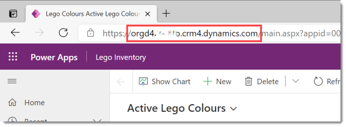
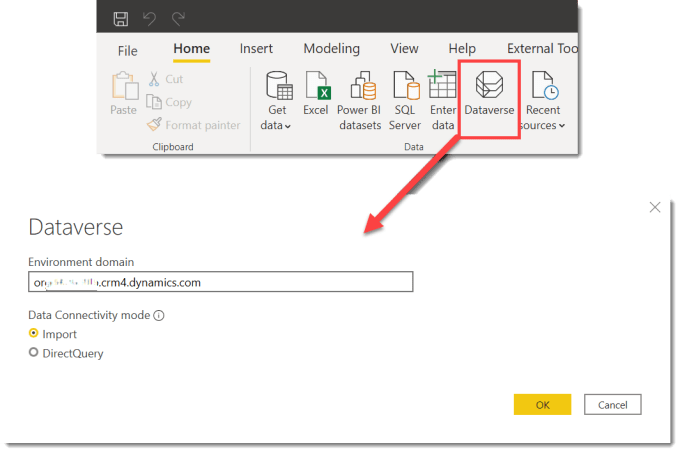
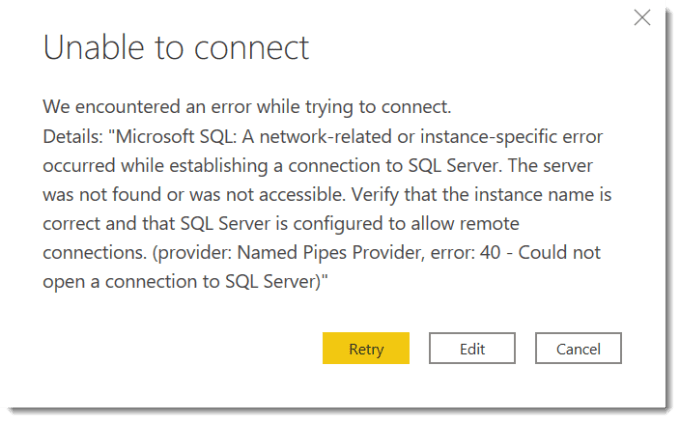

Dataverse is a secure flexible data storage solution that is part of the very popular Microsoft Power Platform family. So connecting to Dataverse is an obvious request. Dataverse was previously known as Common Data Service. This post is from getting very frustrated mid-hackathon and trying to connect to Dataverse and just getting an odd error.

If you want to learn more about Dataverse you can find more information at [Microsoft Dataverse documentation](https://docs.microsoft.com/en-us/powerapps/maker/data-platform/?WT.mc_id=DP-MVP-5003563)

### Finding the Environment Domain

To connect to Dataverse you need the environment domain. This can be found by going to Power Apps. Then open a model driven app and look at the address bar in your browser. The domain is the XXXXX.crmX.dynamics.com part.

### Connecting to Dataverse

In Power BI desktop Dataverse is one of the connectors found on the Home ribbon and found in the drop down under Get Data. If you are looking in the dialog it comes under Power Platform. Here is where you put the Environment domain of your Dataverse.

Use the domain without the https:// and without the / after it. If this is your first time connecting it will ask you to login and then will offer you the list of tables available in your Dataverse environment. I strongly advise transforming the tables to remove the columns you don’t need from your Dataverse tables.

You can connect to Dataverse using DirectQuery if you must. Often its not required and makes the report slow to edit. Yes I have opinions 😊.

### Weird Error

If you include the https:// or the final / or any other extras in the environment domain it will take ages to try and connect and then will come back with an error. The error refers to trying to connect to SQL server which will confuse users.

