In late 2021, the Charticulator visual was added to Power BI desktop. This post walks through creating a Charticulator Simple Custom Chart. The chart will show the drink preference split of 20 office colleagues. The steps assume you already have connected to the data. The data is available for download or direct connection here:

[https://hatfullofdata.blog/wp-content/uploads/2021/12/Drinks.xlsx](https://hatfullofdata.blog/wp-content/uploads/2021/12/Drinks.xlsx)

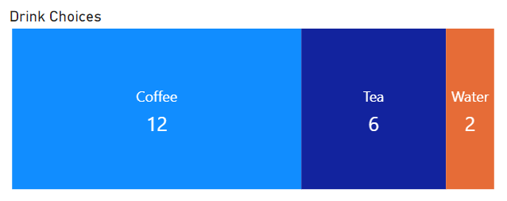

### Charticulator Series

This series will build a number of different visuals using the Charticulator visual in Power BI desktop. Each post will include links to data sources, sample Power BI reports and any related YouTube videos.

- Simple Chart
- Exporting and Importing Templates
- Allowing Export of Templates
- 

### YouTube Video

It’s coming!

### Adding the Charticulator Visual

The Charticulator visual is a custom visual so needs to be added. In the visualisations pane, click on the three dots and then click on Get more visuals. Search for Charticulator. Then click on the icon to see the full description. Click Add to add the visual to this report.

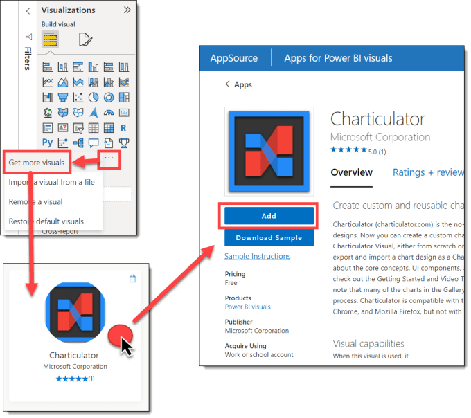

### Start creating Charticulator Simple Custom Chart

Add the Charticulator visual to a report page. This visual needs the count of the people who prefer a drink. So I created a measure that counts the rows.

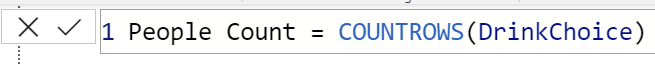

Next I add Drink field and People Count measure to the Data of the visual. Once you have data added you can create the visual. So click on the three dots on the visual and select edit.

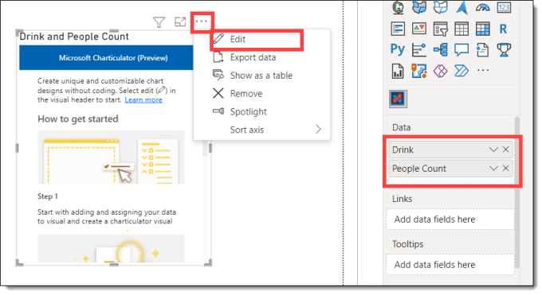

When the Charticulator pane appears, click Create Chart. Then the Charticulator editor window appears.

### Creating Charticulator Simple Custom Chart

The Charticulator editor window has different areas. We are going to start by working with the Glyph area to define the shapes that will appear in the plot area.

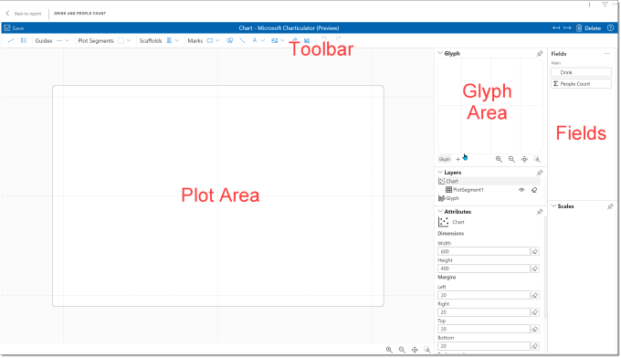

### Adding Shapes

The chart is made of a rectangle per drink with a width that corresponds to the number of people who prefer that drink. From the toolbar make sure the Marks button shows a rectangle and then drag the rectangle into the glyph area.  The glyph area should now have a rectangle in it and the plot area 3 rectangles, one for each row of data from the three drink types.

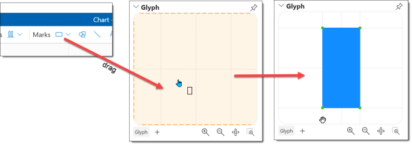

The 3 rectangles in the plot area are all the same size. We want the width to be linked to the people count value. Make sure you still have the shape selected. Then click on the link button next the Width box and select People Count. The plot area rectangles will now be different widths.

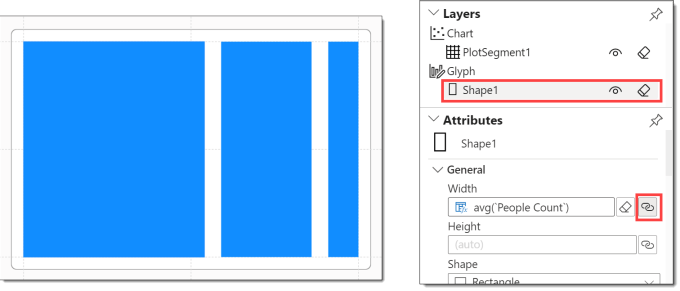

Next we want the rectangles to be different colours. Further down the attributes pane there is a Fill property. Click on the link and select Drink. You can change the colours here as well if you want to.

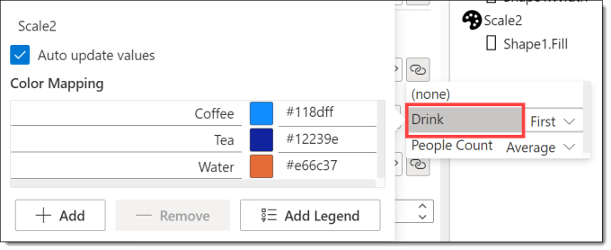

The final step before me move on to text is to remove the gap between the rectangles. This is a property of Plot Segment. Start by selecting the PlotSegment1 in the Layers. Then scroll down the Attributes to find Gap. Reduce the Gap value down to 0.

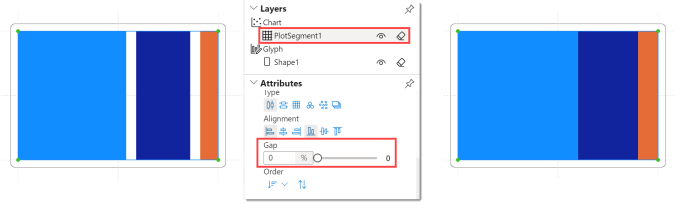

### Adding Text

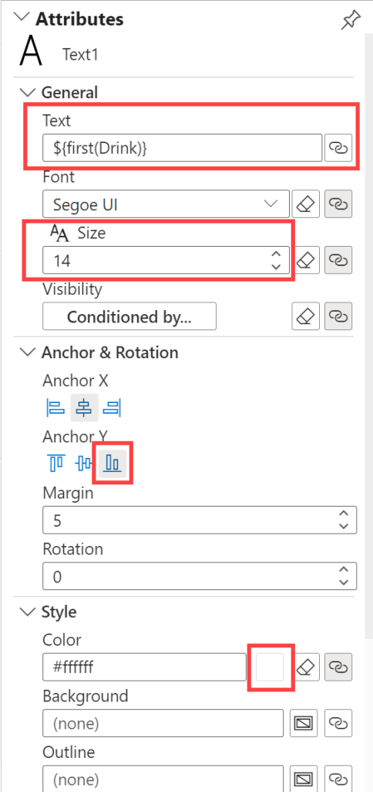

A good alternative to adding a legend to a chart is to add labels. We are going to add 2 text objects to show the drink name and the people count. Drag a text item, show by A, into the glyph area. Keeping Text1 selected, we can update the attributes. Make the following changes

- Link the text to Drink

- Increase the Font size if required

- Change the Anchor Y to be bottom

- Change the color to be white

Note you can click on Glyph title to minimise that section of the pane to see more Attributes.

Add another text object. Make very similar changes except link the Text to the People Count and the Anchor Y link to be Top so that the number is under the drink.

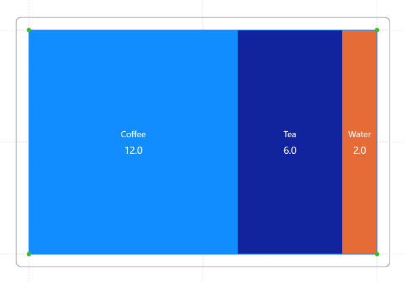

### Formatting Numbers

When you link a numeric column to a text object the calculation includes the formatting for the number. In the example below the second pair of {} includes the formatting. f = fixed point notation and the .1 means show 1 decimal place, so {.2f} would show 2 decimal places etc.

Copy CodeCopiedUse a different Browser
```xml
${avg(`People Count`)}{.1f}
```

You can change this to {.0f} to show no decimal places or you can use {d} which is decimal notation, rounded to integer. This notation is called d3 and more information can be found here.

[https://github.com/d3/d3-format#format](https://github.com/d3/d3-format#format)

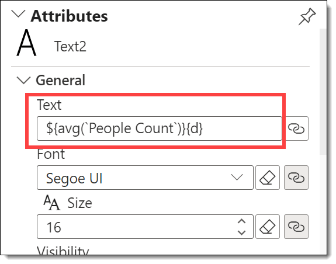

### Changing Plot Size

By default the chart is 600 x 400. This would make the chart very square. Click on the Chart layer and reduce the height. You can also reduce the margins to make the chart fill more of the area.

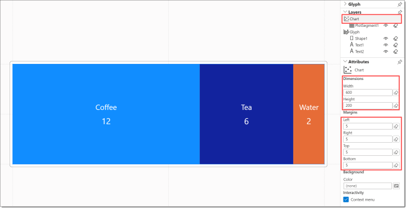

### Finishing the Charticulator Simple Custom Chart

Finish editing the chart by clicking on Back to report. Click on Save to save your changes to the chart. Be aware as you re-size the chart the font size is fixed.

### Conclusion

This is the first post in a series on creating charts using the Charticulator visual. I will be looking at creating templates and how to create custom visuals. On the bottom of every post I will be including useful references. If I’m missing any please reach out

### Resources

- [Charticulator Getting Started](https://charticulator.com/docs/getting-started.html)
- [Burning Suit Charticulator blog series](https://www.burningsuit.co.uk/charticulator-in-power-bi-1/)
- [Enterprise DNA Intro video](https://www.youtube.com/watch?v=ORKTLUAFXnI)
- [Radacad Intro Video](https://www.youtube.com/watch?v=xtyxTNnEvnw)
- [Power BI Tips Charticulator Video Series](https://www.youtube.com/playlist?list=PLn1m_aBmgsbH31NHXuT9ArgY5ZefuKESo)

## More Power BI Posts

- [Conditional Formatting Update](https://hatfullofdata.blog/power-bi-conditional-formatting-update/)

- [Data Refresh Date](https://hatfullofdata.blog/power-bi-data-refresh-date/)

- [Using Inactive Relationships in a Measure](https://hatfullofdata.blog/power-bi-inactive-relationships-in-a-measure/)

- [DAX CrossFilter Function](https://hatfullofdata.blog/power-bi-dax-crossfilter-function/)

- [COALESCE Function to Remove Blanks](https://hatfullofdata.blog/power-bi-coalesce-function-to-remove-blanks/)

- [Personalize Visuals](https://hatfullofdata.blog/power-bi-personalize-visuals/)

- [Gradient Legends](https://hatfullofdata.blog/power-bi-gradient-legends/)

- [Endorse a Dataset as Promoted or Certified](https://hatfullofdata.blog/power-bi-endorse-a-dataset/)

- [Q&A Synonyms Update](https://hatfullofdata.blog/power-bi-qa-synonyms-update/)

- [Import Text Using Examples](https://hatfullofdata.blog/power-bi-import-text-using-examples/)

- [Paginated Report Resources](https://hatfullofdata.blog/paginated-report-resources/)

- [Refreshing Datasets Automatically with Power BI Dataflows](https://hatfullofdata.blog/refreshing-datasets-automatically-with-dataflow/)

- [Charticulator](https://hatfullofdata.blog/charticulator-simple-custom-chart/)

- [Dataverse Connector – July 2022 Update](https://hatfullofdata.blog/power-bi-dataverse-connector-july-2022-update/)

- [Dataverse Choice Columns](https://hatfullofdata.blog/power-bi-dataverse-choices-and-choice-column/)

- [Switch Dataverse Tenancy](https://hatfullofdata.blog/power-bi-switch-dataverse-tenancy/)

- [Connecting to Google Analytics](https://hatfullofdata.blog/power-bi-connecting-to-google-analytics/)

- [Take Over a Dataset](https://hatfullofdata.blog/power-bi-take-over-a-dataset/)

- [Export Data from Power BI Visuals](https://hatfullofdata.blog/export-data-from-power-bi-visuals/)

- [Embed a Paginated Report](https://hatfullofdata.blog/power-bi-embed-a-paginated-report/)

- [Using SQL on Dataverse for Power BI](https://hatfullofdata.blog/using-sql-on-dataverse-for-power-bi/)

- [Power Platform Solution and Power BI Series](https://hatfullofdata.blog/power-platform-solution-and-power-bi-part-1/)

- [Creating a Custom Smart Narrative](https://hatfullofdata.blog/power-bi-creating-a-custom-smart-narrative/)

- [Power Automate Button in a Power BI Report](https://hatfullofdata.blog/power-automate-button-in-a-power-bi-report/)

## Power BI Series

- [SVG in Power BI series](https://hatfullofdata.blog/svg-in-power-bi-part-1-svg-basics/)

- [Power BI and Project Online series](https://hatfullofdata.blog/power-bi-connecting-to-project-online/)

- [Slicers series](https://hatfullofdata.blog/power-bi-slicers-introduction/)

- [Dataflow series](https://hatfullofdata.blog/power-bi-create-a-dataflow/)

- [Power BI SVG series](https://hatfullofdata.blog/svg-in-power-bi-part-1-svg-basics/)

- [Power Automate and Power BI Rest API series](https://hatfullofdata.blog/power-automate-and-power-bi-rest-api/)

- [Power BI and DevOps series](https://hatfullofdata.blog/devops-data-into-power-bi/)

