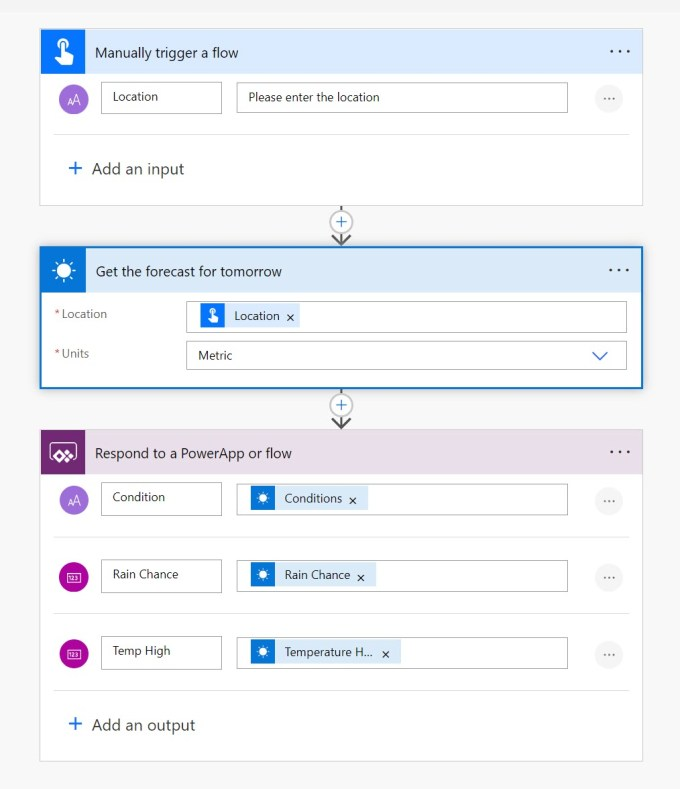
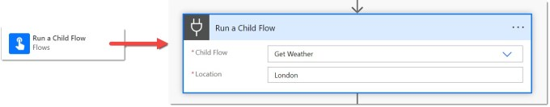
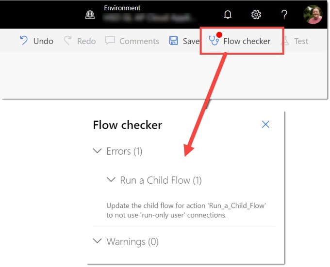
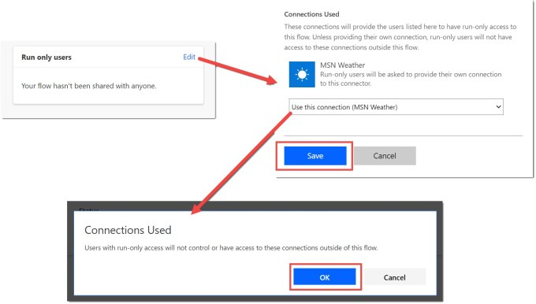

Occasionally it is useful to break your flow apart into separate flows. For this you need to create a child flow or two. There is one tweak I always forget, hence this post.

### Create the Child Flow

When building child flows you need to follow these rules

- Child flows need to be built inside a solution

- The trigger needs to be a Manually trigger a flow. Add inputs to the trigger.

- To return values back to the parent flow the last action should a Respond to PowerApp of Flow action.

Above is a very simple example. The trigger has an input of location and the child flow will return 3 values.

### Calling the Child Flow

Now you have created your child flow and tested that it works you can now call it. In the parent flow, add the action Run a child flow. Select your child flow and populate the inputs.

As soon as you add this you will probably get an error in the flow checker. Stating “Update the child flow for action ‘Run a child flow’ to not use ‘run-only user’ connections”

### Fixing the Child Flow

Return back to the child flow information page. In the bottom right of the window look for Run only users box. When you have found it, click Edit. For each connection change the Provided by run-only user to the connection listed. You get a dialog stating the run-only users only get access to the connections for this flow. Click OK.

When you have updated all the connections remember to click save.

You can now return to the parent flow. You might need to re-add the action but you will no longer get an error.

### Conclusion

Child flows are a great way to re-use logic and break a process down into manageable parts.

## More Power Automate Posts

- [Creating Adaptive Cards](https://hatfullofdata.blog/microsoft-flow-creating-adaptive-cards/)

- [Refreshing Datasets Automatically with Power BI Dataflows](https://hatfullofdata.blog/refreshing-datasets-automatically-with-dataflow/)

- [Power Automate Child Flow](https://hatfullofdata.blog/power-automate-child-flow/)

- [Get data from a Power BI dataset](https://hatfullofdata.blog/power-automate-get-data-from-a-power-bi-dataset/)

- [Power Automate Button in a Power BI Report](https://hatfullofdata.blog/power-automate-button-in-a-power-bi-report/)

- [Write Me a Flow](https://hatfullofdata.blog/power-automate-write-me-a-flow/)

- [Power Automate and DevOps series](https://hatfullofdata.blog/connecting-power-automate-to-devops/)

- [Power Automate and Power BI Rest API series](https://hatfullofdata.blog/power-automate-and-power-bi-rest-api/)

- [Save a File to OneLake Lakehouse](https://hatfullofdata.blog/power-automate-save-a-file-to-onelake-lakehouse/)

- [Trigger Microsoft Fabric Data Pipeline using Power Automate](https://hatfullofdata.blog/trigger-microsoft-fabric-data-pipeline/)

