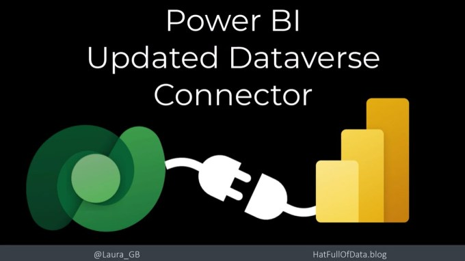
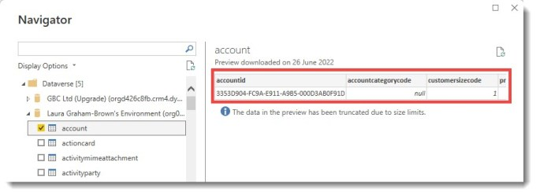
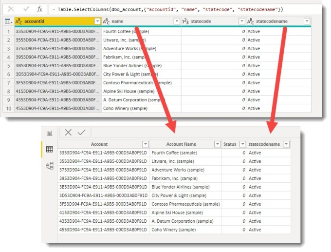
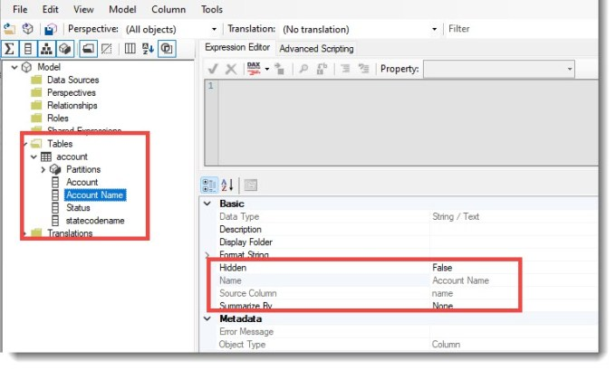
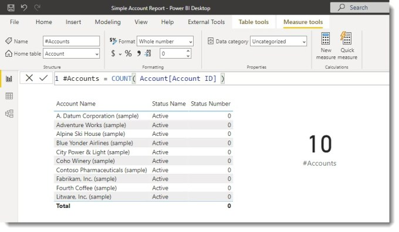
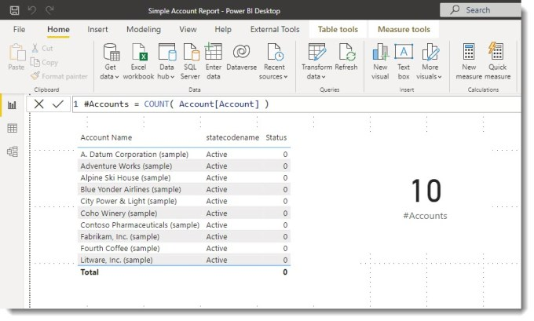

In the July 2022 Power BI update, they updated the Dataverse connector. The connector now uses the display names from a Dataverse table. Dataverse columns have internal name and display names and previously the display names were not available.

### YouTube Version

For those who prefer a video version.

### New Connection

Let’s start with a brand new Dataverse connection. When you click on the Dataverse button the dialog appears as before. When you select a table it still shows the internal names of the columns.

When you click Transform and Power Query opens it still shows the internal names. So I select a few columns and then click Close and Apply. When the data appears in Power BI desktop it now shows the display names. If a column does not have a display name such as statecodename it shows the internal name.

Power Query and Power BI Desktop views

When I experimented I found that even if you renamed the columns within Power Query the name within Power BI desktop did not change. And if you changed the name in Power BI desktop it did not push back into Power Query as it does with other connectors.

### Exploring with Tabular Editor

Opening the model in Tabular Editor 2 we can see that the column has two names. So the source column has a different value to the Name property.

### Updating an Existing Model

I created a Power BI model in an earlier version of Power that used the old Dataverse connector. It contains the Account table with columns renamed in Power Query and a measure to count the Account table records.

Report before refresh

When I opened the file in the July 2022 version of Power BI with the new Dataverse Connector, it looked unchanged. When the report is refreshed in Power BI desktop the connector is updated. The column names change and measures update and still work.

Report after refresh with updated column names

### Exceptions

If the table from Dataverse is transformed using a reference the display names do not come through. I have not explored all the combinations as to which break the new update so please be aware.

### Conclusion on Dataverse Connector

The update to the dataverse connector makes this connector work differently to other connectors. This update works well if all the transformation does is reduce the columns and filter the rows. This will work for many reports.

## More Power BI Posts

- [Conditional Formatting Update](https://hatfullofdata.blog/power-bi-conditional-formatting-update/)

- [Data Refresh Date](https://hatfullofdata.blog/power-bi-data-refresh-date/)

- [Using Inactive Relationships in a Measure](https://hatfullofdata.blog/power-bi-inactive-relationships-in-a-measure/)

- [DAX CrossFilter Function](https://hatfullofdata.blog/power-bi-dax-crossfilter-function/)

- [COALESCE Function to Remove Blanks](https://hatfullofdata.blog/power-bi-coalesce-function-to-remove-blanks/)

- [Personalize Visuals](https://hatfullofdata.blog/power-bi-personalize-visuals/)

- [Gradient Legends](https://hatfullofdata.blog/power-bi-gradient-legends/)

- [Endorse a Dataset as Promoted or Certified](https://hatfullofdata.blog/power-bi-endorse-a-dataset/)

- [Q&A Synonyms Update](https://hatfullofdata.blog/power-bi-qa-synonyms-update/)

- [Import Text Using Examples](https://hatfullofdata.blog/power-bi-import-text-using-examples/)

- [Paginated Report Resources](https://hatfullofdata.blog/paginated-report-resources/)

- [Refreshing Datasets Automatically with Power BI Dataflows](https://hatfullofdata.blog/refreshing-datasets-automatically-with-dataflow/)

- [Charticulator](https://hatfullofdata.blog/charticulator-simple-custom-chart/)

- [Dataverse Connector – July 2022 Update](https://hatfullofdata.blog/power-bi-dataverse-connector-july-2022-update/)

- [Dataverse Choice Columns](https://hatfullofdata.blog/power-bi-dataverse-choices-and-choice-column/)

- [Switch Dataverse Tenancy](https://hatfullofdata.blog/power-bi-switch-dataverse-tenancy/)

- [Connecting to Google Analytics](https://hatfullofdata.blog/power-bi-connecting-to-google-analytics/)

- [Take Over a Dataset](https://hatfullofdata.blog/power-bi-take-over-a-dataset/)

- [Export Data from Power BI Visuals](https://hatfullofdata.blog/export-data-from-power-bi-visuals/)

- [Embed a Paginated Report](https://hatfullofdata.blog/power-bi-embed-a-paginated-report/)

- [Using SQL on Dataverse for Power BI](https://hatfullofdata.blog/using-sql-on-dataverse-for-power-bi/)

- [Power Platform Solution and Power BI Series](https://hatfullofdata.blog/power-platform-solution-and-power-bi-part-1/)

- [Creating a Custom Smart Narrative](https://hatfullofdata.blog/power-bi-creating-a-custom-smart-narrative/)

- [Power Automate Button in a Power BI Report](https://hatfullofdata.blog/power-automate-button-in-a-power-bi-report/)

## Power BI Series

- [SVG in Power BI series](https://hatfullofdata.blog/svg-in-power-bi-part-1-svg-basics/)

- [Power BI and Project Online series](https://hatfullofdata.blog/power-bi-connecting-to-project-online/)

- [Slicers series](https://hatfullofdata.blog/power-bi-slicers-introduction/)

- [Dataflow series](https://hatfullofdata.blog/power-bi-create-a-dataflow/)

- [Power BI SVG series](https://hatfullofdata.blog/svg-in-power-bi-part-1-svg-basics/)

- [Power Automate and Power BI Rest API series](https://hatfullofdata.blog/power-automate-and-power-bi-rest-api/)

- [Power BI and DevOps series](https://hatfullofdata.blog/devops-data-into-power-bi/)

