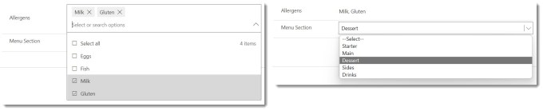
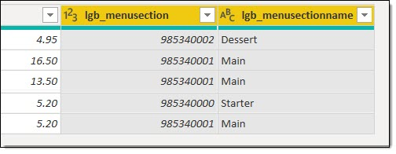
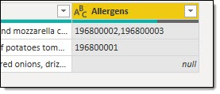
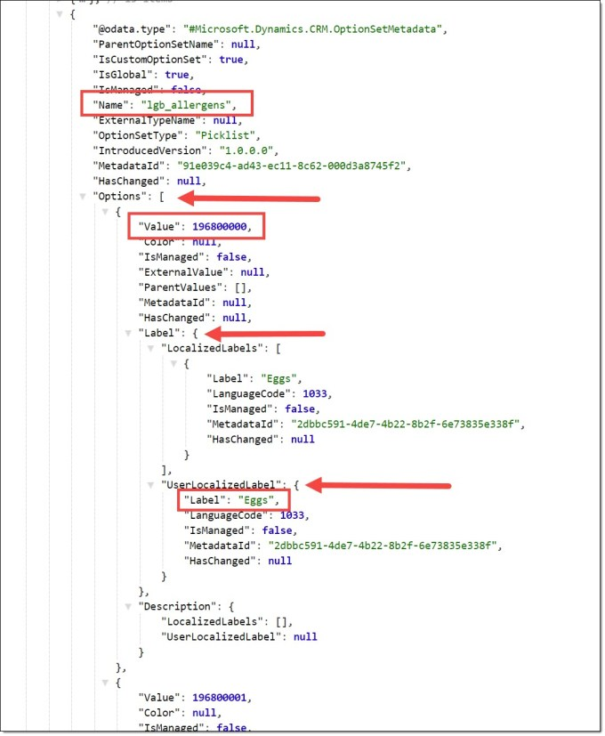
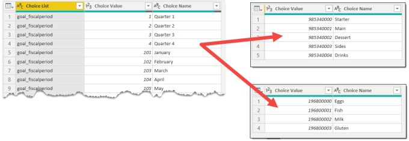

---
title: Power BI & Dataverse – Choice Columns
description: When a choice column is created in Dataverse, you can create a custom list of values which you want in Power BI as a table.
slug: power-bi-dataverse-choices-and-choice-column
date: 2022-09-24 19:24:07+0000
lastmod: 2025-02-14 11:42:33+0000
image: cover.jpg
categories:
    - Dataverse
    - Power BI
---

### Choices and Choice Column Introduction

When a choice column is created in a Dataverse table the developer can either select a pre-made list of choices or create a custom list of choices. In a Power BI model it helps to add the dimension table of those values.

The difference between a choice and choices column is how many choices can be picked. A choice column only allows one choice and a choices columns column allows multiple values to be added. So if we take dish from our menu then the menu section, eg starter, main, side would be a choice but the allergens such as gluten, dairy etc could be a choices column.



### Choice Column in Power BI

When the table is loaded into Power BI there are two columns for the choice column. The first column is the number that refers to the choice in the choices list and the second column is the value from the choice list. The limitation of using the name column is only selected values will in your data and it will slow down the refresh of the data.



### Choices Column in Power BI

When the table is loaded into Power BI there is a single column for the choices column. This column contains numbers separated by commas. Each of these numbers refers to a choice in the choices list. Using the Dataverse connection, there is no easy to get the choice values.



### Using the Web API to get choice lists

Choice are part of the table and columns definition and one of the four paths exposed is Global Option Set Definitions. Choices and Options are the same thing in this context. Microsoft give us the path on this page

[https://docs.microsoft.com/en-us/powerapps/developer/data-platform/webapi/use-web-api-metadata](https://docs.microsoft.com/en-us/powerapps/developer/data-platform/webapi/use-web-api-metadata)

The path given is

```xml
[Organization URI]/api/data/v9.0/GlobalOptionSetDefinitions
```

If you navigate to that url in your environment you will get JSON data. Then exploring the JSON we can find the Name of the choice list. Expanding Options we get the Value which matches the values in the choices column in our table. Expanding Label and then UserLocalizedLabel we get the Label value.



Using the Web Connector to link to the JSON we can connect. Power Query decides to expand everything for you. I deleted all the steps except Source and expanded only the columns I needed.

Before I add the list I create a parameter called Environment to store the path to the my Dataverse environment, eg orgdaae212f.crm11.dynamics.com.

Then this code gives you the list of all the choice lists in your environment. I save this as one query which is not loaded and then I add referenced queries for each choice list that I want to include in my report.

```xml
let
    Source = Json.Document(Web.Contents("https://" & Environment & "/api/data/v9.0/GlobalOptionSetDefinitions")),
    value = Source[value],
    #"Converted to Table" = Table.FromList(value, Splitter.SplitByNothing(), null, null, ExtraValues.Error),
    #"Expanded Column1" = Table.ExpandRecordColumn(#"Converted to Table", "Column1", {"Name", "Options"}, {"Name", "Options"}),
    #"Expanded Options" = Table.ExpandListColumn(#"Expanded Column1", "Options"),
    #"Expanded Options1" = Table.ExpandRecordColumn(#"Expanded Options", "Options", {"Value", "Label"}, {"Value", "Label"}),
    #"Expanded Label" = Table.ExpandRecordColumn(#"Expanded Options1", "Label", {"UserLocalizedLabel"}, {"UserLocalizedLabel"}),
    #"Expanded UserLocalizedLabel" = Table.ExpandRecordColumn(#"Expanded Label", "UserLocalizedLabel", {"Label"}, {"Label"}),
    #"Changed Type" = Table.TransformColumnTypes(#"Expanded UserLocalizedLabel",{{"Name", type text}, {"Value", Int64.Type}, {"Label", type text}}),
    #"Renamed Columns" = Table.RenameColumns(#"Changed Type",{{"Name", "Choice List"}, {"Value", "Choice Value"}, {"Label", "Choice Name"}})
in
    #"Renamed Columns"
```

### Result

After you add the above code, you get a table of all the options available. Then using reference and a filter and the choice dimension tables can be created.



### Conclusion

Its not pretty, its not clean and I’d prefer a straight forward connector. It works for now though and until there is another method that works this is the method I’ll use. If there is another method please correct me via the comments below and I’ll correct my post!

## More Power BI Posts

- [Conditional Formatting Update](https://hatfullofdata.blog/power-bi-conditional-formatting-update/)

- [Data Refresh Date](https://hatfullofdata.blog/power-bi-data-refresh-date/)

- [Using Inactive Relationships in a Measure](https://hatfullofdata.blog/power-bi-inactive-relationships-in-a-measure/)

- [DAX CrossFilter Function](https://hatfullofdata.blog/power-bi-dax-crossfilter-function/)

- [COALESCE Function to Remove Blanks](https://hatfullofdata.blog/power-bi-coalesce-function-to-remove-blanks/)

- [Personalize Visuals](https://hatfullofdata.blog/power-bi-personalize-visuals/)

- [Gradient Legends](https://hatfullofdata.blog/power-bi-gradient-legends/)

- [Endorse a Dataset as Promoted or Certified](https://hatfullofdata.blog/power-bi-endorse-a-dataset/)

- [Q&A Synonyms Update](https://hatfullofdata.blog/power-bi-qa-synonyms-update/)

- [Import Text Using Examples](https://hatfullofdata.blog/power-bi-import-text-using-examples/)

- [Paginated Report Resources](https://hatfullofdata.blog/paginated-report-resources/)

- [Refreshing Datasets Automatically with Power BI Dataflows](https://hatfullofdata.blog/refreshing-datasets-automatically-with-dataflow/)

- [Charticulator](https://hatfullofdata.blog/charticulator-simple-custom-chart/)

- [Dataverse Connector – July 2022 Update](https://hatfullofdata.blog/power-bi-dataverse-connector-july-2022-update/)

- [Dataverse Choice Columns](https://hatfullofdata.blog/power-bi-dataverse-choices-and-choice-column/)

- [Switch Dataverse Tenancy](https://hatfullofdata.blog/power-bi-switch-dataverse-tenancy/)

- [Connecting to Google Analytics](https://hatfullofdata.blog/power-bi-connecting-to-google-analytics/)

- [Take Over a Dataset](https://hatfullofdata.blog/power-bi-take-over-a-dataset/)

- [Export Data from Power BI Visuals](https://hatfullofdata.blog/export-data-from-power-bi-visuals/)

- [Embed a Paginated Report](https://hatfullofdata.blog/power-bi-embed-a-paginated-report/)

- [Using SQL on Dataverse for Power BI](https://hatfullofdata.blog/using-sql-on-dataverse-for-power-bi/)

- [Power Platform Solution and Power BI Series](https://hatfullofdata.blog/power-platform-solution-and-power-bi-part-1/)

- [Creating a Custom Smart Narrative](https://hatfullofdata.blog/power-bi-creating-a-custom-smart-narrative/)

- [Power Automate Button in a Power BI Report](https://hatfullofdata.blog/power-automate-button-in-a-power-bi-report/)

## Power BI Series

- [SVG in Power BI series](https://hatfullofdata.blog/svg-in-power-bi-part-1-svg-basics/)

- [Power BI and Project Online series](https://hatfullofdata.blog/power-bi-connecting-to-project-online/)

- [Slicers series](https://hatfullofdata.blog/power-bi-slicers-introduction/)

- [Dataflow series](https://hatfullofdata.blog/power-bi-create-a-dataflow/)

- [Power BI SVG series](https://hatfullofdata.blog/svg-in-power-bi-part-1-svg-basics/)

- [Power Automate and Power BI Rest API series](https://hatfullofdata.blog/power-automate-and-power-bi-rest-api/)

- [Power BI and DevOps series](https://hatfullofdata.blog/devops-data-into-power-bi/)

