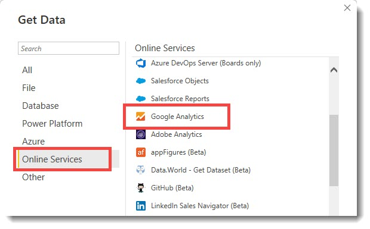
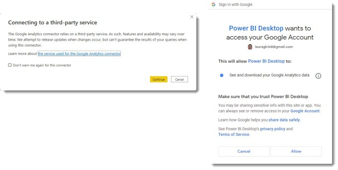
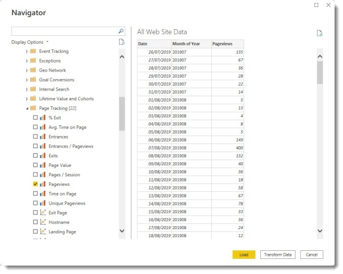
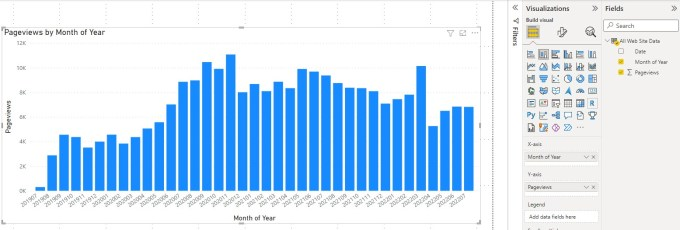
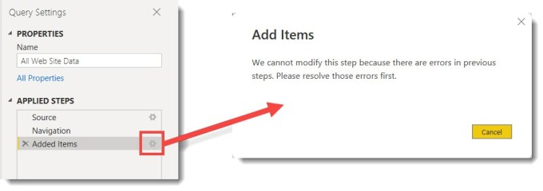

When I started my WordPress blog I added a Google Analytics plugin. This allows me to track visitors to my blog. So now I have a few years worth of data to load into a Power BI report. Power BI has a Google Analytics connector. This blog post is to walk through building a simple report on my blog visitors.

### YouTube Video

For those who prefer a video guide.

[https://www.youtube.com/watch?v=AdvAq-B6ZWg](https://www.youtube.com/watch?v=AdvAq-B6ZWg)

### Creating the connection to Google Analytics

In Power BI desktop the connector can be found under Get Data > More and then Online Services.

The connector relies on a third party, i.e. Google. Therefore Power BI shows a message warning the connector user that Microsoft can’t guarantee the connector will always work correctly. Google will also confirm that its okay for Power BI to connect to your Google Analytics.

### Selecting Fields

When the connection is established the Navigator dialog lists all the fields grouped in folders. The fields have two types, Dimensions and Measures. Every report must include at least one of each. For this example I select from the Time folder, Date and Month of Year as the dimensions. Then from the Page Tracking folder I select the measure Pageviews. Finally I click Load to get the data into my report.

### Quick Chart

A quick column chart, using Month of Year and Pageviews shows the page views over the past few years.

### Adding more fields from Google Analytics

Google analytics has many more dimensions and measures to explore. After you click on Transform and return to Power Query you can see the applied steps. My first attempt to add more dimensions to the query was to click on the cog next to Added Items. This gives you can error so you cannot just modify that step.

The error is not a problem. Instead of modifying the existing step, the easiest method to add new dimensions is to add a new step. On the Cube Tools – Manage ribbon, click on Add Items. For this example I added the following:

- Geo Network

Continent

- Country

- Platform or Device

Browser

- User

Users

After adding the new items, I return to the report and add slicers and more visuals.

## More Power BI Posts

- [Conditional Formatting Update](https://hatfullofdata.blog/power-bi-conditional-formatting-update/)

- [Data Refresh Date](https://hatfullofdata.blog/power-bi-data-refresh-date/)

- [Using Inactive Relationships in a Measure](https://hatfullofdata.blog/power-bi-inactive-relationships-in-a-measure/)

- [DAX CrossFilter Function](https://hatfullofdata.blog/power-bi-dax-crossfilter-function/)

- [COALESCE Function to Remove Blanks](https://hatfullofdata.blog/power-bi-coalesce-function-to-remove-blanks/)

- [Personalize Visuals](https://hatfullofdata.blog/power-bi-personalize-visuals/)

- [Gradient Legends](https://hatfullofdata.blog/power-bi-gradient-legends/)

- [Endorse a Dataset as Promoted or Certified](https://hatfullofdata.blog/power-bi-endorse-a-dataset/)

- [Q&A Synonyms Update](https://hatfullofdata.blog/power-bi-qa-synonyms-update/)

- [Import Text Using Examples](https://hatfullofdata.blog/power-bi-import-text-using-examples/)

- [Paginated Report Resources](https://hatfullofdata.blog/paginated-report-resources/)

- [Refreshing Datasets Automatically with Power BI Dataflows](https://hatfullofdata.blog/refreshing-datasets-automatically-with-dataflow/)

- [Charticulator](https://hatfullofdata.blog/charticulator-simple-custom-chart/)

- [Dataverse Connector – July 2022 Update](https://hatfullofdata.blog/power-bi-dataverse-connector-july-2022-update/)

- [Dataverse Choice Columns](https://hatfullofdata.blog/power-bi-dataverse-choices-and-choice-column/)

- [Switch Dataverse Tenancy](https://hatfullofdata.blog/power-bi-switch-dataverse-tenancy/)

- [Connecting to Google Analytics](https://hatfullofdata.blog/power-bi-connecting-to-google-analytics/)

- [Take Over a Dataset](https://hatfullofdata.blog/power-bi-take-over-a-dataset/)

- [Export Data from Power BI Visuals](https://hatfullofdata.blog/export-data-from-power-bi-visuals/)

- [Embed a Paginated Report](https://hatfullofdata.blog/power-bi-embed-a-paginated-report/)

- [Using SQL on Dataverse for Power BI](https://hatfullofdata.blog/using-sql-on-dataverse-for-power-bi/)

- [Power Platform Solution and Power BI Series](https://hatfullofdata.blog/power-platform-solution-and-power-bi-part-1/)

- [Creating a Custom Smart Narrative](https://hatfullofdata.blog/power-bi-creating-a-custom-smart-narrative/)

- [Power Automate Button in a Power BI Report](https://hatfullofdata.blog/power-automate-button-in-a-power-bi-report/)

## Power BI Series

- [SVG in Power BI series](https://hatfullofdata.blog/svg-in-power-bi-part-1-svg-basics/)

- [Power BI and Project Online series](https://hatfullofdata.blog/power-bi-connecting-to-project-online/)

- [Slicers series](https://hatfullofdata.blog/power-bi-slicers-introduction/)

- [Dataflow series](https://hatfullofdata.blog/power-bi-create-a-dataflow/)

- [Power BI SVG series](https://hatfullofdata.blog/svg-in-power-bi-part-1-svg-basics/)

- [Power Automate and Power BI Rest API series](https://hatfullofdata.blog/power-automate-and-power-bi-rest-api/)

- [Power BI and DevOps series](https://hatfullofdata.blog/devops-data-into-power-bi/)

