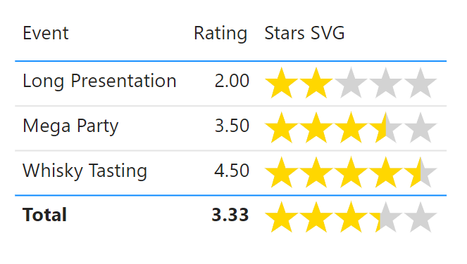
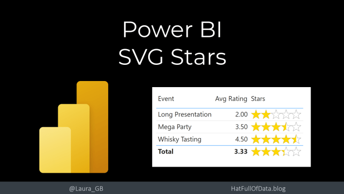
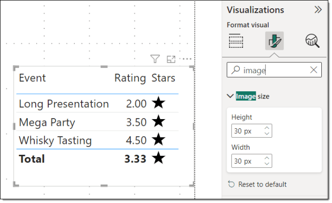
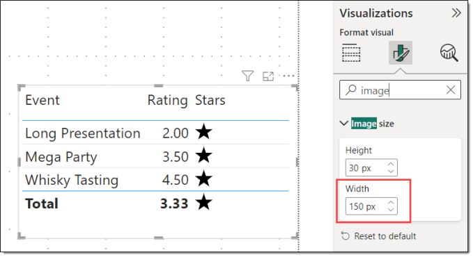
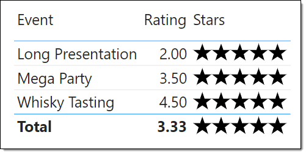
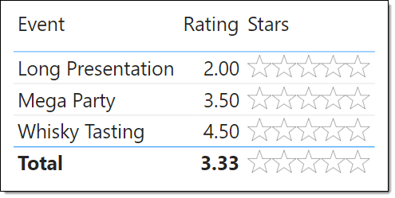

---
title: Power BI – 5 Stars SVG
description: In the Feb 2023 Power BI Update they introduced image width in a table formatting. This means SVG images now don’t have to be square, so we can now do rectangle images. So I ported Stars SVG code I had in my Power Apps series and added this post to my Power BI SVG series For this post we are...
slug: power-bi-5-stars-svg
date: 2023-02-25 22:57:38+0000
lastmod: 2025-02-14 11:31:37+0000
image: cover.png
categories:
    - Power BI
    - SVG
---

In the Feb 2023 Power BI Update they introduced image width in a table formatting. This means SVG images now don’t have to be square, so we can now do rectangle images. So I ported Stars SVG code I had in my Power Apps series and added this post to my Power BI SVG series

- [Introduction to SVG Basics](https://hatfullofdata.blog/svg-in-power-bi-part-1/)

- [KPI Shapes in Power BI](https://hatfullofdata.blog/svg-in-power-bi-part-2/)

- [Filling up with colour using SVG in Power BI](https://hatfullofdata.blog/svg-in-power-bi-part-3/)

- [Using Text in SVG](https://hatfullofdata.blog/svg-in-power-bi-part-4/)

- [Using SVG Rotate to create a dial in Power BI](https://hatfullofdata.blog/svg-in-power-bi-part-5/)

- [SVG Icons in Conditional Formatting](https://hatfullofdata.blog/svg-in-power-bi-part-6-new-icon-conditional-formatting/)

- [Using a Theme to add SVG Icons](https://hatfullofdata.blog/svg-in-power-bi-part-7-using-theme-svg-icons/)

- [Feb 2023 Update – 5 SVG Stars](https://hatfullofdata.blog/power-bi-5-stars-svg/)

For this post we are using a table of events that have a rating score. I want to add a visual version of the rating to the table visual.

Resources for this post and video can be found at [https://github.com/Laura-GB/DemoData/](https://github.com/Laura-GB/DemoData/)



## YouTube Version

[](https://youtu.be/gGOQg7G86jw)

## Draw 1 Star SVG

The first step is a measure to draw a single star. That starts with the SVG essentials similar to previous examples and the basic star shape. We need to remember to change Data Category the measure is an Image URL under data category and then add it to the table

```xml
Stars = 
// svg essentials
VAR svg_start = "data:image/svg+xml;utf8,"
VAR svg_end = ""
// star shapes
VAR Star1 = ""

RETURN
svg_start & Star1 & svg_end
```

The default image size will be too big. In the formatting for the table, change the image size. I’ve used 30 px, pick a size that works for you.



## Draw 5 Stars SVG

In order to draw 5 stars in a row the view box needs to be expanded to fit them all in. So the svg_start needs to change to 500 100. This will mean that the above width will also need to change. One star is 30 px, so 5 stars will need a width of 150 px.



Then we need to draw 5 stars in a row. We can use GENERATESERIES to create a table with numbers 0,100..400 so we can draw a star at 0,0 and 100,0 etc. That can be used inside a CONCATENATEX to create 5 groups. Each group will use a transform, translate to position each star.

```xml
Stars = 
// svg essentials
VAR svg_start = "data:image/svg+xml;utf8,"
VAR svg_end = ""
// star shapes
VAR Star1 = ""
VAR Star5 = CONCATENATEX(
    GENERATESERIES(0,400,100),
    "" & Star1 & ""
)
RETURN
svg_start & Star5 & svg_end
```



## Grey Star Outlines

The first layer of stars is outline stars so we need to put the 5 stars in a group with a white fill and 1 point black outline.

```xml
Stars = 
// svg essentials
VAR svg_start = "data:image/svg+xml;utf8,"
VAR svg_end = ""
// star shapes
VAR Star1 = ""
VAR Star5 = CONCATENATEX(
    GENERATESERIES(0,400,100),
    "" & Star1 & ""
)
// Defs

// Coloured Stars
VAR GreyStars = "" & Star5 & ""
RETURN
svg_start & GreyStars & svg_end
```



## Define Clip Path

The gold stars need clipping to match the rating score. 5 stars is 500 wide so a rating of 2 needs the gold stars clipped at 200, and 3.5 at 350 etc. We use variable ClipWidth to store this. To clip an image we use the  and  tags. The clipPath includes an id so it can be used later. The clipped area is a rectangle from with a height of 100 and a width of ClipWidth.

```xml
Stars = 
// svg essentials
VAR svg_start = "data:image/svg+xml;utf8,"
VAR svg_end = ""
// star shapes
VAR Star1 = ""
VAR Star5 = CONCATENATEX(
    GENERATESERIES(0,400,100),
    "" & Star1 & ""
)
// Defs
VAR ClipWidth = [Avg Rating] * 100
VAR Defs = "
                
            "
            
// Coloured Stars
VAR GreyStars = "" & Star5 & ""
RETURN
svg_start & GreyStars & svg_end
```

## Draw Clipped Gold Stars

The last step is to draw the 5 gold stars using the clip path. So we use another group, apply a fill of gold and the clip path. The clip path name

```xml
Stars = 
// svg essentials
VAR svg_start = "data:image/svg+xml;utf8,"
VAR svg_end = ""
// star shapes
VAR Star1 = ""
VAR Star5 = CONCATENATEX(
    GENERATESERIES(0,400,100),
    "" & Star1 & ""
)
// Defs
VAR ClipWidth = [Avg Rating] * 100
VAR Defs = "
                
            "

// Coloured Stars
VAR GreyStars = "" & Star5 & ""
VAR GoldStars = "" & Star5 & ""
RETURN
svg_start & Defs & GreyStars & GoldStars & svg_end
```

## Conclusion

The width addition to images in tables and matrix opens up lots of possibilities to use images in tables. There are lots of ideas for visuals to add to a table or matrix.Kerry Kolosko has some brilliant templates to get you started at [https://kerrykolosko.com/portfolio/](https://kerrykolosko.com/portfolio/)

## More Power BI Posts

- [Conditional Formatting Update](https://hatfullofdata.blog/power-bi-conditional-formatting-update/)

- [Data Refresh Date](https://hatfullofdata.blog/power-bi-data-refresh-date/)

- [Using Inactive Relationships in a Measure](https://hatfullofdata.blog/power-bi-inactive-relationships-in-a-measure/)

- [DAX CrossFilter Function](https://hatfullofdata.blog/power-bi-dax-crossfilter-function/)

- [COALESCE Function to Remove Blanks](https://hatfullofdata.blog/power-bi-coalesce-function-to-remove-blanks/)

- [Personalize Visuals](https://hatfullofdata.blog/power-bi-personalize-visuals/)

- [Gradient Legends](https://hatfullofdata.blog/power-bi-gradient-legends/)

- [Endorse a Dataset as Promoted or Certified](https://hatfullofdata.blog/power-bi-endorse-a-dataset/)

- [Q&A Synonyms Update](https://hatfullofdata.blog/power-bi-qa-synonyms-update/)

- [Import Text Using Examples](https://hatfullofdata.blog/power-bi-import-text-using-examples/)

- [Paginated Report Resources](https://hatfullofdata.blog/paginated-report-resources/)

- [Refreshing Datasets Automatically with Power BI Dataflows](https://hatfullofdata.blog/refreshing-datasets-automatically-with-dataflow/)

- [Charticulator](https://hatfullofdata.blog/charticulator-simple-custom-chart/)

- [Dataverse Connector – July 2022 Update](https://hatfullofdata.blog/power-bi-dataverse-connector-july-2022-update/)

- [Dataverse Choice Columns](https://hatfullofdata.blog/power-bi-dataverse-choices-and-choice-column/)

- [Switch Dataverse Tenancy](https://hatfullofdata.blog/power-bi-switch-dataverse-tenancy/)

- [Connecting to Google Analytics](https://hatfullofdata.blog/power-bi-connecting-to-google-analytics/)

- [Take Over a Dataset](https://hatfullofdata.blog/power-bi-take-over-a-dataset/)

- [Export Data from Power BI Visuals](https://hatfullofdata.blog/export-data-from-power-bi-visuals/)

- [Embed a Paginated Report](https://hatfullofdata.blog/power-bi-embed-a-paginated-report/)

- [Using SQL on Dataverse for Power BI](https://hatfullofdata.blog/using-sql-on-dataverse-for-power-bi/)

- [Power Platform Solution and Power BI Series](https://hatfullofdata.blog/power-platform-solution-and-power-bi-part-1/)

- [Creating a Custom Smart Narrative](https://hatfullofdata.blog/power-bi-creating-a-custom-smart-narrative/)

- [Power Automate Button in a Power BI Report](https://hatfullofdata.blog/power-automate-button-in-a-power-bi-report/)

## Power BI Series

- [SVG in Power BI series](https://hatfullofdata.blog/svg-in-power-bi-part-1-svg-basics/)

- [Power BI and Project Online series](https://hatfullofdata.blog/power-bi-connecting-to-project-online/)

- [Slicers series](https://hatfullofdata.blog/power-bi-slicers-introduction/)

- [Dataflow series](https://hatfullofdata.blog/power-bi-create-a-dataflow/)

- [Power BI SVG series](https://hatfullofdata.blog/svg-in-power-bi-part-1-svg-basics/)

- [Power Automate and Power BI Rest API series](https://hatfullofdata.blog/power-automate-and-power-bi-rest-api/)

- [Power BI and DevOps series](https://hatfullofdata.blog/devops-data-into-power-bi/)

