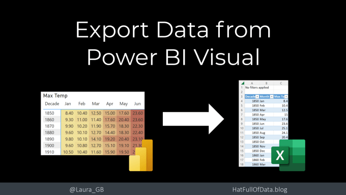
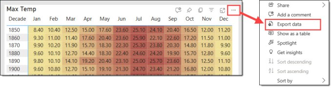
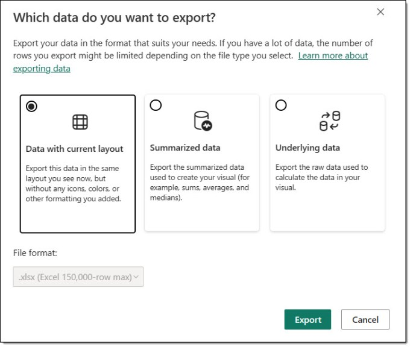
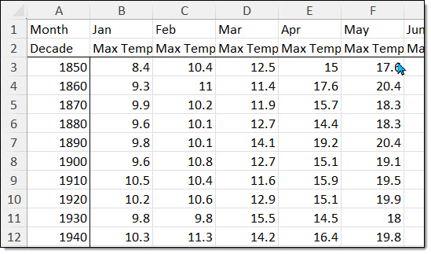
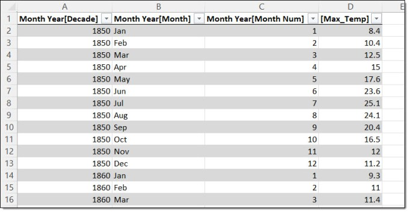
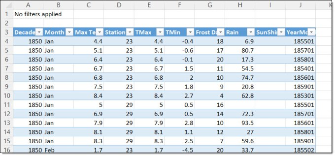
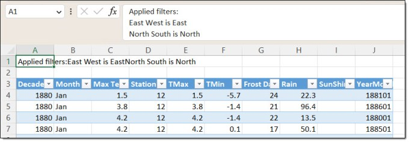
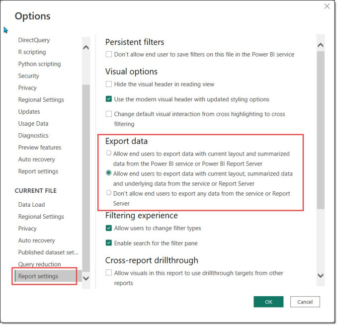
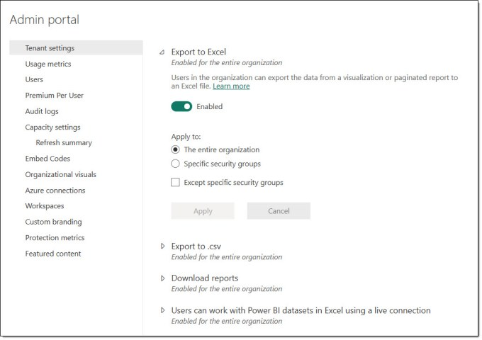

Excel has been the backbone of finance departments for decades. Almost every company has multiple spreadsheets that are business critical. Many Power BI adoption programmes have aimed to reduce the reliance on such spreadsheets. But we may still need to export data from Power BI into an Excel spreadsheet as old habits die hard and Excel is an amazing tool and Power BI will never replace it completely. This is one possible option and I will cover creating pivot tables from a dataset in another post.

## YouTube Version

## Export data from a visual

When viewing a report in the Power BI Service, the viewer can click on the three dots usually in the top right of the visual. When the menu that appears, they can click Export data. (See [Admin](#Admin) and [Report Settings](#ReportSetting) sections if its not there) Then it will display a dialog giving potentially multiple ways to export data.

Different options will be available based on the visual selected and the report options. The details for each option will be covered.

### Data with current layout

This option is only available on Table or Matrix visuals. It creates an Excel file with almost exactly the same layout. The file is a pure export and does not include a refresh.

### Summarized Data

Assuming the admin and report creator have allowed export, this option is available for most visuals. When selected it has three possibilities. The live connection is only available if you have contributor or higher access, i.e. its not available if you have Viewer access.

- Excel with live connection, 500,000 row max.Live connection means the data can be refreshed at a future time.

- Excel, 150,000 row maxExport without refresh.

- CSV file, 30,000 row maxCSV cannot include a refresh.

### Underlying Data

This option is only available if the report creator has enabled it. (See Report Setting Options below) It exposes more columns than summarized. In this example it exports all the columns from the fact table, the 2 columns from the dimension table used and the measure used.

## Applied Filters in Export Data

When the data is exported, the exported data will be filtered with the report filters applied. Then the filter details are included in Excel files. CSV files will be filtered but will not include the details.

## Report Setting Options

A report creator can control if report readers can export data from the report. These settings are found under File – Options, CURRENT REPORT – Report settings. Then look under Export data. The first option is the default and will allow Data with Current Layout and Summarized data. When option 2 is selected, underlying data export is enabled as well. Option 3 disables all exports from this report.

## Admin Options

Power Admins have ultimate control over this feature. There are 3 features they can restrict, enable or disable. These options are Export to Excel, Export to csv and Users can work with Power BI datasets. Disabling the third option will disable files having a live refresh.

Also by using security groups, you can restrict any of these features to limited users across the tenancy.

## Data Export Conclusion

Educating users in good practice on using these features will help your strong Excel users feel more comfortable. I can understand companies restricting parts of this, but I would hope it is not just a blanket ban hoping this will speed up adoption of Power BI. In my experience it will just make some people more stubborn. Stubborn workarounds will be shadow IT and increase your technical debt.

## Resources

The UK Weather pbix file is on my github site – [https://github.com/Laura-GB/DemoData#video-and-blog-resources](https://github.com/Laura-GB/DemoData#video-and-blog-resources)

## More Power BI Posts

- [Conditional Formatting Update](https://hatfullofdata.blog/power-bi-conditional-formatting-update/)

- [Data Refresh Date](https://hatfullofdata.blog/power-bi-data-refresh-date/)

- [Using Inactive Relationships in a Measure](https://hatfullofdata.blog/power-bi-inactive-relationships-in-a-measure/)

- [DAX CrossFilter Function](https://hatfullofdata.blog/power-bi-dax-crossfilter-function/)

- [COALESCE Function to Remove Blanks](https://hatfullofdata.blog/power-bi-coalesce-function-to-remove-blanks/)

- [Personalize Visuals](https://hatfullofdata.blog/power-bi-personalize-visuals/)

- [Gradient Legends](https://hatfullofdata.blog/power-bi-gradient-legends/)

- [Endorse a Dataset as Promoted or Certified](https://hatfullofdata.blog/power-bi-endorse-a-dataset/)

- [Q&A Synonyms Update](https://hatfullofdata.blog/power-bi-qa-synonyms-update/)

- [Import Text Using Examples](https://hatfullofdata.blog/power-bi-import-text-using-examples/)

- [Paginated Report Resources](https://hatfullofdata.blog/paginated-report-resources/)

- [Refreshing Datasets Automatically with Power BI Dataflows](https://hatfullofdata.blog/refreshing-datasets-automatically-with-dataflow/)

- [Charticulator](https://hatfullofdata.blog/charticulator-simple-custom-chart/)

- [Dataverse Connector – July 2022 Update](https://hatfullofdata.blog/power-bi-dataverse-connector-july-2022-update/)

- [Dataverse Choice Columns](https://hatfullofdata.blog/power-bi-dataverse-choices-and-choice-column/)

- [Switch Dataverse Tenancy](https://hatfullofdata.blog/power-bi-switch-dataverse-tenancy/)

- [Connecting to Google Analytics](https://hatfullofdata.blog/power-bi-connecting-to-google-analytics/)

- [Take Over a Dataset](https://hatfullofdata.blog/power-bi-take-over-a-dataset/)

- [Export Data from Power BI Visuals](https://hatfullofdata.blog/export-data-from-power-bi-visuals/)

- [Embed a Paginated Report](https://hatfullofdata.blog/power-bi-embed-a-paginated-report/)

- [Using SQL on Dataverse for Power BI](https://hatfullofdata.blog/using-sql-on-dataverse-for-power-bi/)

- [Power Platform Solution and Power BI Series](https://hatfullofdata.blog/power-platform-solution-and-power-bi-part-1/)

- [Creating a Custom Smart Narrative](https://hatfullofdata.blog/power-bi-creating-a-custom-smart-narrative/)

- [Power Automate Button in a Power BI Report](https://hatfullofdata.blog/power-automate-button-in-a-power-bi-report/)

## Power BI Series

- [SVG in Power BI series](https://hatfullofdata.blog/svg-in-power-bi-part-1-svg-basics/)

- [Power BI and Project Online series](https://hatfullofdata.blog/power-bi-connecting-to-project-online/)

- [Slicers series](https://hatfullofdata.blog/power-bi-slicers-introduction/)

- [Dataflow series](https://hatfullofdata.blog/power-bi-create-a-dataflow/)

- [Power BI SVG series](https://hatfullofdata.blog/svg-in-power-bi-part-1-svg-basics/)

- [Power Automate and Power BI Rest API series](https://hatfullofdata.blog/power-automate-and-power-bi-rest-api/)

- [Power BI and DevOps series](https://hatfullofdata.blog/devops-data-into-power-bi/)

