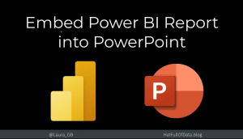
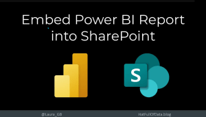
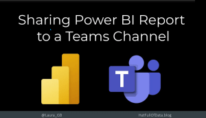
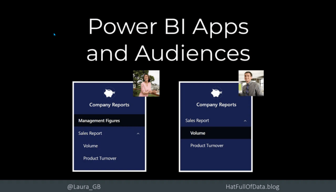
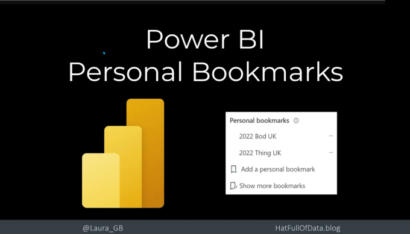
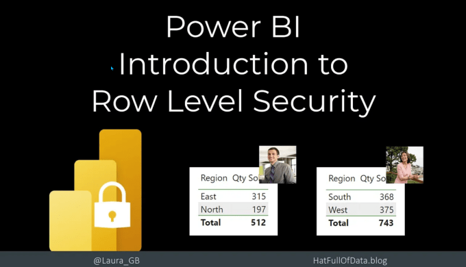

So you’ve found Power BI, you’ve created amazing reports that answer every question your business has. Yet when you look at the stats your reports are not being looked at. People are still returning to the old spreadsheets and creating their own pie charts. What has gone wrong with your Power BI adoption?

You might have adopted Power BI but your business hasn’t. You need to take your business on the Power BI adoption journey. No they don’t need to learn M and DAX, but they do need to understand how they can view reports and how to use them. This post is to go along with a set of videos looking at ways to deliver the reports to your business report consumers. Click on the pictures to view the videos.

## Report Delivery

Workspaces are not user friendly, you need to find the workspace and then the report etc. So what options are there for delivering the report to where the viewer already is. Here are four videos to get you started

My favourite update for 2022 was being able to embed a Power BI report into PowerPoint with full functionality. This bring Power BI into the meeting without any fuss, window switching. Embedding is fast and simple assuming everyone has licenses and access.

For outside the meeting but still in the areas your users work embedding in a SharePoint page could be the answer. If your users are working every day in SharePoint then this is the obvious place to embed your report.

Most Office workers use MS Teams for almost everything. So its obvious to pin that Power BI report into the relevant Teams channel for everyone to be able to quickly find it when they are working in that channel.

When you have a complete report suite that should be delivered together then a Power BI App is your best option. Using Audiences you can tailor the experience based on the viewer. This is my second favourite update from 2022.

## Report Experience

The average manager does not believe they have time to learn the complexities of how a new report works. So you need to make the transition easy. Give the 5 minute tour, listen to feedback and show them how to make it work for them.

When a report covers multiple teams and slicers give users the specific results they need, show them how to use Personal Bookmarks. Now the report view is under their control and its quick and easy.

When that multi-team report is exposing data too widely then Row Level Security should be considered. This is the simplest version. Another post will take this further.

## Old habits die hard

Excel is here to stay, do not make your Power BI adoption project a battle you cannot win. As much as Power BI can do much of the reporting that Excel does there are times when exploring the data in Excel is the best option. Showing your users how to connect Excel to a Power BI dataset will at least make sure the data they have in Excel should be the same as the data in Power BI.

With the proper controls users can pull data from a Power BI dataset into a Pivot Table or into a table. However much you’d prefer they didn’t, they will want the data in Excel. So let them do it, with it controlled by you.

## Conclusion

In order for your reports to be used, trusted and promoted across the business you need to deliver them. Hopefully you have a few more ideas now on how you could do that. Please let me know if you have any other ideas to add to the list.

## More Power BI Posts

- [Conditional Formatting Update](https://hatfullofdata.blog/power-bi-conditional-formatting-update/)

- [Data Refresh Date](https://hatfullofdata.blog/power-bi-data-refresh-date/)

- [Using Inactive Relationships in a Measure](https://hatfullofdata.blog/power-bi-inactive-relationships-in-a-measure/)

- [DAX CrossFilter Function](https://hatfullofdata.blog/power-bi-dax-crossfilter-function/)

- [COALESCE Function to Remove Blanks](https://hatfullofdata.blog/power-bi-coalesce-function-to-remove-blanks/)

- [Personalize Visuals](https://hatfullofdata.blog/power-bi-personalize-visuals/)

- [Gradient Legends](https://hatfullofdata.blog/power-bi-gradient-legends/)

- [Endorse a Dataset as Promoted or Certified](https://hatfullofdata.blog/power-bi-endorse-a-dataset/)

- [Q&A Synonyms Update](https://hatfullofdata.blog/power-bi-qa-synonyms-update/)

- [Import Text Using Examples](https://hatfullofdata.blog/power-bi-import-text-using-examples/)

- [Paginated Report Resources](https://hatfullofdata.blog/paginated-report-resources/)

- [Refreshing Datasets Automatically with Power BI Dataflows](https://hatfullofdata.blog/refreshing-datasets-automatically-with-dataflow/)

- [Charticulator](https://hatfullofdata.blog/charticulator-simple-custom-chart/)

- [Dataverse Connector – July 2022 Update](https://hatfullofdata.blog/power-bi-dataverse-connector-july-2022-update/)

- [Dataverse Choice Columns](https://hatfullofdata.blog/power-bi-dataverse-choices-and-choice-column/)

- [Switch Dataverse Tenancy](https://hatfullofdata.blog/power-bi-switch-dataverse-tenancy/)

- [Connecting to Google Analytics](https://hatfullofdata.blog/power-bi-connecting-to-google-analytics/)

- [Take Over a Dataset](https://hatfullofdata.blog/power-bi-take-over-a-dataset/)

- [Export Data from Power BI Visuals](https://hatfullofdata.blog/export-data-from-power-bi-visuals/)

- [Embed a Paginated Report](https://hatfullofdata.blog/power-bi-embed-a-paginated-report/)

- [Using SQL on Dataverse for Power BI](https://hatfullofdata.blog/using-sql-on-dataverse-for-power-bi/)

- [Power Platform Solution and Power BI Series](https://hatfullofdata.blog/power-platform-solution-and-power-bi-part-1/)

- [Creating a Custom Smart Narrative](https://hatfullofdata.blog/power-bi-creating-a-custom-smart-narrative/)

- [Power Automate Button in a Power BI Report](https://hatfullofdata.blog/power-automate-button-in-a-power-bi-report/)

## Power BI Series

- [SVG in Power BI series](https://hatfullofdata.blog/svg-in-power-bi-part-1-svg-basics/)

- [Power BI and Project Online series](https://hatfullofdata.blog/power-bi-connecting-to-project-online/)

- [Slicers series](https://hatfullofdata.blog/power-bi-slicers-introduction/)

- [Dataflow series](https://hatfullofdata.blog/power-bi-create-a-dataflow/)

- [Power BI SVG series](https://hatfullofdata.blog/svg-in-power-bi-part-1-svg-basics/)

- [Power Automate and Power BI Rest API series](https://hatfullofdata.blog/power-automate-and-power-bi-rest-api/)

- [Power BI and DevOps series](https://hatfullofdata.blog/devops-data-into-power-bi/)

