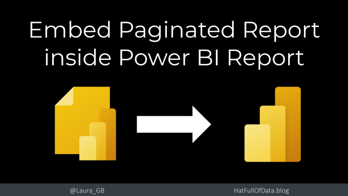
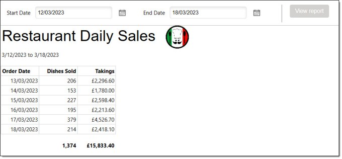
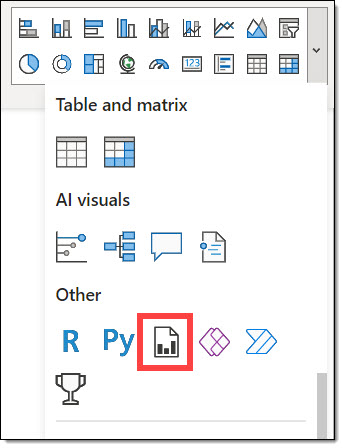
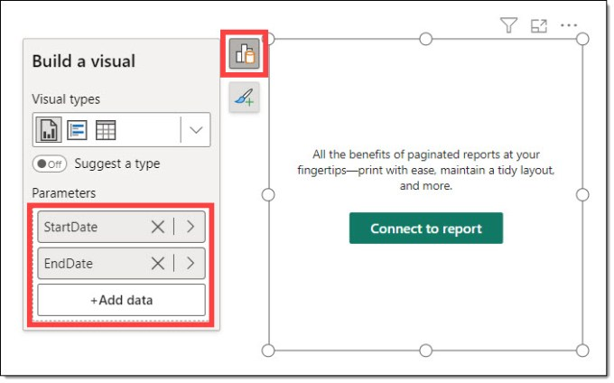
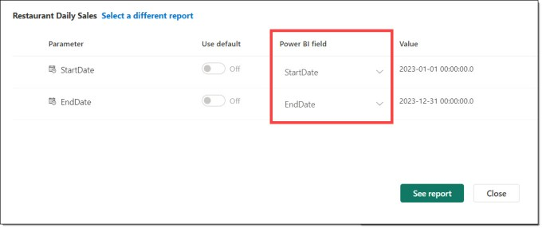
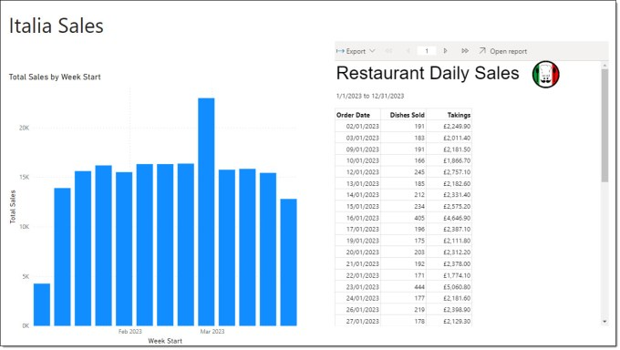
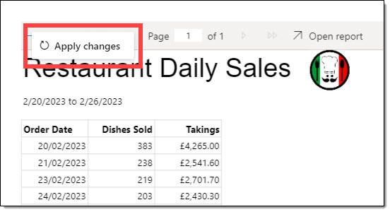
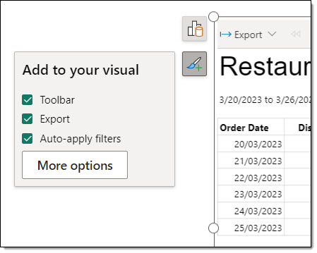
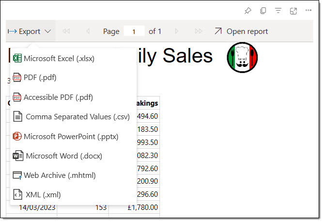
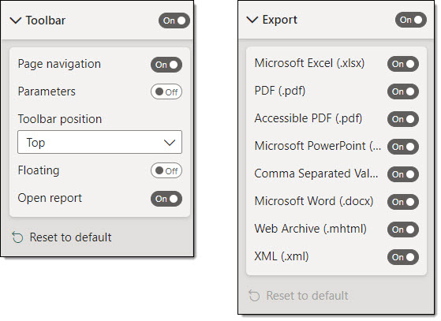

Within a Power BI report you can embed a paginated report. Values can be passed to the paginated report to populate parameters. The paginated report can be exported by a report consumer.

## YouTube Version

[](https://youtu.be/aIDLAloE_oc)

## Paginated Report

For this post we are going to use a paginated report connected to restaurant sales data. The report shows daily total dishes sold and takings. It uses 2 parameters, StartDate and EndDate to filter the report.



## Prepare Measures for Parameter Values

The Power BI report in this example uses the same data source of restaurant data. It doesn’t have to. The report requires 2 parameters. The easiest way to fill these vales would be to create measures. We create 2 measures to define the date range.

Copy CodeCopiedUse a different Browser
```xml
StartDate = MIN('Date'[Date])

EndDate = MAX('Date'[Date])
```

## Embed a Paginated Report

In a report in Power BI desktop drop down the visual selection from the Home or Insert ribbon. Then select the Paginated Report visual from the Other group.



When the visual appears, click on the Build Visual button to display the data options. Add the measures to the visual. Then click Connect to report button to select the report.



The next dialog shows all the paginated reports you have access to and includes a search box. Select the correct report and then click Set Parameters. Add the relevant measures from the dropdown. The current values of the measures will appear next to each measure.



Click See report to see the report. In this report there is also a chart showing sales per week.



## Filtering the Paginated Report

When a filter is applied that changes the measures used as parameters, a Apply changes button appears. Clicking this will filter the report.



We can remove  Click on the report and click the format button. Then tick the Auto-apply. Now when the measures change the report will refresh immedeatly.



## Exporting the Report

After the Power BI report is published, consumers can view it from the workspace or workspace app. When viewing the report the viewer can click on Export and select a format. Then all pages will download as a single file.



The toolbar at the top of the report allows the viewer to navigate the pages. We can open the report with the current filters applied by clicking Open Report.

## Restricting Viewer Options

When designing the report you can add restrictions to the embedded Paginated report from the format pane. We can hide the complete toolbar, or remove access to export, navigate pages and viewing the report alone. We can restrict exporting or the different export formats.



## Conclusion

This was a very simple example with 2 simple parameters. The paginated report could have optional parameters with default values and could accept multiple values. The tricky part there is setting up the paginated report rather than embedding it.

One great option would be to use bookmarks to save the common parameters.

## More Power BI Posts

- [Conditional Formatting Update](https://hatfullofdata.blog/power-bi-conditional-formatting-update/)

- [Data Refresh Date](https://hatfullofdata.blog/power-bi-data-refresh-date/)

- [Using Inactive Relationships in a Measure](https://hatfullofdata.blog/power-bi-inactive-relationships-in-a-measure/)

- [DAX CrossFilter Function](https://hatfullofdata.blog/power-bi-dax-crossfilter-function/)

- [COALESCE Function to Remove Blanks](https://hatfullofdata.blog/power-bi-coalesce-function-to-remove-blanks/)

- [Personalize Visuals](https://hatfullofdata.blog/power-bi-personalize-visuals/)

- [Gradient Legends](https://hatfullofdata.blog/power-bi-gradient-legends/)

- [Endorse a Dataset as Promoted or Certified](https://hatfullofdata.blog/power-bi-endorse-a-dataset/)

- [Q&A Synonyms Update](https://hatfullofdata.blog/power-bi-qa-synonyms-update/)

- [Import Text Using Examples](https://hatfullofdata.blog/power-bi-import-text-using-examples/)

- [Paginated Report Resources](https://hatfullofdata.blog/paginated-report-resources/)

- [Refreshing Datasets Automatically with Power BI Dataflows](https://hatfullofdata.blog/refreshing-datasets-automatically-with-dataflow/)

- [Charticulator](https://hatfullofdata.blog/charticulator-simple-custom-chart/)

- [Dataverse Connector – July 2022 Update](https://hatfullofdata.blog/power-bi-dataverse-connector-july-2022-update/)

- [Dataverse Choice Columns](https://hatfullofdata.blog/power-bi-dataverse-choices-and-choice-column/)

- [Switch Dataverse Tenancy](https://hatfullofdata.blog/power-bi-switch-dataverse-tenancy/)

- [Connecting to Google Analytics](https://hatfullofdata.blog/power-bi-connecting-to-google-analytics/)

- [Take Over a Dataset](https://hatfullofdata.blog/power-bi-take-over-a-dataset/)

- [Export Data from Power BI Visuals](https://hatfullofdata.blog/export-data-from-power-bi-visuals/)

- [Embed a Paginated Report](https://hatfullofdata.blog/power-bi-embed-a-paginated-report/)

- [Using SQL on Dataverse for Power BI](https://hatfullofdata.blog/using-sql-on-dataverse-for-power-bi/)

- [Power Platform Solution and Power BI Series](https://hatfullofdata.blog/power-platform-solution-and-power-bi-part-1/)

- [Creating a Custom Smart Narrative](https://hatfullofdata.blog/power-bi-creating-a-custom-smart-narrative/)

- [Power Automate Button in a Power BI Report](https://hatfullofdata.blog/power-automate-button-in-a-power-bi-report/)

## Power BI Series

- [SVG in Power BI series](https://hatfullofdata.blog/svg-in-power-bi-part-1-svg-basics/)

- [Power BI and Project Online series](https://hatfullofdata.blog/power-bi-connecting-to-project-online/)

- [Slicers series](https://hatfullofdata.blog/power-bi-slicers-introduction/)

- [Dataflow series](https://hatfullofdata.blog/power-bi-create-a-dataflow/)

- [Power BI SVG series](https://hatfullofdata.blog/svg-in-power-bi-part-1-svg-basics/)

- [Power Automate and Power BI Rest API series](https://hatfullofdata.blog/power-automate-and-power-bi-rest-api/)

- [Power BI and DevOps series](https://hatfullofdata.blog/devops-data-into-power-bi/)

