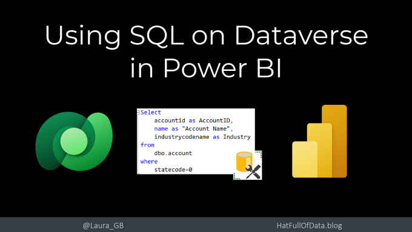
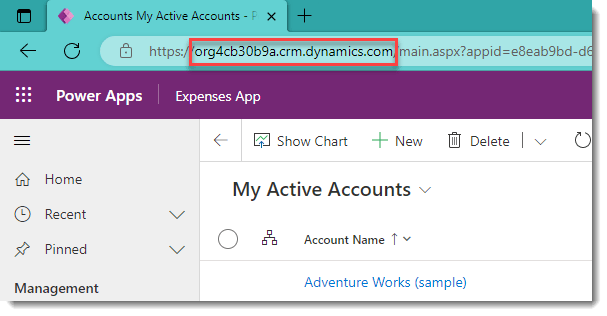
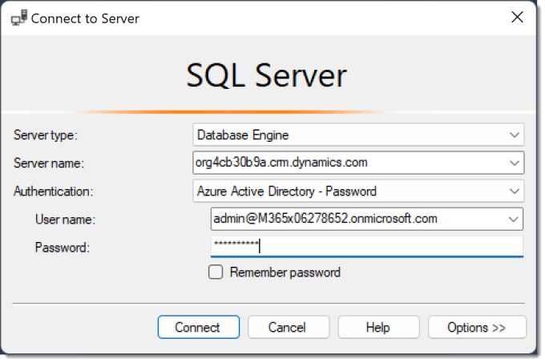
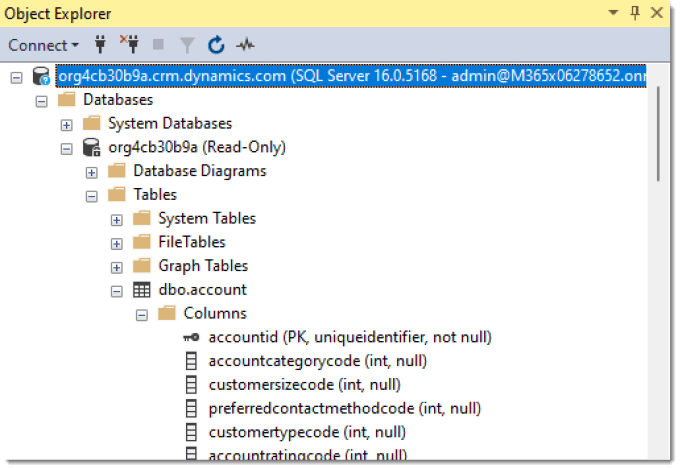
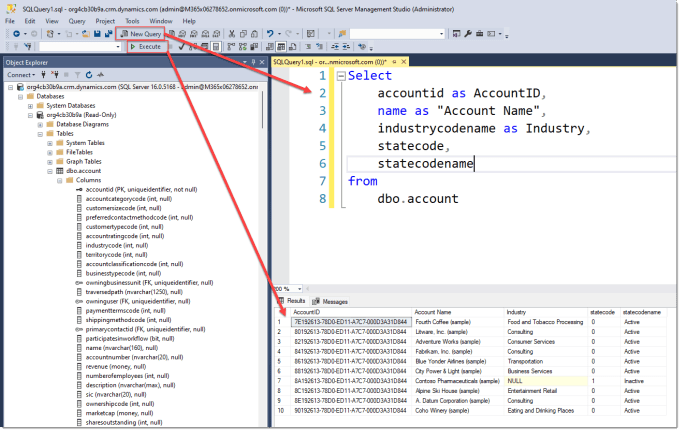
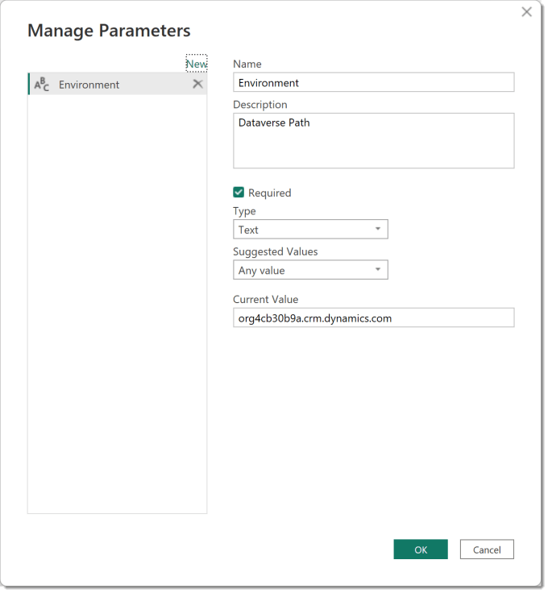
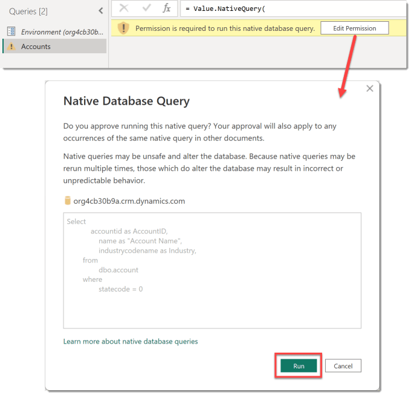
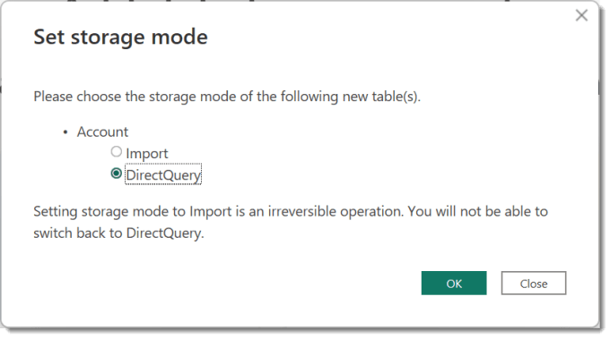
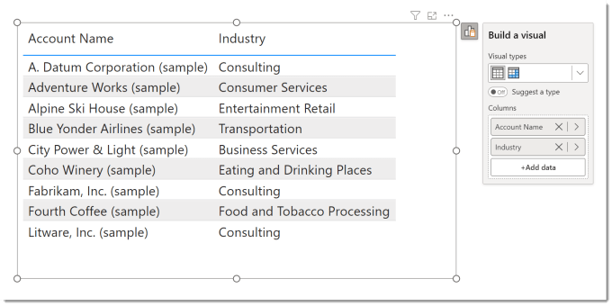
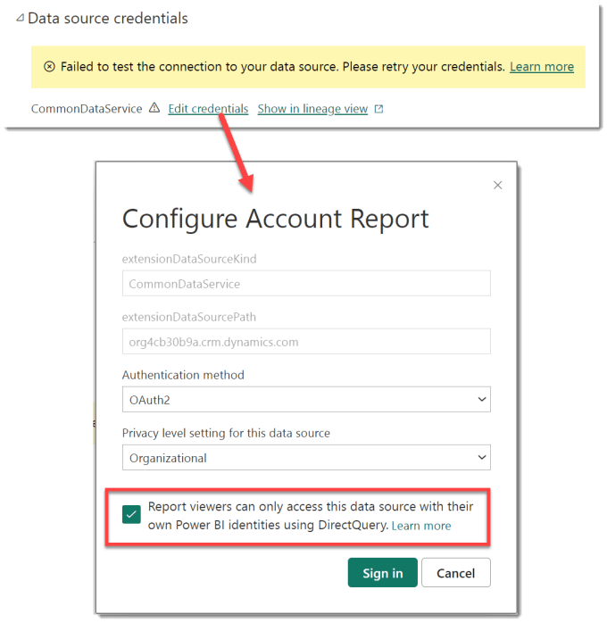

---
title: Using SQL on Dataverse for Power BI
description: SQL (Structured Query Language) has been used to get data in and out of databases for decades. Dataverse is a database. So lets use SQL on Dataverse to fetch data into a report. This can simplify our queries and make a direct query report easier to write. YouTube Version Microsoft SQL Server Management Studio There are multiple tools available to...
slug: using-sql-on-dataverse-for-power-bi
date: 2023-04-26 16:55:19+0000
lastmod: 2025-02-14 11:23:17+0000
image: cover.png
categories:
    - Dataverse
    - Power BI
---

SQL (Structured Query Language) has been used to get data in and out of databases for decades. Dataverse is a database. So lets use SQL on Dataverse to fetch data into a report. This can simplify our queries and make a direct query report easier to write.

## YouTube Version

[](https://youtu.be/SbWxzBlwN0k)

## Microsoft SQL Server Management Studio

There are multiple tools available to write and test your SQL, for this post I am using SQL Server Management Studio (SSMS), which is a free tool from Microsoft. You can download SSMS from

[https://learn.microsoft.com/en-us/sql/ssms/download-sql-server-management-studio-ssms](https://learn.microsoft.com/en-us/sql/ssms/download-sql-server-management-studio-ssms)

After you have downloaded SSMS, you can start it. Then you need to login to the specific environment. A dialog should pop up to fill in or you can click Connect. The Server type is Database Engine. The server name is in the url path from running a model driven app.



For this post the authentication I am using is Azure Active Directory – Password. So I also supply a User Name and Password. Then you can click Connect.



When connection has completed, the Object Explorer pane will show the hierarchy of items. Expand Databases to find your environment database and then expand that database and Tables to see the complete list of tables. Expand the table to see the list of columns.



## Write your first query

This post is not to teach you SQL. There are plenty of sites to do that. Here are some very simple queries to get you started. For our first query, we will write a query to fetch a list of accounts. Click on New Query and a blank page appears. In here we can type a simple query to list all accounts. Click Execute to run the query and see the results.



#### SQL Code

```xml
Select
	accountid as AccountID,
	name as "Account Name",
	industrycodename as Industry,
	statecode,
	statecodename
from
	dbo.account
```

## Filtering the data

The previous example includes an account that is not active. Contoso Pharmaceuticals has a statecode of 1 and statecodename of Inactive. For this example we are going to filter to only show the active records. The active records have 0 in the statecode column. The WHERE clause applies the filter.  The statecode and statecodename columns can be removed.

```xml
Select
	accountid as AccountID,
	name as "Account Name",
	industrycodename as Industry
from
	dbo.account
where
	statecode = 0
```

## Using SQL on Dataverse in Power BI

Now we have an SQL statement we can use it in Power BI. Start POwer BI and then click Transform data to open Power Query. Then we create a parameter by clicking Manage Parameters and then click New and fillin in the details. The current value should be the environment path you used earlier.



Now you have the parameter we can create the query. Start by creating a blank query by clicking New Source and then Blank Query. Then on the Home ribbon click Advanced Editor and paste in this code. I have adapted a pattern created by Scott Sewell.

```xml
let
    Dataverse = CommonDataService.Database(Environment, 
        [CreateNavigationProperties=false]),
    SQL = "Select
	        accountid as AccountID,
	        name as ""Account Name"",
	        industrycodename as Industry
        from
	        dbo.account
        where
	        statecode = 0",
    Source = Value.NativeQuery(
        Dataverse,
        SQL,
        null,
        [EnableFolding=true]
    )
in
    Source
```

Note 1 – the CreateNavigationProperties and EnableFolding are important flags to help with performance. Scott Sewell explains both topics in these posts.

[https://www.linkedin.com/pulse/speedtip-enablefolding-option-dataverse-native-sql-power-sewell/](https://www.linkedin.com/pulse/speedtip-enablefolding-option-dataverse-native-sql-power-sewell/)[https://www.linkedin.com/pulse/stuck-evaluating-dataverse-source-power-bi-try-speedtip-sewell/](https://www.linkedin.com/pulse/stuck-evaluating-dataverse-source-power-bi-try-speedtip-sewell/)

Note 2 – If your SQL includes any ” you will need to double them up inside the string. In this example the ” is needed as the column Account Name has a space in it’s name.

For other queries you just replace the SQL = step with a different SQL statement. You can add further transformations if you need them into Power Query. Remember to rename your query to a clear name.

## Permission to Run a Native Database Query

SQL is a powerful language. On some databases, not Dataverse, it can edit or delete the data. So Power Query will check the first time it runs any query. A message in a yellow bar appears stating Permission is required. When you click Edit Permission, a dialog appears showing you the query and you can click the Run button. Then the data will appear.



## Loading into Power BI Desktop

Now you have a query that loads data you can load it into Power BI desktop by clicking Close & Apply on the home ribbon. Before it will load the data it will ask you to set the storage mode. For this post I am selecting DirectQuery. This means the data is live and data security is applied using the report viewer’s security. (See publishing to get this 100% right)



It will ask you confirm running the query again, just click Run. Once the data has loaded we add relationships if required, measures and visuals into the report. Be aware direct query will need to refresh and so will be slightly slower.



## Publishing

Once you have completed the modelling and visuals, you can publish the report. You need to check the credentials of the report. Even if credentials look okay, confirm the viewers credentials are used. In the workspace, open up settings of the dataset. Under Data source credentials click on Edit credentials. Authentication method should be OAuth2 and select the appropiate security level.

If you are using direct query then tick the bottom option so that report viewers credentials get used to fetch the data. Security within Dataverse is now applied to your report.

Click Sign in and complete the sign in to now make your report ready for the report consumers.



## Conclusion

Dataverse is a great data source for business apps and being able to report on the data in there is important. Building a simple efficient pattern to do this is important. Hopefully this post helps get you there.

## More Power BI Posts

- [Conditional Formatting Update](https://hatfullofdata.blog/power-bi-conditional-formatting-update/)

- [Data Refresh Date](https://hatfullofdata.blog/power-bi-data-refresh-date/)

- [Using Inactive Relationships in a Measure](https://hatfullofdata.blog/power-bi-inactive-relationships-in-a-measure/)

- [DAX CrossFilter Function](https://hatfullofdata.blog/power-bi-dax-crossfilter-function/)

- [COALESCE Function to Remove Blanks](https://hatfullofdata.blog/power-bi-coalesce-function-to-remove-blanks/)

- [Personalize Visuals](https://hatfullofdata.blog/power-bi-personalize-visuals/)

- [Gradient Legends](https://hatfullofdata.blog/power-bi-gradient-legends/)

- [Endorse a Dataset as Promoted or Certified](https://hatfullofdata.blog/power-bi-endorse-a-dataset/)

- [Q&A Synonyms Update](https://hatfullofdata.blog/power-bi-qa-synonyms-update/)

- [Import Text Using Examples](https://hatfullofdata.blog/power-bi-import-text-using-examples/)

- [Paginated Report Resources](https://hatfullofdata.blog/paginated-report-resources/)

- [Refreshing Datasets Automatically with Power BI Dataflows](https://hatfullofdata.blog/refreshing-datasets-automatically-with-dataflow/)

- [Charticulator](https://hatfullofdata.blog/charticulator-simple-custom-chart/)

- [Dataverse Connector – July 2022 Update](https://hatfullofdata.blog/power-bi-dataverse-connector-july-2022-update/)

- [Dataverse Choice Columns](https://hatfullofdata.blog/power-bi-dataverse-choices-and-choice-column/)

- [Switch Dataverse Tenancy](https://hatfullofdata.blog/power-bi-switch-dataverse-tenancy/)

- [Connecting to Google Analytics](https://hatfullofdata.blog/power-bi-connecting-to-google-analytics/)

- [Take Over a Dataset](https://hatfullofdata.blog/power-bi-take-over-a-dataset/)

- [Export Data from Power BI Visuals](https://hatfullofdata.blog/export-data-from-power-bi-visuals/)

- [Embed a Paginated Report](https://hatfullofdata.blog/power-bi-embed-a-paginated-report/)

- [Using SQL on Dataverse for Power BI](https://hatfullofdata.blog/using-sql-on-dataverse-for-power-bi/)

- [Power Platform Solution and Power BI Series](https://hatfullofdata.blog/power-platform-solution-and-power-bi-part-1/)

- [Creating a Custom Smart Narrative](https://hatfullofdata.blog/power-bi-creating-a-custom-smart-narrative/)

- [Power Automate Button in a Power BI Report](https://hatfullofdata.blog/power-automate-button-in-a-power-bi-report/)

## Power BI Series

- [SVG in Power BI series](https://hatfullofdata.blog/svg-in-power-bi-part-1-svg-basics/)

- [Power BI and Project Online series](https://hatfullofdata.blog/power-bi-connecting-to-project-online/)

- [Slicers series](https://hatfullofdata.blog/power-bi-slicers-introduction/)

- [Dataflow series](https://hatfullofdata.blog/power-bi-create-a-dataflow/)

- [Power BI SVG series](https://hatfullofdata.blog/svg-in-power-bi-part-1-svg-basics/)

- [Power Automate and Power BI Rest API series](https://hatfullofdata.blog/power-automate-and-power-bi-rest-api/)

- [Power BI and DevOps series](https://hatfullofdata.blog/devops-data-into-power-bi/)

