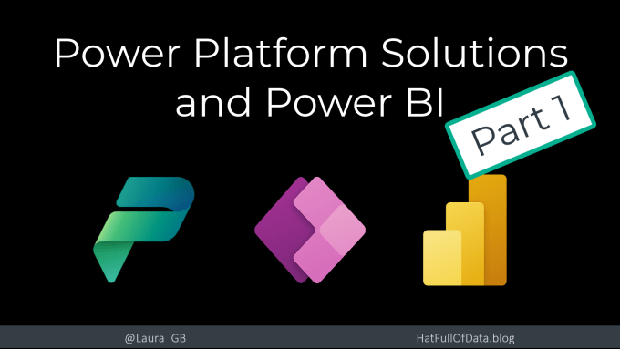
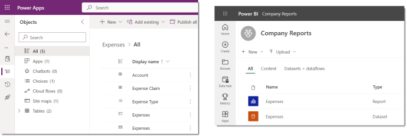
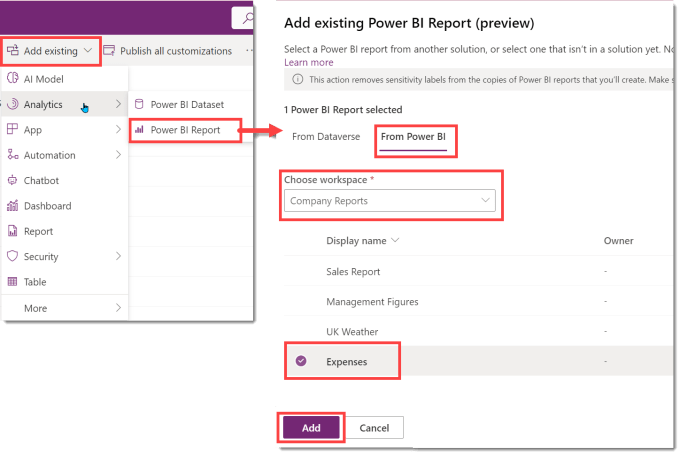
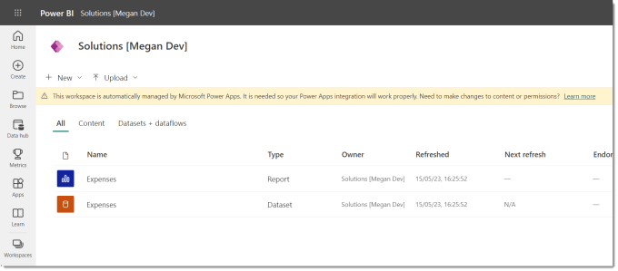
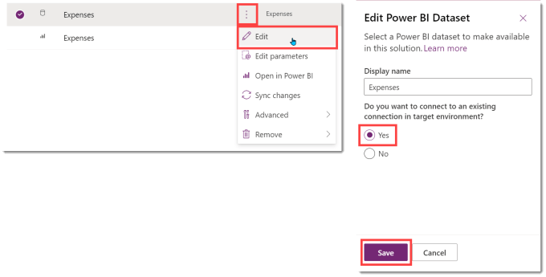

Power BI reports can be an important part of a Power Platform solution. Microsoft has added a new feature to Power Platform Solutions to add a Power BI dataset and report. Then you can add the Power BI report in as a dashboard or as an embedded report in a form and add context filtering. Part 1 will cover adding the Power BI dataset and report to the solution.

## Series

- [Part 1 – Add Power BI dataset and report to solution](https://hatfullofdata.blog/power-platform-solution-and-power-bi-part-1/)

- [Part 2 – Show report in a dashboard](https://hatfullofdata.blog/power-platform-solution-and-power-bi-part-2/)

- [Part 3 – Embed report in a form and add context filtering](https://hatfullofdata.blog/power-platform-solution-and-power-bi-part-3/)

## YouTube Version

## Preparation

For this post I have a Power Platform solution already. I have a Power BI report connected to the environment and published to a workspace.

## Add Power BI to Power Platform Solution

First task is to add the Power BI report to the solution. Start by clicking on Add Existing and from Analytics selecting Power BI report. This will bring the underlying dataset in as well. Then click on From Power BI which will show you a workspace drop down*.

From the drop down, we select the right workspace and then the right report. Then we click on Add.

It takes a while for the dataset and report to be added. Behind the scenes a new workspace is created and the report is copied to there. If you don’t have permission to create a workspace you will get errors.

## Checking the New Workspace

I recommend that you check the workspace. Check the credentials in the dataset and refresh the dataset and finally make sure the report opens and shows data. Remember to setup a refresh schedule if your report needs it.

Note the message across the top telling you that this is a workspace connected to a solution and the workspace icon is the Power Apps icon.

## Finishing the connection part

The report is connected to this environment’s Dataverse. When the solution is exported and imported the report needs to be connected to the new environment’s Dataverse.

In the solution, I clicked on the three dots and selected Edit. Then a pane will appear on the right. Then select Yes from for the existing connection question and click Save.

## Conclusion and Resources

Congratulations, you now have a solution that includes a Power BI report.

This is just Part 1. The future parts will cover adding a dashboard and an embedded report. Here are the resources I have used.[About Power BI in Power Apps Solutions – Power BI | Microsoft Learn](https://learn.microsoft.com/en-us/power-bi/collaborate-share/service-power-bi-powerapps-integration-about)

## More Power BI Posts

- [Conditional Formatting Update](https://hatfullofdata.blog/power-bi-conditional-formatting-update/)

- [Data Refresh Date](https://hatfullofdata.blog/power-bi-data-refresh-date/)

- [Using Inactive Relationships in a Measure](https://hatfullofdata.blog/power-bi-inactive-relationships-in-a-measure/)

- [DAX CrossFilter Function](https://hatfullofdata.blog/power-bi-dax-crossfilter-function/)

- [COALESCE Function to Remove Blanks](https://hatfullofdata.blog/power-bi-coalesce-function-to-remove-blanks/)

- [Personalize Visuals](https://hatfullofdata.blog/power-bi-personalize-visuals/)

- [Gradient Legends](https://hatfullofdata.blog/power-bi-gradient-legends/)

- [Endorse a Dataset as Promoted or Certified](https://hatfullofdata.blog/power-bi-endorse-a-dataset/)

- [Q&A Synonyms Update](https://hatfullofdata.blog/power-bi-qa-synonyms-update/)

- [Import Text Using Examples](https://hatfullofdata.blog/power-bi-import-text-using-examples/)

- [Paginated Report Resources](https://hatfullofdata.blog/paginated-report-resources/)

- [Refreshing Datasets Automatically with Power BI Dataflows](https://hatfullofdata.blog/refreshing-datasets-automatically-with-dataflow/)

- [Charticulator](https://hatfullofdata.blog/charticulator-simple-custom-chart/)

- [Dataverse Connector – July 2022 Update](https://hatfullofdata.blog/power-bi-dataverse-connector-july-2022-update/)

- [Dataverse Choice Columns](https://hatfullofdata.blog/power-bi-dataverse-choices-and-choice-column/)

- [Switch Dataverse Tenancy](https://hatfullofdata.blog/power-bi-switch-dataverse-tenancy/)

- [Connecting to Google Analytics](https://hatfullofdata.blog/power-bi-connecting-to-google-analytics/)

- [Take Over a Dataset](https://hatfullofdata.blog/power-bi-take-over-a-dataset/)

- [Export Data from Power BI Visuals](https://hatfullofdata.blog/export-data-from-power-bi-visuals/)

- [Embed a Paginated Report](https://hatfullofdata.blog/power-bi-embed-a-paginated-report/)

- [Using SQL on Dataverse for Power BI](https://hatfullofdata.blog/using-sql-on-dataverse-for-power-bi/)

- [Power Platform Solution and Power BI Series](https://hatfullofdata.blog/power-platform-solution-and-power-bi-part-1/)

- [Creating a Custom Smart Narrative](https://hatfullofdata.blog/power-bi-creating-a-custom-smart-narrative/)

- [Power Automate Button in a Power BI Report](https://hatfullofdata.blog/power-automate-button-in-a-power-bi-report/)

## Power BI Series

- [SVG in Power BI series](https://hatfullofdata.blog/svg-in-power-bi-part-1-svg-basics/)

- [Power BI and Project Online series](https://hatfullofdata.blog/power-bi-connecting-to-project-online/)

- [Slicers series](https://hatfullofdata.blog/power-bi-slicers-introduction/)

- [Dataflow series](https://hatfullofdata.blog/power-bi-create-a-dataflow/)

- [Power BI SVG series](https://hatfullofdata.blog/svg-in-power-bi-part-1-svg-basics/)

- [Power Automate and Power BI Rest API series](https://hatfullofdata.blog/power-automate-and-power-bi-rest-api/)

- [Power BI and DevOps series](https://hatfullofdata.blog/devops-data-into-power-bi/)

