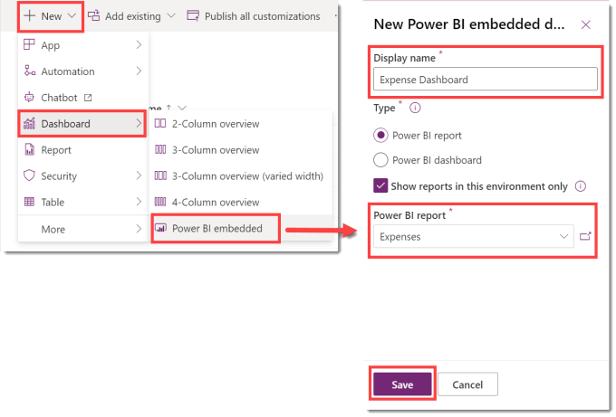
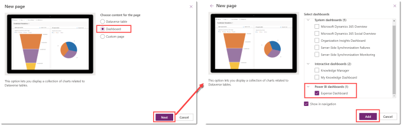

## Intro – Add a Dashboard

In Part 1 we added a Power BI dataset and report to a Power Platform Solution. In Part 2 we will create a dashboard and add it to the model driven app.

## Series

- [Part 1 – Add Power BI dataset and report to solution](https://hatfullofdata.blog/power-platform-solution-and-power-bi-part-1/)

- [Part 2 – Show report in a dashboard](https://hatfullofdata.blog/power-platform-solution-and-power-bi-part-2/)

- [Part 3 – Embed report in a form and add context filtering](https://hatfullofdata.blog/power-platform-solution-and-power-bi-part-3/)

## YouTube Version

## Create the Dashboard

In the solution click on +New and select Dashboard and then Power BI embedded. When the pane on the right hand side loads, enter in a name for your dashboard. Then make sure Power BI report is selected and select your report from the drop down.

## Add the Dashboard to the App in the Power Platform Solution

After the dashboard has been added, you can add the dashboard to a model driven app. Edit the app by clicking on the name of it in the Power Platform Solution. Then click on Add Page and the New page dialog appears. On the first page select Dashboard and then click Next. Then on the next page, select your report, probably at the bottom of the list. Finally click Add to add the dashboard to your app.

### Note

At the time of publishing there is a small bug that the report doesn’t show correctly in edit mode but if you publish all customisations it fixes it in play mode. Remember this feature

## Testing the Report

As with any addition to a development you should test the report works. In my example the report is a direct query. So my test is check the dashboard, then add a new expense record and then return to the dashboard to check the new record is showing.

## Conclusion

For some projects this is enough, an embedded dashboard in the model driven app. The next post will be to add an embedded report into a form.

As in Part 1 here are the resources I’ve used

[About Power BI in Power Apps Solutions – Power BI | Microsoft Learn](https://learn.microsoft.com/en-us/power-bi/collaborate-share/service-power-bi-powerapps-integration-about)

## More Power BI Posts

- [Conditional Formatting Update](https://hatfullofdata.blog/power-bi-conditional-formatting-update/)

- [Data Refresh Date](https://hatfullofdata.blog/power-bi-data-refresh-date/)

- [Using Inactive Relationships in a Measure](https://hatfullofdata.blog/power-bi-inactive-relationships-in-a-measure/)

- [DAX CrossFilter Function](https://hatfullofdata.blog/power-bi-dax-crossfilter-function/)

- [COALESCE Function to Remove Blanks](https://hatfullofdata.blog/power-bi-coalesce-function-to-remove-blanks/)

- [Personalize Visuals](https://hatfullofdata.blog/power-bi-personalize-visuals/)

- [Gradient Legends](https://hatfullofdata.blog/power-bi-gradient-legends/)

- [Endorse a Dataset as Promoted or Certified](https://hatfullofdata.blog/power-bi-endorse-a-dataset/)

- [Q&A Synonyms Update](https://hatfullofdata.blog/power-bi-qa-synonyms-update/)

- [Import Text Using Examples](https://hatfullofdata.blog/power-bi-import-text-using-examples/)

- [Paginated Report Resources](https://hatfullofdata.blog/paginated-report-resources/)

- [Refreshing Datasets Automatically with Power BI Dataflows](https://hatfullofdata.blog/refreshing-datasets-automatically-with-dataflow/)

- [Charticulator](https://hatfullofdata.blog/charticulator-simple-custom-chart/)

- [Dataverse Connector – July 2022 Update](https://hatfullofdata.blog/power-bi-dataverse-connector-july-2022-update/)

- [Dataverse Choice Columns](https://hatfullofdata.blog/power-bi-dataverse-choices-and-choice-column/)

- [Switch Dataverse Tenancy](https://hatfullofdata.blog/power-bi-switch-dataverse-tenancy/)

- [Connecting to Google Analytics](https://hatfullofdata.blog/power-bi-connecting-to-google-analytics/)

- [Take Over a Dataset](https://hatfullofdata.blog/power-bi-take-over-a-dataset/)

- [Export Data from Power BI Visuals](https://hatfullofdata.blog/export-data-from-power-bi-visuals/)

- [Embed a Paginated Report](https://hatfullofdata.blog/power-bi-embed-a-paginated-report/)

- [Using SQL on Dataverse for Power BI](https://hatfullofdata.blog/using-sql-on-dataverse-for-power-bi/)

- [Power Platform Solution and Power BI Series](https://hatfullofdata.blog/power-platform-solution-and-power-bi-part-1/)

- [Creating a Custom Smart Narrative](https://hatfullofdata.blog/power-bi-creating-a-custom-smart-narrative/)

- [Power Automate Button in a Power BI Report](https://hatfullofdata.blog/power-automate-button-in-a-power-bi-report/)

## Power BI Series

- [SVG in Power BI series](https://hatfullofdata.blog/svg-in-power-bi-part-1-svg-basics/)

- [Power BI and Project Online series](https://hatfullofdata.blog/power-bi-connecting-to-project-online/)

- [Slicers series](https://hatfullofdata.blog/power-bi-slicers-introduction/)

- [Dataflow series](https://hatfullofdata.blog/power-bi-create-a-dataflow/)

- [Power BI SVG series](https://hatfullofdata.blog/svg-in-power-bi-part-1-svg-basics/)

- [Power Automate and Power BI Rest API series](https://hatfullofdata.blog/power-automate-and-power-bi-rest-api/)

- [Power BI and DevOps series](https://hatfullofdata.blog/devops-data-into-power-bi/)

