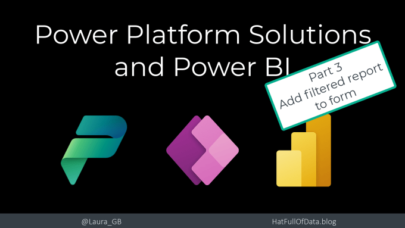
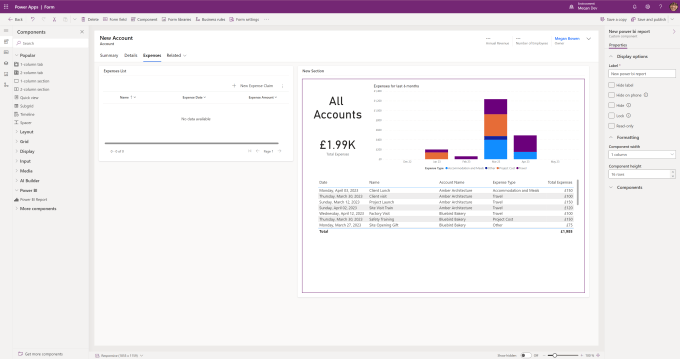
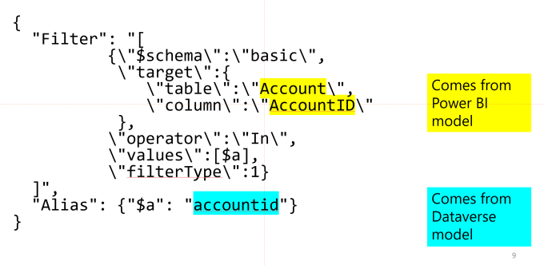
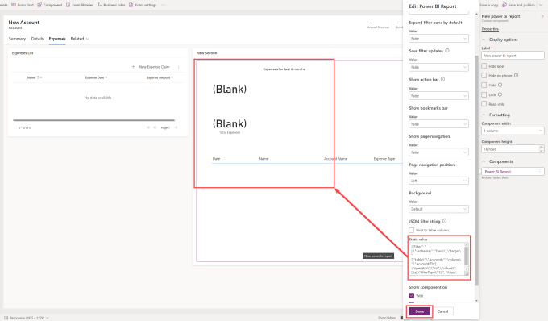
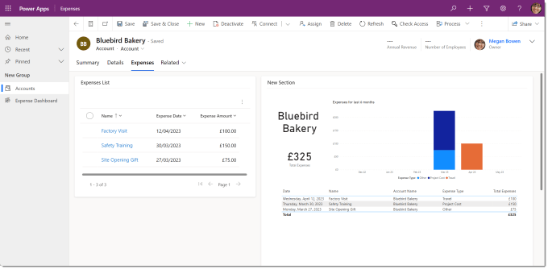

In Part 1 we added Power BI to the Power Platform solution and then in Part 2 we added a dashboard. This is post we will embed the report into a form and filter the report to match the context of the form. For this we will use the Accounts form and filter the expenses report to only show the expenses related to one account.

## Series

- [Part 1 – Add Power BI dataset and report to solution](https://hatfullofdata.blog/power-platform-solution-and-power-bi-part-1/)

- [Part 2 – Show report in a dashboard](https://hatfullofdata.blog/power-platform-solution-and-power-bi-part-2/)

- [Part 3 – Embed report in a form and add context filtering](https://hatfullofdata.blog/power-platform-solution-and-power-bi-part-3/)

## YouTube Version

[](https://youtu.be/JoaBoL2ljcM)

## Embed the report into a form.

In my Power Platform solution, the Accounts table has one form included. When I edit the form I can see that I previously added a tab for expenses. On that tab there is an empty section, ready to insert the report.

In the left hand side menu, select components and expand Power BI. Drag and drop Power BI report into the blank section. An pane appears asking lots of questions regarding showing various parts. For now leave all of them as default and click Done. The unfiltered report should appear.



## Filtering the embedded report.

The report needs to be filtered to only show the expenses of the selected account. With the report selected you will get the properties pane showing on the right hand side. Expand Components and click on Power BI Report. In the pane that appears, same as before find JSON filter string. You need a JSON string to put in the Static value.

The filter we are going to apply is straight forward match the account id on the form with the account id in the report. We need 3 bits of information

- Power BI Report table name – Account

- Power BI Report column name for the account id – AccountID

- Dataverse logical column name for account id – accountid

You must get the case and of course the spelling right. We then insert these into a json string. The whole string must be on one line, no returns and tabs to make it pretty. Below is an image to explain the parts and below that is the code I used.



Copy CodeCopiedUse a different Browser
```xml
{"Filter": "[{\"$schema\":\"basic\",\"target\": {\"table\":\"Account\",\"column\":\"AccountID\"}, \"operator\":\"In\",\"values\":[$a],\"filterType\":1}]", "Alias": {"$a": "accountid"}}
```

When editing a form in Dataverse, the form is in new record mode so if you have the filter right the report should filter to nothing. When it is working click Done and Save and Publish your form.



## Testing the form

Make sure you test your form. Open your app, open an account and look at the expenses and the report. If your report is a direct query report you should be able to add a new record and the report update.



## Conclusion

The three posts combined gives us the building blocks to include Power BI in our Power Platform Solutions. I’m hoping more Power BI artefacts such as dataflows also get included in time. There will be future posts, let me know what you want me to do.

Here are the resources I used[About Power BI in Power Apps Solutions – Power BI | Microsoft Learn](https://learn.microsoft.com/en-us/power-bi/collaborate-share/service-power-bi-powerapps-integration-about)

## More Power BI Posts

- [Conditional Formatting Update](https://hatfullofdata.blog/power-bi-conditional-formatting-update/)

- [Data Refresh Date](https://hatfullofdata.blog/power-bi-data-refresh-date/)

- [Using Inactive Relationships in a Measure](https://hatfullofdata.blog/power-bi-inactive-relationships-in-a-measure/)

- [DAX CrossFilter Function](https://hatfullofdata.blog/power-bi-dax-crossfilter-function/)

- [COALESCE Function to Remove Blanks](https://hatfullofdata.blog/power-bi-coalesce-function-to-remove-blanks/)

- [Personalize Visuals](https://hatfullofdata.blog/power-bi-personalize-visuals/)

- [Gradient Legends](https://hatfullofdata.blog/power-bi-gradient-legends/)

- [Endorse a Dataset as Promoted or Certified](https://hatfullofdata.blog/power-bi-endorse-a-dataset/)

- [Q&A Synonyms Update](https://hatfullofdata.blog/power-bi-qa-synonyms-update/)

- [Import Text Using Examples](https://hatfullofdata.blog/power-bi-import-text-using-examples/)

- [Paginated Report Resources](https://hatfullofdata.blog/paginated-report-resources/)

- [Refreshing Datasets Automatically with Power BI Dataflows](https://hatfullofdata.blog/refreshing-datasets-automatically-with-dataflow/)

- [Charticulator](https://hatfullofdata.blog/charticulator-simple-custom-chart/)

- [Dataverse Connector – July 2022 Update](https://hatfullofdata.blog/power-bi-dataverse-connector-july-2022-update/)

- [Dataverse Choice Columns](https://hatfullofdata.blog/power-bi-dataverse-choices-and-choice-column/)

- [Switch Dataverse Tenancy](https://hatfullofdata.blog/power-bi-switch-dataverse-tenancy/)

- [Connecting to Google Analytics](https://hatfullofdata.blog/power-bi-connecting-to-google-analytics/)

- [Take Over a Dataset](https://hatfullofdata.blog/power-bi-take-over-a-dataset/)

- [Export Data from Power BI Visuals](https://hatfullofdata.blog/export-data-from-power-bi-visuals/)

- [Embed a Paginated Report](https://hatfullofdata.blog/power-bi-embed-a-paginated-report/)

- [Using SQL on Dataverse for Power BI](https://hatfullofdata.blog/using-sql-on-dataverse-for-power-bi/)

- [Power Platform Solution and Power BI Series](https://hatfullofdata.blog/power-platform-solution-and-power-bi-part-1/)

- [Creating a Custom Smart Narrative](https://hatfullofdata.blog/power-bi-creating-a-custom-smart-narrative/)

- [Power Automate Button in a Power BI Report](https://hatfullofdata.blog/power-automate-button-in-a-power-bi-report/)

## Power BI Series

- [SVG in Power BI series](https://hatfullofdata.blog/svg-in-power-bi-part-1-svg-basics/)

- [Power BI and Project Online series](https://hatfullofdata.blog/power-bi-connecting-to-project-online/)

- [Slicers series](https://hatfullofdata.blog/power-bi-slicers-introduction/)

- [Dataflow series](https://hatfullofdata.blog/power-bi-create-a-dataflow/)

- [Power BI SVG series](https://hatfullofdata.blog/svg-in-power-bi-part-1-svg-basics/)

- [Power Automate and Power BI Rest API series](https://hatfullofdata.blog/power-automate-and-power-bi-rest-api/)

- [Power BI and DevOps series](https://hatfullofdata.blog/devops-data-into-power-bi/)

