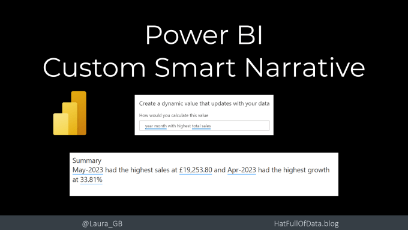
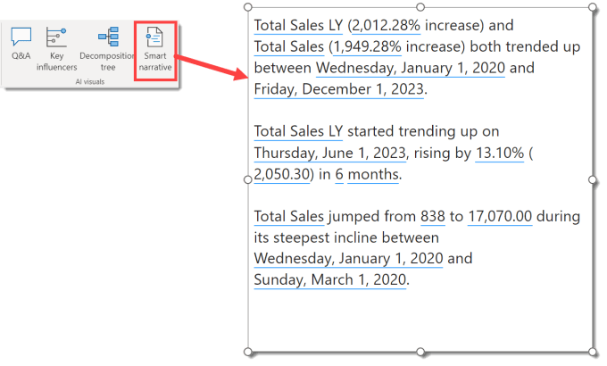
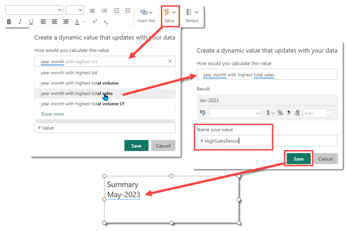
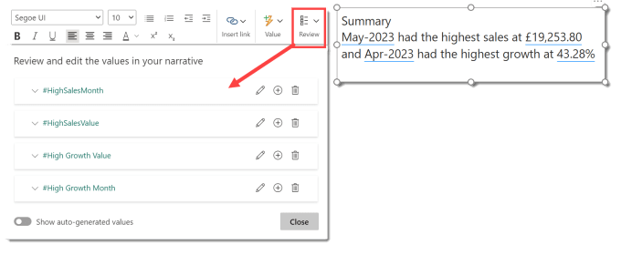

Power BI desktop includes the Smart Narrative visual. This will summarise a page or visual in your report for you. Often though the summary it produces is not the summary you would have written. This post will show you how to write your own custom smart narrative that updates and filters exactly the same as the standard smart narrative.

## YouTube Version

## What is the Smart Narrative?

With a report open in Power BI desktop, you can add a standard Smart narrative by selecting Smart Narrative from the Insert ribbon. It will create text based on the visuals on that page. It doesn’t support all visuals and although can be very good it is very generic.

More instructions and information can be found at [https://learn.microsoft.com/en-us/power-bi/visuals/power-bi-visualization-smart-narrative](https://learn.microsoft.com/en-us/power-bi/visuals/power-bi-visualization-smart-narrative)

## Create your own custom smart narrative

The smart narrative is a text box with some generated text added. The clever part is adding values to that text box.

Start by adding a text box to your report. Position it and start to add some text.

When you want to add a dynamic result to the text click on the Value button on the Text box ribbon. Describe what you would like to calculate. If the dialog offers suggestions as to what you mean click on the correct one. When you click Save, the value will be entered into the text box.

Formatting to numbers could be applied when creating a text box value. Weirdly you cannot use the same name for values in different text boxes unless you copy and paste the text box then its fine. The values cannot transfer into any other visual either, use measures for that.

## Reviewing the Values

When you added values to your custom smart narrative you hopefully remembered to name them. This helps when you go to review the values. Click on Review to list the values. You can click on edit on any value to confirm what question you asked, rename or apply extra formatting

## Resources

The report and the data source used in this blog post can be found on my [Github](https://github.com/Laura-GB/DemoData#readme)

- Power BI Report – [https://github.com/Laura-GB/DemoData/raw/main/Sales%20Data.pbix](https://github.com/Laura-GB/DemoData/raw/main/Sales%20Data.pbix)

- Excel file [https://github.com/Laura-GB/DemoData/raw/main/Sales%20Data.xlsx](https://github.com/Laura-GB/DemoData/raw/main/Sales%20Data.xlsx)

## Conclusion

Know your audience, does a summary paragraph work for them? If it doesn’t then stick to visuals that work for them. Some clients love a description others just prefer a batch of cards showing the same values.

## More Power BI Posts

- [Conditional Formatting Update](https://hatfullofdata.blog/power-bi-conditional-formatting-update/)

- [Data Refresh Date](https://hatfullofdata.blog/power-bi-data-refresh-date/)

- [Using Inactive Relationships in a Measure](https://hatfullofdata.blog/power-bi-inactive-relationships-in-a-measure/)

- [DAX CrossFilter Function](https://hatfullofdata.blog/power-bi-dax-crossfilter-function/)

- [COALESCE Function to Remove Blanks](https://hatfullofdata.blog/power-bi-coalesce-function-to-remove-blanks/)

- [Personalize Visuals](https://hatfullofdata.blog/power-bi-personalize-visuals/)

- [Gradient Legends](https://hatfullofdata.blog/power-bi-gradient-legends/)

- [Endorse a Dataset as Promoted or Certified](https://hatfullofdata.blog/power-bi-endorse-a-dataset/)

- [Q&A Synonyms Update](https://hatfullofdata.blog/power-bi-qa-synonyms-update/)

- [Import Text Using Examples](https://hatfullofdata.blog/power-bi-import-text-using-examples/)

- [Paginated Report Resources](https://hatfullofdata.blog/paginated-report-resources/)

- [Refreshing Datasets Automatically with Power BI Dataflows](https://hatfullofdata.blog/refreshing-datasets-automatically-with-dataflow/)

- [Charticulator](https://hatfullofdata.blog/charticulator-simple-custom-chart/)

- [Dataverse Connector – July 2022 Update](https://hatfullofdata.blog/power-bi-dataverse-connector-july-2022-update/)

- [Dataverse Choice Columns](https://hatfullofdata.blog/power-bi-dataverse-choices-and-choice-column/)

- [Switch Dataverse Tenancy](https://hatfullofdata.blog/power-bi-switch-dataverse-tenancy/)

- [Connecting to Google Analytics](https://hatfullofdata.blog/power-bi-connecting-to-google-analytics/)

- [Take Over a Dataset](https://hatfullofdata.blog/power-bi-take-over-a-dataset/)

- [Export Data from Power BI Visuals](https://hatfullofdata.blog/export-data-from-power-bi-visuals/)

- [Embed a Paginated Report](https://hatfullofdata.blog/power-bi-embed-a-paginated-report/)

- [Using SQL on Dataverse for Power BI](https://hatfullofdata.blog/using-sql-on-dataverse-for-power-bi/)

- [Power Platform Solution and Power BI Series](https://hatfullofdata.blog/power-platform-solution-and-power-bi-part-1/)

- [Creating a Custom Smart Narrative](https://hatfullofdata.blog/power-bi-creating-a-custom-smart-narrative/)

- [Power Automate Button in a Power BI Report](https://hatfullofdata.blog/power-automate-button-in-a-power-bi-report/)

## Power BI Series

- [SVG in Power BI series](https://hatfullofdata.blog/svg-in-power-bi-part-1-svg-basics/)

- [Power BI and Project Online series](https://hatfullofdata.blog/power-bi-connecting-to-project-online/)

- [Slicers series](https://hatfullofdata.blog/power-bi-slicers-introduction/)

- [Dataflow series](https://hatfullofdata.blog/power-bi-create-a-dataflow/)

- [Power BI SVG series](https://hatfullofdata.blog/svg-in-power-bi-part-1-svg-basics/)

- [Power Automate and Power BI Rest API series](https://hatfullofdata.blog/power-automate-and-power-bi-rest-api/)

- [Power BI and DevOps series](https://hatfullofdata.blog/devops-data-into-power-bi/)

