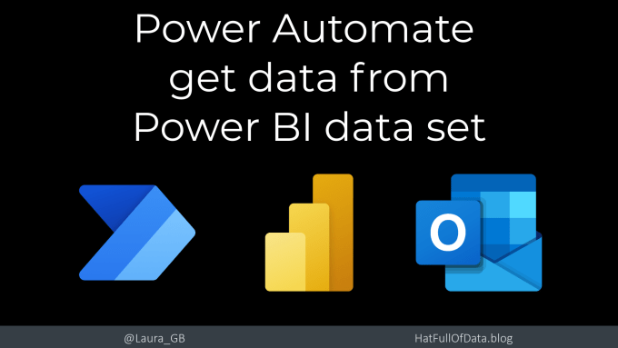
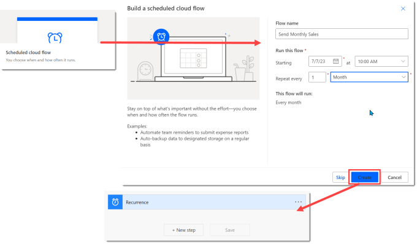
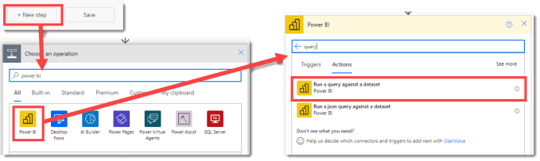
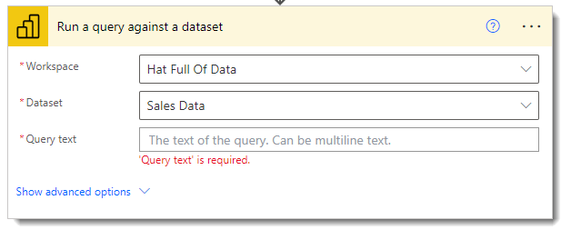
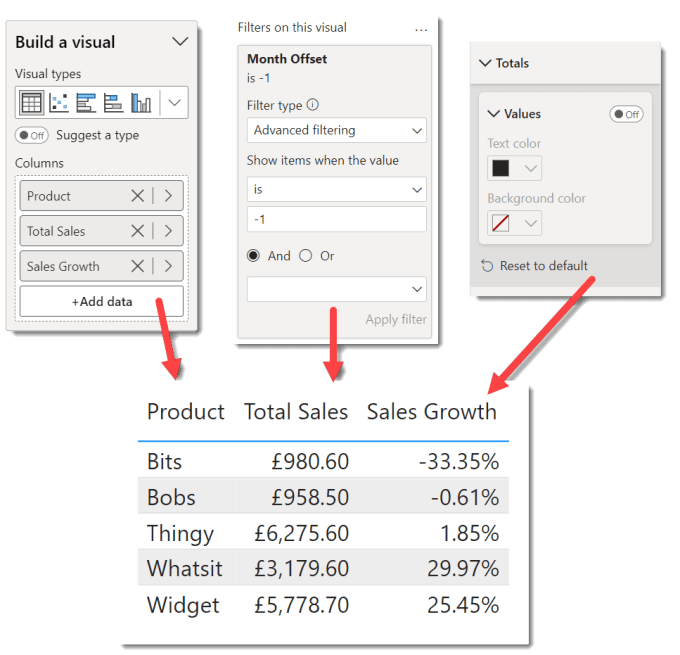
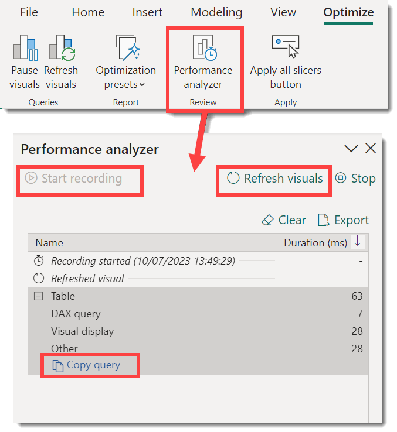
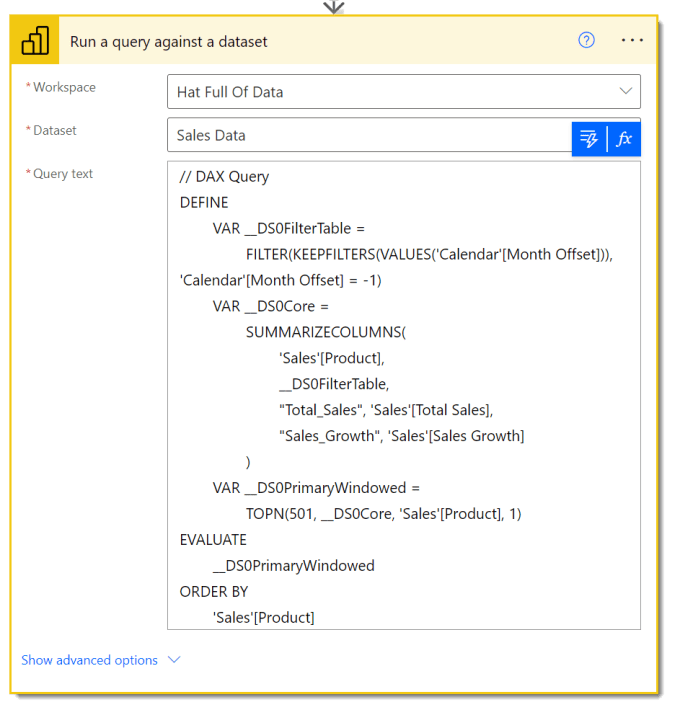
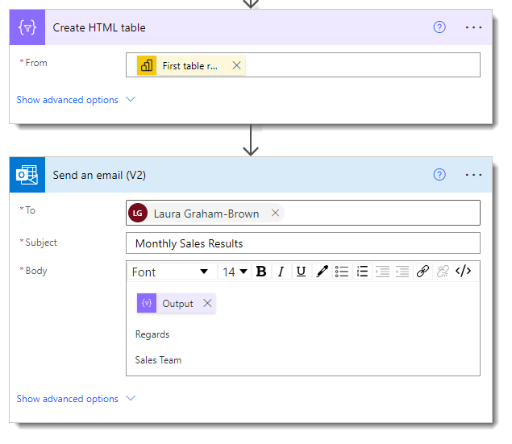
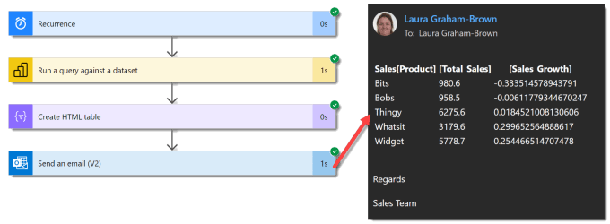

Power BI datasets contain a rich useful data resource that would be really useful in a Power Automate flow. In this post we will walk through how to get data from a Power BI dataset and then email that data. This is just one example of how you could use data fetched from a Power BI dataset behind a report.

## YouTube Version

## Starting the Flow

In this example we want to send a monthly quick summary. So I started by creating a scheduled email, repeated every month. After I enter the flow name and change the repeat to every month rather than the default every minute! Now I can press Create, which after a few moments creates a flow with the recurrence step.

## Fetch Data using a Power BI step

Click on New step to start the process. In the search box type in Power BI and click on the Power BI tile when it appears. Now you can search the Power BI actions. In the search box enter in query and this will filter to 2 actions. The action we want is Run a query against a dataset.[1](#footnote_1_1771)

When the step appears, I select the Workspace and Dataset I am interested in. The query text is expecting a DAX statement. Don’t worry you don’t have to write the DAX by hand, we can get Power BI desktop to do it for us.

## Writing the Query Text

Power BI desktop can write the query text for you. You need to open the Power BI report or a report connected to the dataset. On a blank page add a table visual. Populate the table with the data you want to use in Power Automate remember to apply the correct filters. I also recommend you remove totals unless you want the totals row in your data.

In my example the table shows Total Sales and Sales Growth for products in the previous month, using Offset Month column from my calendar.

After creating the table, on the Optimize ribbon tab click on Performance analyzer[2](#footnote_2_1771). When the pane appears on the right hand side, click on Start Recording. Then you click on Refresh Visuals. This tool is usually used for analysing how long each visual takes to refresh and part of that is to provide the query being run.

Expand the Table line by clicking on the +. Then click on Copy Query. Now you can return to the flow in Power Automate and paste the query into the query box.

## Sending the Email

The final part of this process is to create the email to send the details. The Power BI step returns an array of the rows of data. The Send an Email action would like this array converted into a html table. So we need 2 actions, create HTML table and Send an email. I am not going to make the table or email pretty. That is a separate post!

## Testing the flow

I would test as I added each action to the flow, even on a short flow. Obviously once completed I’d test again.

## Resources

The report used for this example can be found on my [GitHub](https://github.com/Laura-GB/DemoData#readme)

- Power BI Report – [https://github.com/Laura-GB/DemoData/raw/main/Sales%20Data.pbix](https://github.com/Laura-GB/DemoData/raw/main/Sales%20Data.pbix)

- Excel file [https://github.com/Laura-GB/DemoData/raw/main/Sales%20Data.xlsx](https://github.com/Laura-GB/DemoData/raw/main/Sales%20Data.xlsx)

## Conclusion

Remember its Power Automate not Power Integrate. So yes you can load a long list into Power Automate but this is not a good tool to load large quantities of data into a new system. This is a brilliant feature though that unlocks data in a dataset for an automation process.

## More Power Automate Posts

- [Creating Adaptive Cards](https://hatfullofdata.blog/microsoft-flow-creating-adaptive-cards/)

- [Refreshing Datasets Automatically with Power BI Dataflows](https://hatfullofdata.blog/refreshing-datasets-automatically-with-dataflow/)

- [Power Automate Child Flow](https://hatfullofdata.blog/power-automate-child-flow/)

- [Get data from a Power BI dataset](https://hatfullofdata.blog/power-automate-get-data-from-a-power-bi-dataset/)

- [Power Automate Button in a Power BI Report](https://hatfullofdata.blog/power-automate-button-in-a-power-bi-report/)

- [Write Me a Flow](https://hatfullofdata.blog/power-automate-write-me-a-flow/)

- [Power Automate and DevOps series](https://hatfullofdata.blog/connecting-power-automate-to-devops/)

- [Power Automate and Power BI Rest API series](https://hatfullofdata.blog/power-automate-and-power-bi-rest-api/)

- [Save a File to OneLake Lakehouse](https://hatfullofdata.blog/power-automate-save-a-file-to-onelake-lakehouse/)

- [Trigger Microsoft Fabric Data Pipeline using Power Automate](https://hatfullofdata.blog/trigger-microsoft-fabric-data-pipeline/)

## More Power BI Posts

- [Conditional Formatting Update](https://hatfullofdata.blog/power-bi-conditional-formatting-update/)

- [Data Refresh Date](https://hatfullofdata.blog/power-bi-data-refresh-date/)

- [Using Inactive Relationships in a Measure](https://hatfullofdata.blog/power-bi-inactive-relationships-in-a-measure/)

- [DAX CrossFilter Function](https://hatfullofdata.blog/power-bi-dax-crossfilter-function/)

- [COALESCE Function to Remove Blanks](https://hatfullofdata.blog/power-bi-coalesce-function-to-remove-blanks/)

- [Personalize Visuals](https://hatfullofdata.blog/power-bi-personalize-visuals/)

- [Gradient Legends](https://hatfullofdata.blog/power-bi-gradient-legends/)

- [Endorse a Dataset as Promoted or Certified](https://hatfullofdata.blog/power-bi-endorse-a-dataset/)

- [Q&A Synonyms Update](https://hatfullofdata.blog/power-bi-qa-synonyms-update/)

- [Import Text Using Examples](https://hatfullofdata.blog/power-bi-import-text-using-examples/)

- [Paginated Report Resources](https://hatfullofdata.blog/paginated-report-resources/)

- [Refreshing Datasets Automatically with Power BI Dataflows](https://hatfullofdata.blog/refreshing-datasets-automatically-with-dataflow/)

- [Charticulator](https://hatfullofdata.blog/charticulator-simple-custom-chart/)

- [Dataverse Connector – July 2022 Update](https://hatfullofdata.blog/power-bi-dataverse-connector-july-2022-update/)

- [Dataverse Choice Columns](https://hatfullofdata.blog/power-bi-dataverse-choices-and-choice-column/)

- [Switch Dataverse Tenancy](https://hatfullofdata.blog/power-bi-switch-dataverse-tenancy/)

- [Connecting to Google Analytics](https://hatfullofdata.blog/power-bi-connecting-to-google-analytics/)

- [Take Over a Dataset](https://hatfullofdata.blog/power-bi-take-over-a-dataset/)

- [Export Data from Power BI Visuals](https://hatfullofdata.blog/export-data-from-power-bi-visuals/)

- [Embed a Paginated Report](https://hatfullofdata.blog/power-bi-embed-a-paginated-report/)

- [Using SQL on Dataverse for Power BI](https://hatfullofdata.blog/using-sql-on-dataverse-for-power-bi/)

- [Power Platform Solution and Power BI Series](https://hatfullofdata.blog/power-platform-solution-and-power-bi-part-1/)

- [Creating a Custom Smart Narrative](https://hatfullofdata.blog/power-bi-creating-a-custom-smart-narrative/)

- [Power Automate Button in a Power BI Report](https://hatfullofdata.blog/power-automate-button-in-a-power-bi-report/)

## Power BI Series

- [SVG in Power BI series](https://hatfullofdata.blog/svg-in-power-bi-part-1-svg-basics/)

- [Power BI and Project Online series](https://hatfullofdata.blog/power-bi-connecting-to-project-online/)

- [Slicers series](https://hatfullofdata.blog/power-bi-slicers-introduction/)

- [Dataflow series](https://hatfullofdata.blog/power-bi-create-a-dataflow/)

- [Power BI SVG series](https://hatfullofdata.blog/svg-in-power-bi-part-1-svg-basics/)

- [Power Automate and Power BI Rest API series](https://hatfullofdata.blog/power-automate-and-power-bi-rest-api/)

- [Power BI and DevOps series](https://hatfullofdata.blog/devops-data-into-power-bi/)

- The other action I have no idea how it works and have yet to find any documentation [[↩](#identifier_1_1771)]
- In earlier versions of Power BI it was on the view ribbon [[↩](#identifier_2_1771)]

