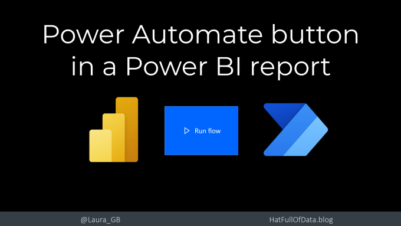
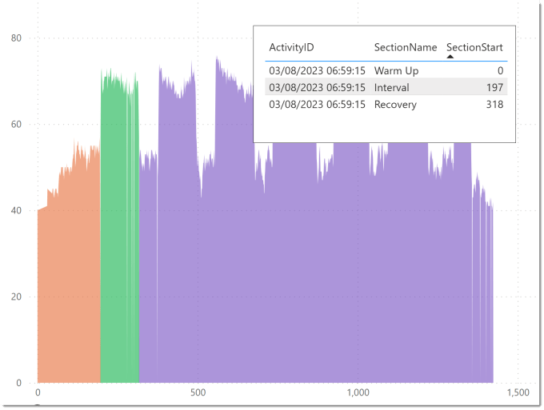
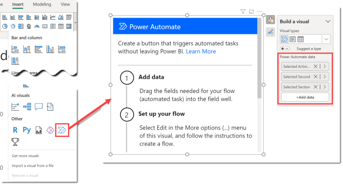
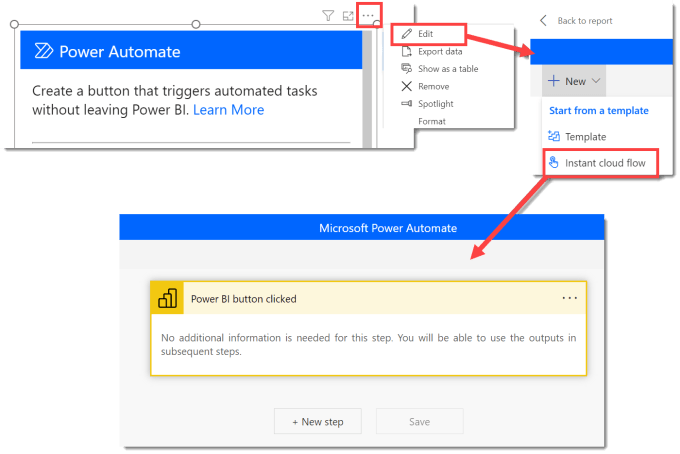
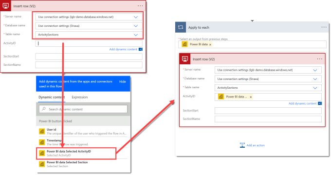
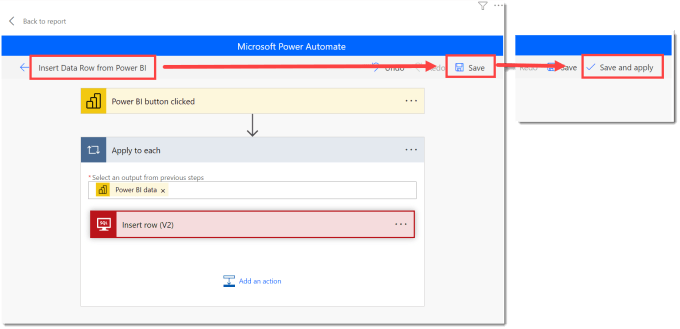
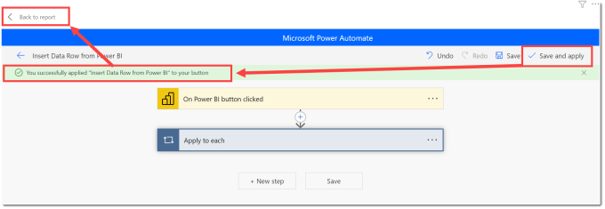

You can add an action to a Power BI report by adding a Power Automate button. The button will trigger a flow to run and perform actions. You add data to be used in the flow. In this post I will show to use a flow to add a row to a table that the report is connected to.

## YouTube Version

## Problem Definition

The report is connected to a table in a database that contains the start times of sections in a bike ride. The section times are used to for calculations and colouring charts. There are three measures that calculate the values to put in a new row of data. I want a Power Automate button to insert a row into my database table.

## Add a Power Automate Button

From the Insert ribbon tab in Power BI desktop, we select the Power Automate visual. It’s right down the bottom under Other. This will add you a visual that includes instructions. The first step is adding data to the visual that will get passed into the flow. I have added my three measures.

## Creating the flow

After you add the data, the next step creates the flow. Click on the … link on the top of the visual and select Edit. This will open a window in Power BI desktop showing you templates and any existing flows that you have.

In the top left, select New and select Instant cloud flow. Then the window moves to give you Power Automate flow editor inside Power BI desktop. Be aware it will be using the credentials you logged into Power BI with.

Then you can click New step and add your actions. In this example I am using SQL Server connection Action to insert a row to a table. I populate the Server name, Database name and Table name. Then the table fields appear. When I click in ActivityID, the first field the Dynamic content shows me the fields available including values I added to the Power Automate button.

When I click on Power BI data Selected Activity ID, measure from my report, it populates the box and it also puts the action into a Apply to each. This is because the values are sent to the flow in a table. When writing the flow it knows its a table so assumes it could be multiple values so therefore adds the apply to each.

There are multiple ways to handle this and convert that table into just three values, or we can accept we know the Apply to each only ever get a single row. Add a comment in your documentation to save future confusion.

## Save and Apply the Flow

When you have completed your flow. You need to add a name in the top left. Then click Save and then click Save and Apply. Yes you need to click both!

After you click Save and Apply you should get a success message in a green bar. Then you can click Back to Report in the top left.

The visual in your report will now have changed to be a blue button. And you can test it out. In Power BI desktop you need to Ctrl + click, when you publish you can just click the button.

## Formatting the Button

Similar to other Power BI visuals formatting can be applied. The blue isn’t a theme colour so I recommend selecting a theme colour so it will change with themes. You also can tweak padding, shadows and the text to make it look part of the report. I could not find a way to change the arrow icon.

## Flow Environments

A Power Automate flow lives in an Environment and developers usually get to select which environment and get to put flows into solutions ready to go through a development life cycle. When writing that flow in Power BI desktop you do not get a choice on environment. It goes into Default environment and therefore cannot be put through any development lifecycle.

One workaround / hack exists. Thank you to James Reeves who pointed it out in a [LinkedIn Post](https://www.linkedin.com/posts/powerbi-limited_re-power-automate-environment-power-bi-activity-7093135914809311232-mQ_v/). It works currently but its a hack and should be treated as such.

## Flow Permissions and licences

When the flow runs it runs as the user who clicks the button. This means firstly the user must have access to the flow, so don’t forget to share it and if like in my example it uses premium connectors the user needs the right licences.

## Conclusion

Adding a way to react to the data and do write is great and Power Automate does it pretty well. There are some missing features though, I’d like to select environment for the flow and be able to select a flow from the solution I’ve added the Power BI report to. And then include that in the solution lifecycle management.

## More Power Automate Posts

- [Creating Adaptive Cards](https://hatfullofdata.blog/microsoft-flow-creating-adaptive-cards/)

- [Refreshing Datasets Automatically with Power BI Dataflows](https://hatfullofdata.blog/refreshing-datasets-automatically-with-dataflow/)

- [Power Automate Child Flow](https://hatfullofdata.blog/power-automate-child-flow/)

- [Get data from a Power BI dataset](https://hatfullofdata.blog/power-automate-get-data-from-a-power-bi-dataset/)

- [Power Automate Button in a Power BI Report](https://hatfullofdata.blog/power-automate-button-in-a-power-bi-report/)

- [Write Me a Flow](https://hatfullofdata.blog/power-automate-write-me-a-flow/)

- [Power Automate and DevOps series](https://hatfullofdata.blog/connecting-power-automate-to-devops/)

- [Power Automate and Power BI Rest API series](https://hatfullofdata.blog/power-automate-and-power-bi-rest-api/)

- [Save a File to OneLake Lakehouse](https://hatfullofdata.blog/power-automate-save-a-file-to-onelake-lakehouse/)

- [Trigger Microsoft Fabric Data Pipeline using Power Automate](https://hatfullofdata.blog/trigger-microsoft-fabric-data-pipeline/)

## More Power BI Posts

- [Conditional Formatting Update](https://hatfullofdata.blog/power-bi-conditional-formatting-update/)

- [Data Refresh Date](https://hatfullofdata.blog/power-bi-data-refresh-date/)

- [Using Inactive Relationships in a Measure](https://hatfullofdata.blog/power-bi-inactive-relationships-in-a-measure/)

- [DAX CrossFilter Function](https://hatfullofdata.blog/power-bi-dax-crossfilter-function/)

- [COALESCE Function to Remove Blanks](https://hatfullofdata.blog/power-bi-coalesce-function-to-remove-blanks/)

- [Personalize Visuals](https://hatfullofdata.blog/power-bi-personalize-visuals/)

- [Gradient Legends](https://hatfullofdata.blog/power-bi-gradient-legends/)

- [Endorse a Dataset as Promoted or Certified](https://hatfullofdata.blog/power-bi-endorse-a-dataset/)

- [Q&A Synonyms Update](https://hatfullofdata.blog/power-bi-qa-synonyms-update/)

- [Import Text Using Examples](https://hatfullofdata.blog/power-bi-import-text-using-examples/)

- [Paginated Report Resources](https://hatfullofdata.blog/paginated-report-resources/)

- [Refreshing Datasets Automatically with Power BI Dataflows](https://hatfullofdata.blog/refreshing-datasets-automatically-with-dataflow/)

- [Charticulator](https://hatfullofdata.blog/charticulator-simple-custom-chart/)

- [Dataverse Connector – July 2022 Update](https://hatfullofdata.blog/power-bi-dataverse-connector-july-2022-update/)

- [Dataverse Choice Columns](https://hatfullofdata.blog/power-bi-dataverse-choices-and-choice-column/)

- [Switch Dataverse Tenancy](https://hatfullofdata.blog/power-bi-switch-dataverse-tenancy/)

- [Connecting to Google Analytics](https://hatfullofdata.blog/power-bi-connecting-to-google-analytics/)

- [Take Over a Dataset](https://hatfullofdata.blog/power-bi-take-over-a-dataset/)

- [Export Data from Power BI Visuals](https://hatfullofdata.blog/export-data-from-power-bi-visuals/)

- [Embed a Paginated Report](https://hatfullofdata.blog/power-bi-embed-a-paginated-report/)

- [Using SQL on Dataverse for Power BI](https://hatfullofdata.blog/using-sql-on-dataverse-for-power-bi/)

- [Power Platform Solution and Power BI Series](https://hatfullofdata.blog/power-platform-solution-and-power-bi-part-1/)

- [Creating a Custom Smart Narrative](https://hatfullofdata.blog/power-bi-creating-a-custom-smart-narrative/)

- [Power Automate Button in a Power BI Report](https://hatfullofdata.blog/power-automate-button-in-a-power-bi-report/)

## Power BI Series

- [SVG in Power BI series](https://hatfullofdata.blog/svg-in-power-bi-part-1-svg-basics/)

- [Power BI and Project Online series](https://hatfullofdata.blog/power-bi-connecting-to-project-online/)

- [Slicers series](https://hatfullofdata.blog/power-bi-slicers-introduction/)

- [Dataflow series](https://hatfullofdata.blog/power-bi-create-a-dataflow/)

- [Power BI SVG series](https://hatfullofdata.blog/svg-in-power-bi-part-1-svg-basics/)

- [Power Automate and Power BI Rest API series](https://hatfullofdata.blog/power-automate-and-power-bi-rest-api/)

- [Power BI and DevOps series](https://hatfullofdata.blog/devops-data-into-power-bi/)

