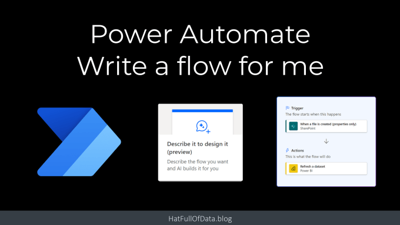
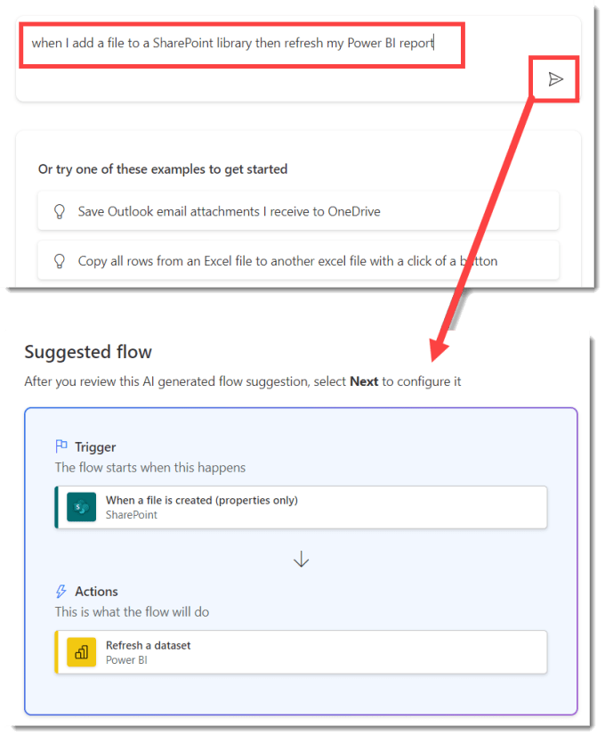
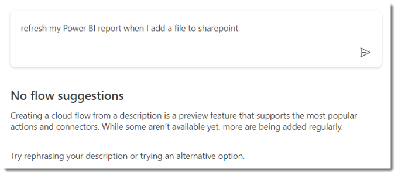
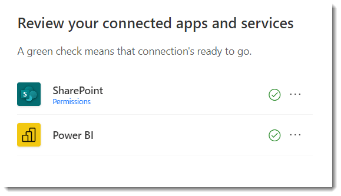
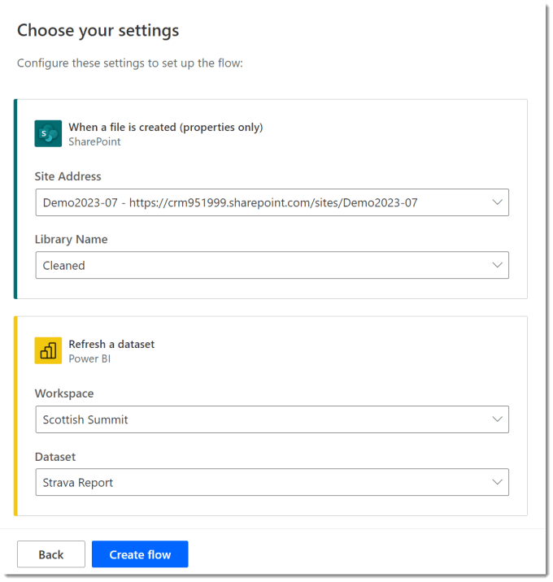
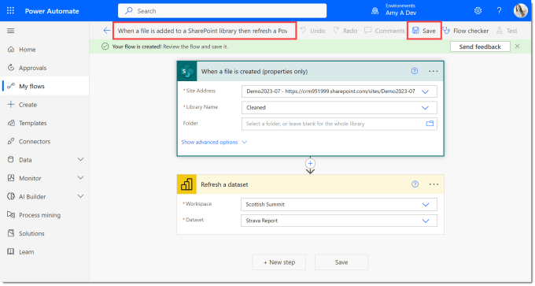

Power Automate create includes a feature called Describe it to design it which will write me a flow if I can describe it. In Aug 2023 its still in preview, and is not 100% and only copes with simple requests. It doesn’t require a co-pilot licence though!

I started to explore this feature for a session for Scottish Summit 2023, trying to do 3 demos in a 25 minute session, I needed my first demo to be quick.

## YouTube Version

## Getting Started

On Power Automate site click on Create and then click on the Describe it to design it tile. This starts a 3 step process. The first step is to describe the flow. My simple request was when I added a new file to a SharePoint library that the Power BI report that was based on that library got refreshed.

Once Step 1 appears I enter in my request using a “When X then Y” pattern. It will show you a list of suggestions as you type. Click the arrow to submit the description. If it works you get a suggested flow and you can click Next to move onto Step 2

When it cannot translate your description into a flow, it shows a message of No flow suggestions. This feature is in preview currently so its not yet working 100%. There are links to provide feedback, they can’t fix what you don’t tell them.

## Step 2 – Connections

When you click next it takes you to step 2 of 3. Here you are asked to review the connections the flow will use.

## Step 3 – Settings

The final step is to add some settings to the flow steps. The drop downs are populated just like in the full flow editor. In some of my explorations it didn’t give me everything I needed but it works mostly. The you click Create flow.

## Power Automate did write me a flow!

Very quickly you get presented with a flow. I recommend editing the name in the top left and of course pressing save in the top right. Then test your flow out.

## Conclusion

For getting started, asking Power Automate to write me a flow is great. For developing a long complex flow its not going to help much. It does allow you to explore some ideas and with the right description it will build longer flows.

## More Power Automate Posts

- [Creating Adaptive Cards](https://hatfullofdata.blog/microsoft-flow-creating-adaptive-cards/)

- [Refreshing Datasets Automatically with Power BI Dataflows](https://hatfullofdata.blog/refreshing-datasets-automatically-with-dataflow/)

- [Power Automate Child Flow](https://hatfullofdata.blog/power-automate-child-flow/)

- [Get data from a Power BI dataset](https://hatfullofdata.blog/power-automate-get-data-from-a-power-bi-dataset/)

- [Power Automate Button in a Power BI Report](https://hatfullofdata.blog/power-automate-button-in-a-power-bi-report/)

- [Write Me a Flow](https://hatfullofdata.blog/power-automate-write-me-a-flow/)

- [Power Automate and DevOps series](https://hatfullofdata.blog/connecting-power-automate-to-devops/)

- [Power Automate and Power BI Rest API series](https://hatfullofdata.blog/power-automate-and-power-bi-rest-api/)

- [Save a File to OneLake Lakehouse](https://hatfullofdata.blog/power-automate-save-a-file-to-onelake-lakehouse/)

- [Trigger Microsoft Fabric Data Pipeline using Power Automate](https://hatfullofdata.blog/trigger-microsoft-fabric-data-pipeline/)

