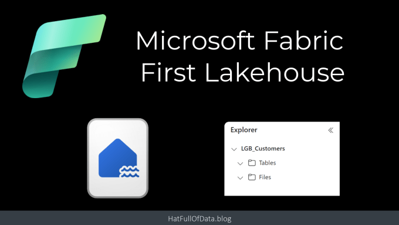
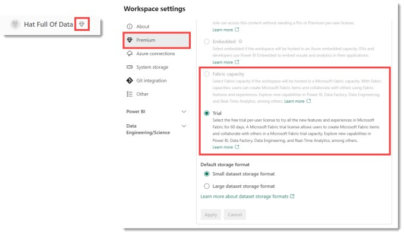
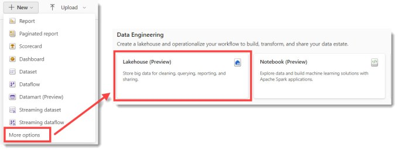
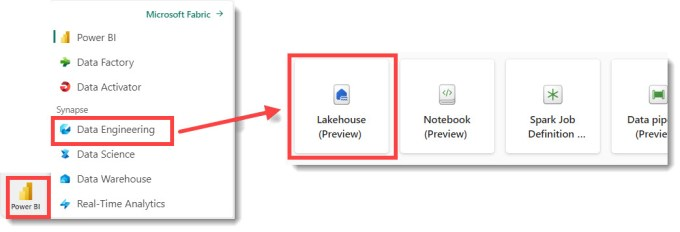
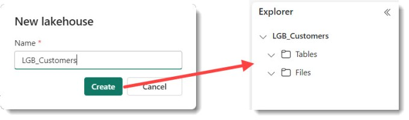
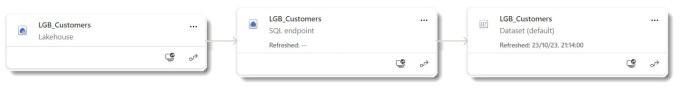

Lakehouses are one of the main building blocks in Microsoft Fabric. A lakehouse allows you to store structured and unstructured data in a single location. In this post we are going to create an empty one. Future posts will populate it.

## Microsoft Fabric Quick Guides

- [Create a Lakehouse](https://hatfullofdata.blog/fabric-create-a-lakehouse/)

- [Load CSV file and folder](https://hatfullofdata.blog/fabric-upload-a-file-and-folder/)

- [Create a table from a CSV file](https://hatfullofdata.blog/fabric-create-table-from-csv-file/)

- [Create a Table with a Dataflow](https://hatfullofdata.blog/microsoft-fabric-create-tables-with-dataflows/)

- [Create a Table using a Notebook and Data Wrangler](https://hatfullofdata.blog/microsoft-fabric-notebook-and-data-wrangler/)

- Exploring the SQL End Point

- Create a Power BI Report

- Create a Paginated Report

## YouTube Version

## Empty Workspace with a Fabric Capacity

We start in an empty workspace that has a capacity assigned to it. A jewel logo next to the workspace name or checking the workspace settings are indicators that it has a capacity. A premium per user capacity does not include all Fabric features.

## Create a Lakehouse

There are two ways to start creating a lakehouse. First method is to click New in the top left of the workspace area, by default it shows Power BI options so click on More options. When the screen updates, on the second row is Lakehouse.

The second option is switch the experience in the bottom left of the screen to show all the Experiences. When the menu pops up, select Data Engineering. Then the screen will update and show a slightly different Lakehouse button.

The next step in the create a lakehouse process is to name the lakehouse. The name can only include letters, numbers, and underscore. It will display an error message to correct you. Enter the name and click Create. Then wait a few moments and you will get your empty lakehouse.

## What is created?

Every lakehouse created in Fabric also creates an SQL Endpoint and a Power BI Dataset. Even though we have not added data the containers are already there to handle the data.

## References

Microsoft’s Lakehouse Overview – [https://learn.microsoft.com/en-us/fabric/data-engineering/lakehouse-overview]( https://learn.microsoft.com/en-us/fabric/data-engineering/lakehouse-overview)

