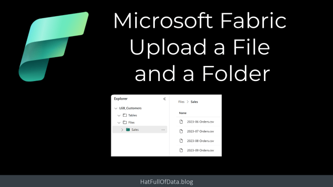
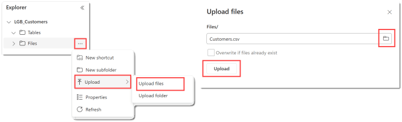
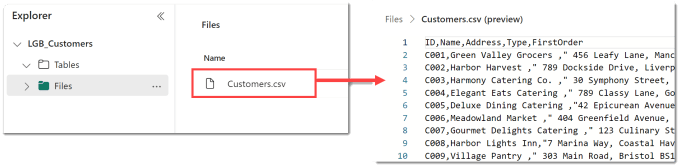
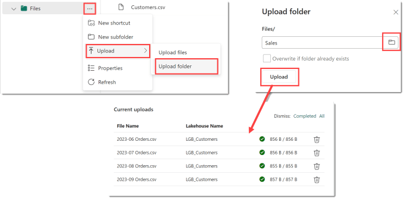
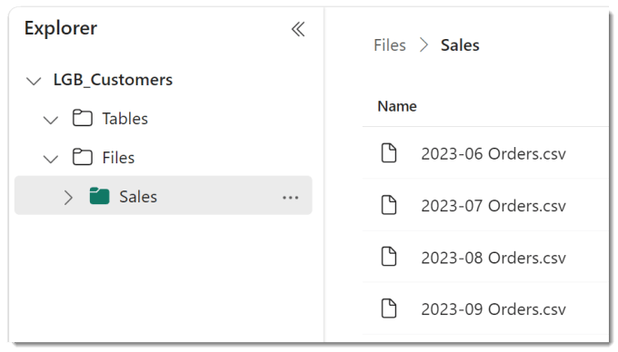
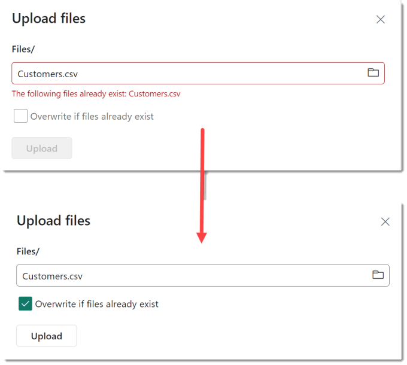

The simplest way to add data to a Lakehouse is upload a csv file. In this blog post we will upload a csv file and upload a folder of csv files. You can upload other file types, but they take more work than csv files to quickly load into tables.

## Microsoft Fabric Quick Guides

- [Create a Lakehouse](https://hatfullofdata.blog/fabric-create-a-lakehouse/)

- [Load CSV file and folder](https://hatfullofdata.blog/fabric-upload-a-file-and-folder/)

- [Create a table from a CSV file](https://hatfullofdata.blog/fabric-create-table-from-csv-file/)

- [Create a Table with a Dataflow](https://hatfullofdata.blog/microsoft-fabric-create-tables-with-dataflows/)

- [Create a Table using a Notebook and Data Wrangler](https://hatfullofdata.blog/microsoft-fabric-notebook-and-data-wrangler/)

- Exploring the SQL End Point

- Create a Power BI Report

- Create a Paginated Report

## YouTube Version

## Upload a CSV

We open the Lakehouse, see previous post on how to create one. Then in the Explorer pane on the left next to Files and click on the three dots. On the popup menu click on Upload and then Upload files. When the pane appears on the right, click on the folder icon in the input box. Once you’ve selected the file, click the Upload button.

Once the file is uploaded it can be found by clicking on Files. If you click on the file it the content will be displayed.

Multiple files could have been selected to be uploaded at the same time. All the files would have been uploaded into the same location.

## Upload a Folder of Files

Uploading a folder is very similar to uploading a single file. In the explorer pane on the left, click on the three dots next to File, or a subfolder and select Upload. Then select Upload folder and the Upload folder pane will appear on the right. Clicking on the folder icon will allow you to select a folder. Finally you can click Upload and you will a progress line for every file in the folder.

The list of files that have been uploaded can be seen by clicking on the folder name in the explorer pane on the left

## Updating a File or Folder

Data is rarely the same forever so you will want to upload an updated file or folder. If you select a file or folder that already exists you will not be able to click the upload button unless you tick the Overwrite if files already exist.

## Conclusion

Manually uploading files and folders is not a great solution for a large number of files but it is a good place to start. The OneLake app will be a great alternative when its fully available and using pipelines to orchestrate file management is also a good alternative and future posts will cover both.

