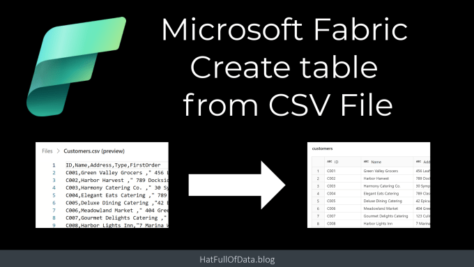
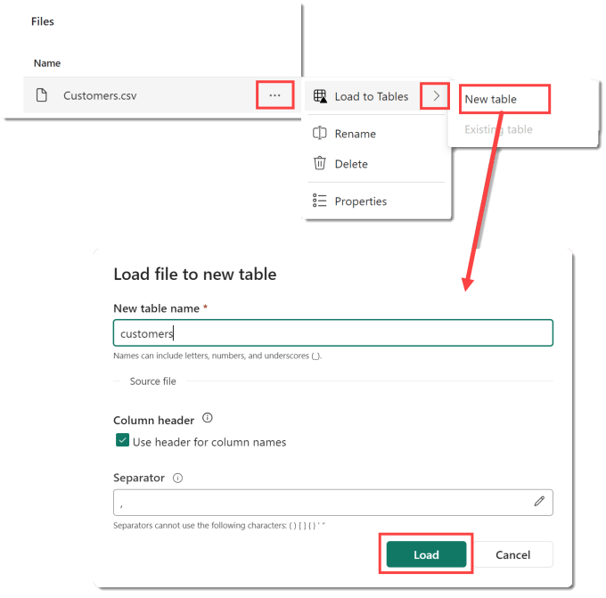
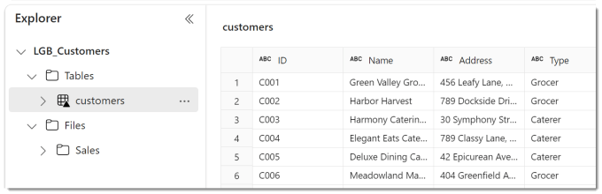
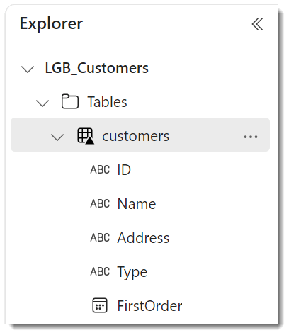
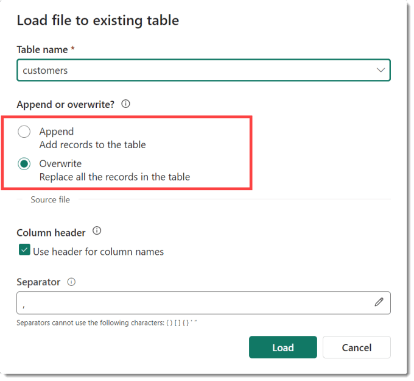

In a previous post we uploaded a csv file into the Lakehouse. In this post we take the next step to create table from csv file loaded into the Lakehouse. This is the simplest method to create a table and requires no coding. The simplicity means that there are limitations.

## Microsoft Fabric Quick Guides

- [Create a Lakehouse](https://hatfullofdata.blog/fabric-create-a-lakehouse/)

- [Load CSV file and folder](https://hatfullofdata.blog/fabric-upload-a-file-and-folder/)

- [Create a table from a CSV file](https://hatfullofdata.blog/fabric-create-table-from-csv-file/)

- [Create a Table with a Dataflow](https://hatfullofdata.blog/microsoft-fabric-create-tables-with-dataflows/)

- [Create a Table using a Notebook and Data Wrangler](https://hatfullofdata.blog/microsoft-fabric-notebook-and-data-wrangler/)

- Exploring the SQL End Point

- Create a Power BI Report

- Create a Paginated Report

## YouTube Version

## Create Table from CSV file

From within the Lakehouse, navigate to view the filename of the file you want to load into a table. Click on the 3 dots next to the filename. Then click on the arrow next to Load to Tables and select New table. When the next dialog appears, by default the table name will match the csv file name in lowercase. The name can be updated. Tick or untick the box regarding the headers, and click Load.

After a short while the new table will appear in the Explorer pane. When you click on the table name, a preview will appear.

## Limitations

This method of creating a table leaves the determination of column type to the process. So we have no control of that. For some files this will cause an issue. To avoid any issue on the date format I made sure the date format was YYYY-MM-DD.

You can see what the column types are in the table by clicking on the arrow next to the table name to expand it.

You cannot change the column types from this view. The table is stored in delta format and clicking on the 3 dots menu will give you options to explore the properties and view the actual files that contain the data.

## Updating a Table

When selecting to load into a table and selecting Existing table instead of New table will give a slightly different dialog box. You need to select the table and then select if the file data is to be appended or will overwrite the existing data. Be aware there is no undo.

## Conclusion

For a clean, well structured CSV file, this is a great place to start. With a slow moving dimension table this could be a good solution as it just requires maintaining a csv file. For more complex files that require transformation there are better methods such as a dataflow or a notebook.

