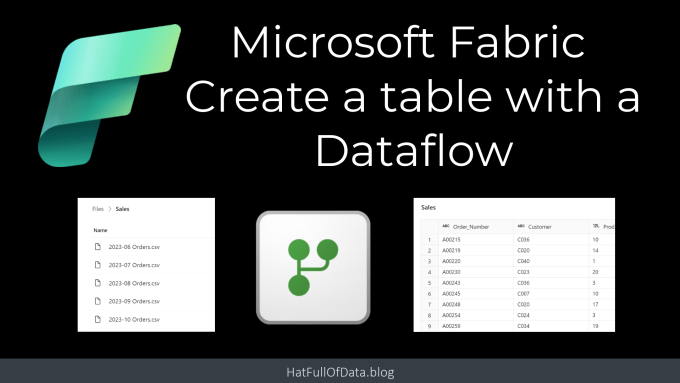
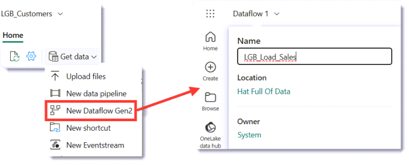
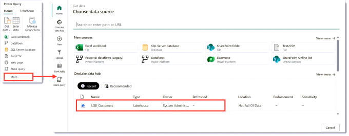
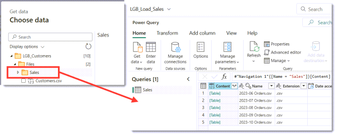
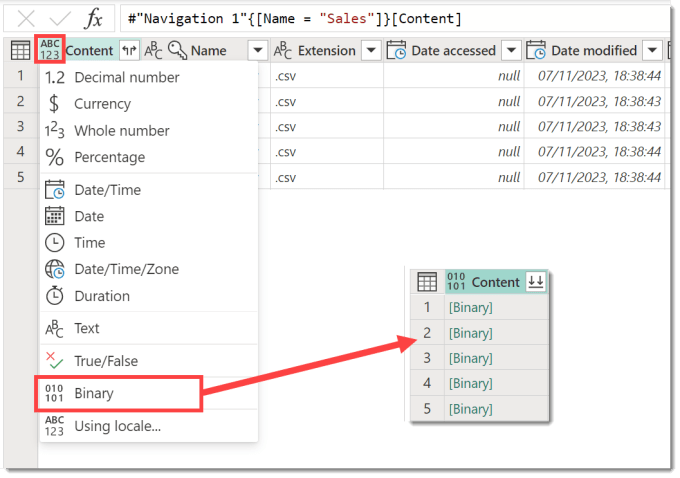
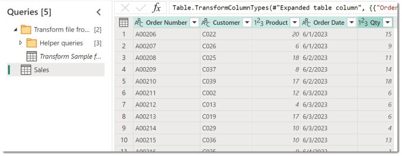
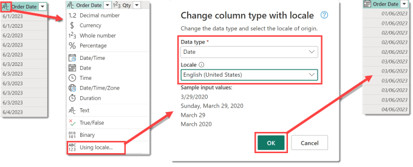
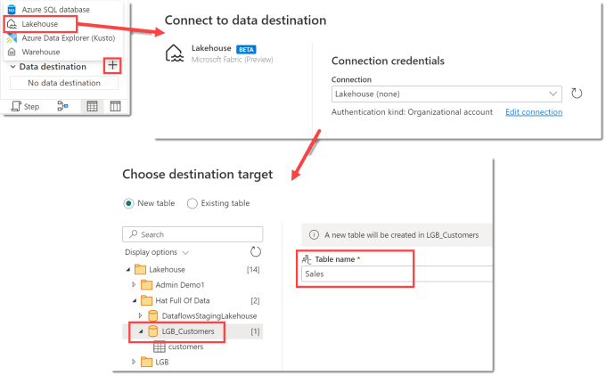
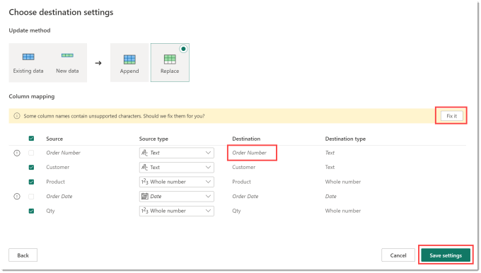
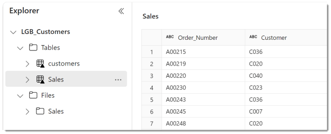

As part of Microsoft Fabric, we have new Gen2 Dataflows and they have a new ability. A Gen2 Dataflow entity can have a destination. This means using a dataflow we can create a table in Fabric from another source, such as a folder of files.

## Microsoft Fabric Quick Guides

- [Create a Lakehouse](https://hatfullofdata.blog/fabric-create-a-lakehouse/)

- [Load CSV file and folder](https://hatfullofdata.blog/fabric-upload-a-file-and-folder/)

- [Create a table from a CSV file](https://hatfullofdata.blog/fabric-create-table-from-csv-file/)

- [Create a Table with a Dataflow](https://hatfullofdata.blog/microsoft-fabric-create-tables-with-dataflows/)

- [Create a Table using a Notebook and Data Wrangler](https://hatfullofdata.blog/microsoft-fabric-notebook-and-data-wrangler/)

- Exploring the SQL End Point

- Create a Power BI Report

- Create a Paginated Report

## YouTube Version

## Creating Gen2 Dataflows

Open the Lakehouse and then from the Get data drop down on the Home ribbon select New Dataflow Gen2. This will create an empty dataflow with a default name. Clicking on the name in the top left, then a pop-up appears allowing you to change the name.

For this blog post we are going to load the csv files in Sales folder, loaded in an earlier post and video. The files have been loaded into the Lakehouse so the data source is OneLake. In the Power Query window, on the Home ribbon, click Get data. From the menu that appears, we select More.. When the Choose data source appears, the bottom half lists OneLake sources, select the Lakehouse.

When the Choose data appears navigate to find the Sales folder. Then click Create. After a few moments a query will appear showing a row for every file in the folder.

Power Query includes a feature to combine files, it requires the Content column to be binary. On the Content column, click on the datatype ABC/123 in the top left of the column and select binary. This will give you a column of binary

The Content column is now the correct data type to combine the files. When you click on the top right icon it will start creating the helper queries to do the file combining. It will open a combine files dialog, showing you the content of the first file. When you click OK it will build the helper queries and the Sales query will now show the data from the files appended.

## Fixing the date column

The CSV files contains dates in American format, MM/DD/YYYY. The dataflow is looking for dates in my format DD/MM/YYYY so makes the date column string format. This needs fixing before saving to a table.

Click on the ABC in the top left of the Order Date column. Then from the data type options select Using locale. When the dialog appears, I select Date for the data type and the English (United States) for the locale. When I click okay it changes the strings into dates. This feature is awesome and probably deserves a post of its own!

## Adding a Destination

Now the data is ready we can set up the destination. In the bottom right of the screen it shows Data Destination and should show No data destination.

Click on the plus next to Data destination and from the options select Lakehouse. You will get a connections window appear and you can just click Next. Then the next step asks you to select which workspace and then which container in that workspace. Once you have selected the right place you can update the Table Name. Now you are ready to click Next.

The last step update method and column mapping. The update method is a choice between adding data to the bottom of the table, Append, or overwriting the data, Replace. We are going to use Replace in this instance. The column mapping takes the columns from the query and tries to use those for column name. Column names can only contain letters, numbers and underscores. So if you have column names that don’t fit that it offers to fix that. Once you are happy click Save Settings

## Publishing and Refreshing

Now we have a query that shapes our data and we have a destination set up we can Publish the dataflow. This will save the dataflow and will refresh it. If you wanted to just save the dataflow and not refresh you can click the arrow next to Publish and select Publish later.

Once the refresh has completed, we can open the Lakehouse and see the new Sales table has been created.

## Gen2 Dataflows Conclusion

Dataflows having a destination to write to is an exciting update. Power Platform has dataflows that can write to Dataverse but they have more issues than I’m willing to list here. Probably 90% of the transformations you need in Dataflows you can do by clicking rather than writing M. So this is mostly a low-code solution for getting data into Fabric. A later post will talk about how to handle not just overwriting the table.

