---
title: Microsoft Fabric – Notebook and Data Wrangler
description: Using a combination of Notebook and Data Wrangler means we can transform data and write to table writing very little code by hand.
slug: microsoft-fabric-notebook-and-data-wrangler
date: 2023-11-13 16:22:16+0000
lastmod: 2025-02-11 18:33:26+0000
categories:
    - Microsoft Fabric
---

Before I started with Microsoft Fabric I had never created a spark notebook. This doesn’t stop me though. By using a combination of Notebook and Data Wrangler means I can transform data and write to table writing very little code by hand.

## Microsoft Fabric Quick Guides

- [Create a Lakehouse](https://hatfullofdata.blog/fabric-create-a-lakehouse/)

- [Load CSV file and folder](https://hatfullofdata.blog/fabric-upload-a-file-and-folder/)

- [Create a table from a CSV file](https://hatfullofdata.blog/fabric-create-table-from-csv-file/)

- [Create a Table with a Dataflow](https://hatfullofdata.blog/microsoft-fabric-create-tables-with-dataflows/)

- [Create a Table using a Notebook and Data Wrangler](https://hatfullofdata.blog/microsoft-fabric-notebook-and-data-wrangler/)

- Exploring the SQL End Point

- Create a Power BI Report

- Create a Paginated Report

## YouTube Version

[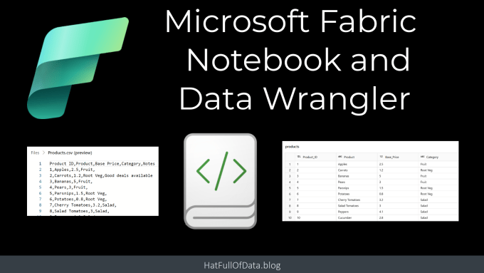](https://youtu.be/tE-eCnlvY9k)

## Create and rename a Notebook

Inside the Lakehouse, on the ribbon drop down Open notebook and select New notebook. This will create an empty notebook with a default name. We can rename the notebook by clicking on the down arrow next to the name and entering a new name.

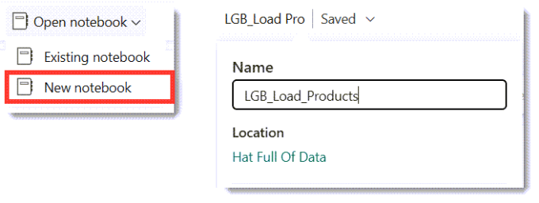

## Adding a Markdown Title cell

Notebooks use 2 different types of cells, Code and Markdown. The Markdown cells allow for documentation to be included in the notebook. Any cell in the notebook can be converted into a Markdown cell. Below are screen grabs of converting the default cell into a Markdown cell, by clicking on the M button so giving a title cell to the notebook.

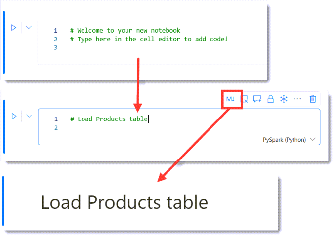

Markdown includes syntax for lots of different text formatting. A good reference can be found at [https://www.markdownguide.org/basic-syntax/](https://www.markdownguide.org/basic-syntax/)

## Load the file into a data frame

Notebooks use data frames to handle blocks of data. The next task is to load a csv file. On the left hand side select Files to list the right file. Then on the Products.csv, click on the three dots menu. Next select Load data and then Spark. This will add a new code cell to the notebook.

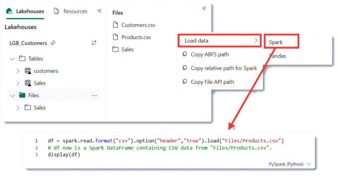

## Run a code cell

Each code cell has a blue arrow on the left, clicking this runs the code in the cell. The function display lists the data frame contents below the code cell. Being able to run each cell in turn really helps with development. There is a run all option on the toolbar.

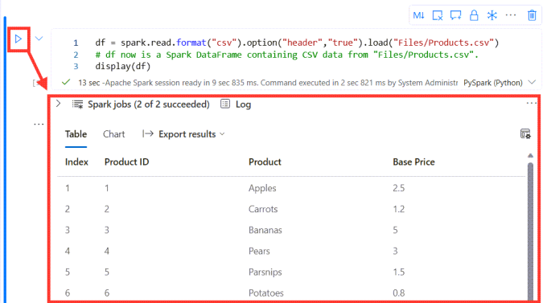

We can limit the display function to only list a few lines by using a method on the data frame called take. df.take(4) just returns 4 rows of data. Another method that is useful to examine a dataframe is dtypes. This returns all the datatypes of the data frame. So I edit the code and re-run the cell.

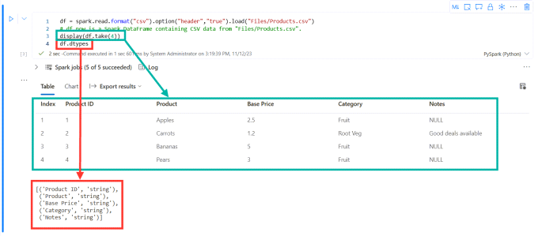

## Data Wrangler

Before I can write the data frame to a table there are transformations that need to be done. Firstly there are spaces in some of the column names. Next the ID and Price columns need to be numbers rather than strings. Finally I do not want to include the Notes column.

I could do the searches and find the Spark code to do those transforms. There is an alternative introduced in Microsoft Fabric called Data Wrangler. This will write the code for the three changes we need. We launch Data Wrangler from the Data ribbon – Transform Data Frame in Data Wrangler. This will list your data frames – which means you need to have run the cell that populates the dataframe first. Then we get to see the Data Wrangler screen.

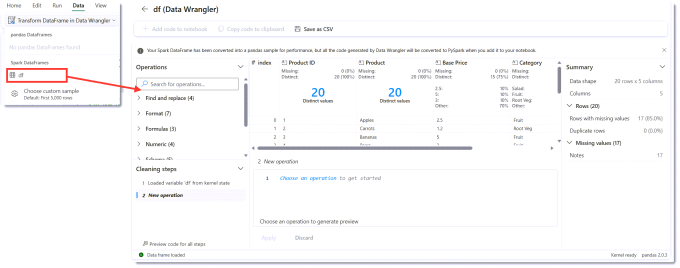

## Rename Columns

Product ID column needs to be renamed. Clicking on the three dots on the Product ID column heading. Then select rename column and the Operations pane changes to show rename options. Enter the new name Product_ID and the data pane will update to show the old in red and the new in green. Finally click Apply to save the changes.

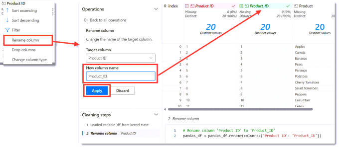

The same needs to be done on the Base Price column to change it to Base_Price.

## Changing Column Types

The next requirement is to change the column data types. This is very similar to renaming and can be found on the column heading menu. I change the Product_ID column to Int64 and the Base_Price column to Float64.

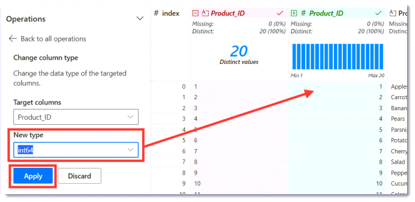

## Dropping a column

Finally we need to drop the Notes column. Again this is found on the column header menu.

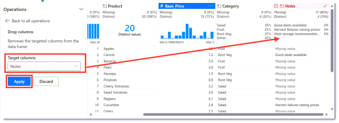

## Add Data Wrangler code to Notebook

Once we have finished all the transformations we are ready to add the code into the notebook. Click on the Add code to notebook. When the dialog appears, check the code and click Add.

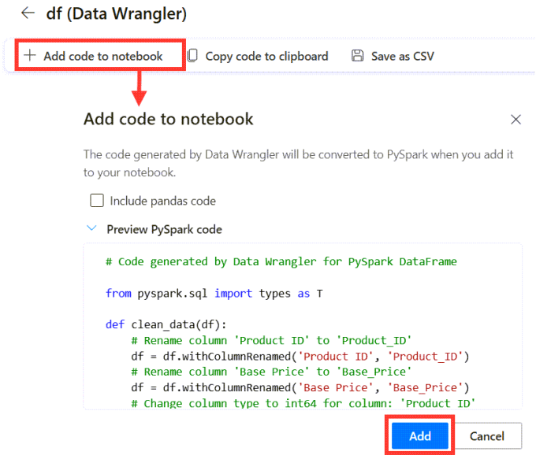

## Run the Data Wrangler code

When the new code cell appears, we can see it ends by creating a new data frame df_clean and displaying it. So if we run the code we can see the result of the transformations.

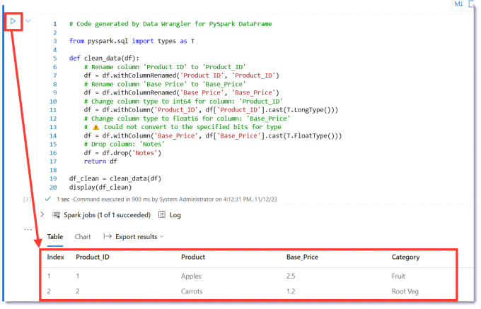

## Write data frame to a table

After the transformation code has run, the data frame is ready to be saved into a table. This is the single line of code we have write by hand. A data frame has a write method which accepts format and mode options. Using Ctrl + Spacebar will get the autocomplete to help. Here is the required code.

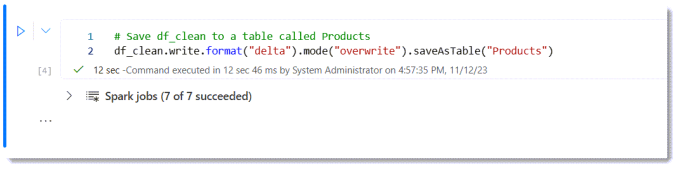

```xml
# Save df_clean to a table called Products
df_clean.write.format("delta").mode("overwrite").saveAsTable("Products")
```

Once the code has run successfully, we can look in the Lakehouse and see the new table products.

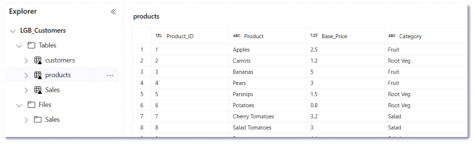

## Conclusion

For the newcomer, notebooks are daunting. With the addition of Data Wrangler we have a tool to help write the transformation code. One quote I heard was Data Wrangler is the Power Query tool for notebooks. I have yet to work out when I would use a notebook over a dataflow but I’m assuming there will be pros and cons that vary depending on the data involved.

