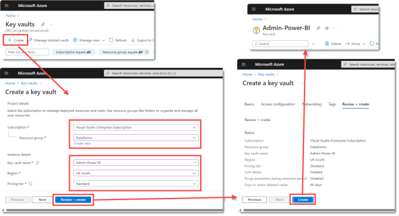
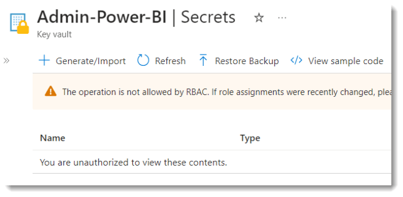
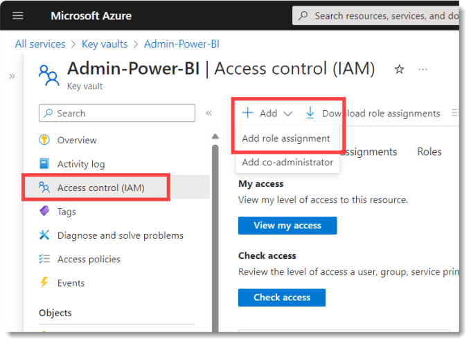
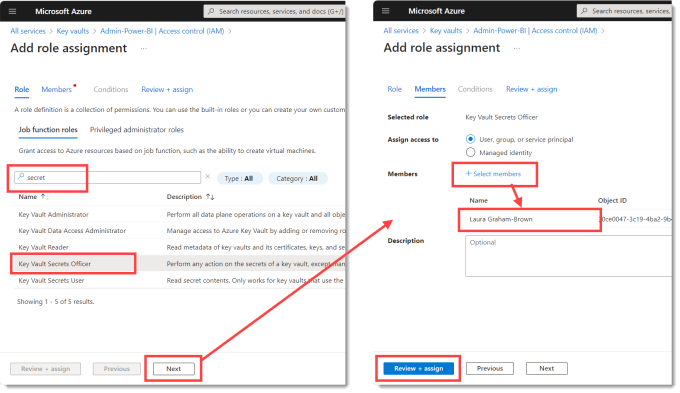
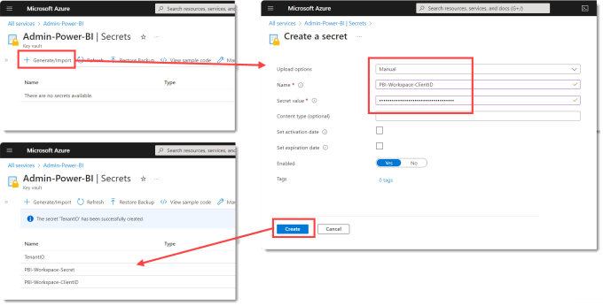

Azure Key Vault is a cloud service that provides a secure store for secrets. And in the previous post on creating [Power BI Service Principal Profile](https://hatfullofdata.blog/create-a-power-bi-service-principle-profile/) we added a secret. The Tenant ID, Client ID and Secret values give access to the Service Principal and whatever permission they have. So for that reason we are going to create an Azure Key Vault.

This post is part of the [Power Automate and Power BI Rest API series](https://hatfullofdata.blog/power-automate-and-power-bi-rest-api/)

## Create Azure Key Vault

The first step is to create the Azure Key Vault. Start at [https://portal.azure.com/](https://portal.azure.com/).  From the Home screen, navigate to all services and find Key Vaults. Once on the Key Vaults page click on Create to start the process. This will navigate you to a screen to select Subscription and Resource group. Key vaults do cost money, in my case 

## Add Role Assignment

Now we have create a new key vault to store our secrets the obvious place to go next is to Secrets. But if you take a look there you will see you do not have permission to play with secrets yet. And if you try to create one it will fail.

You do have the rights to give yourself permission. On the left hand side menu, click on Access Control (IAM). Click on +Add and from the drop down options select Add role assignment.

When the next screen appears, we need to select a role based on Secrets. In the search box enter Secret and from the list select Key Vault Secrets Officer, that can read and write secrets. Click next to move to the Members tab. Click on + Select members and select yourself from the list and anyone else that needs access. When all the members are listed, click Review + Assign twice.

You can look at the list of role assignments or click on Check my access for confirmation. If you want a user to be able to read the secrets but not write them you would pick Key Vault Reader.

## Add Secrets

When we now head to Secrets on the left hand menu, there are no warnings about being unauthorized. Click on + Generate/Import to open the Create a secret form. Upload can stay as Manual, enter in a name and the value. For naming I will use a common start for the Client ID and Secret so that in the flow in the next post I only need to ask for one parameter.

I also add a secret to store the Tenant ID. This probably doesn’t need to be as secure but it makes it easy if everything is in the same location.

## Conclusion

I now have a key vault with 3 values. I can now use either environment variables or a flow to pull through the values. I can add more secrets to the vault for other Power BI actions.

