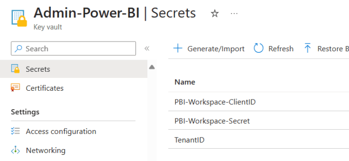
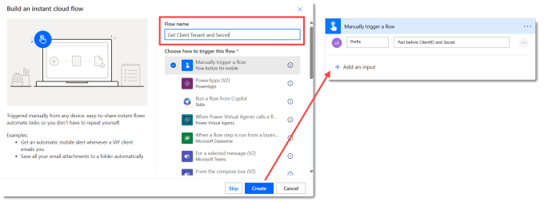
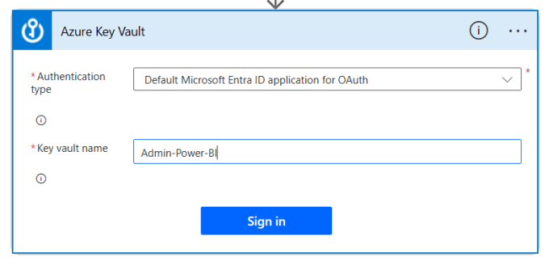
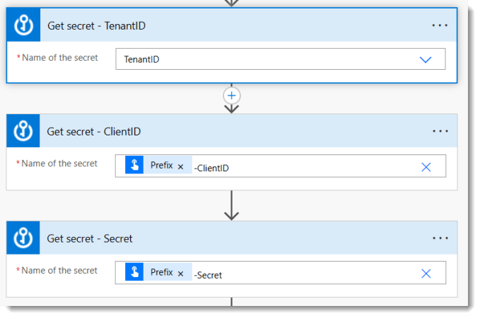
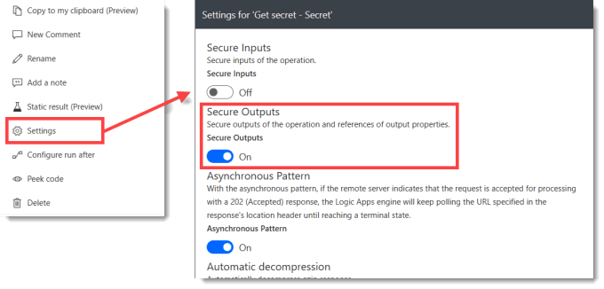
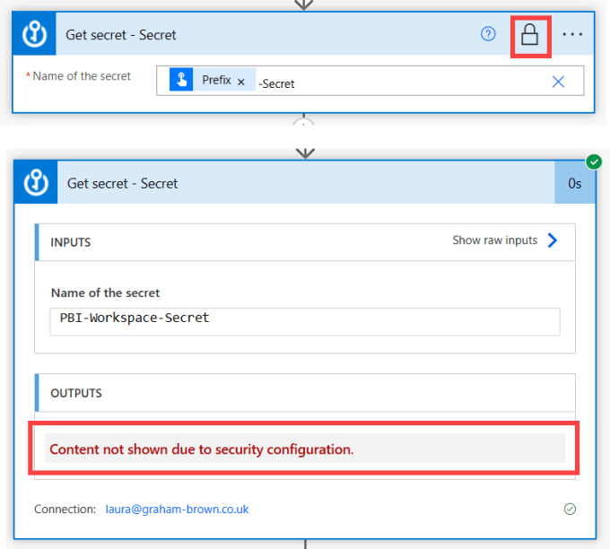
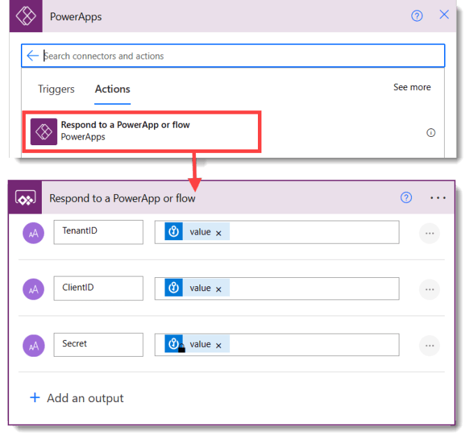
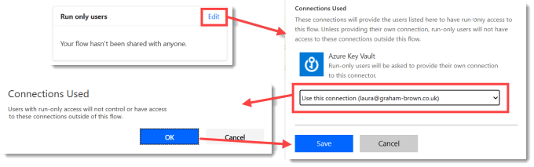
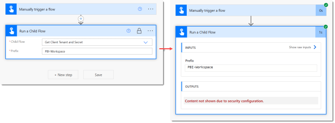

Once you have stored security details in Azure Key Vault as described in the previous post in this series ([Create Azure Key Vault to store Tenant ID, Client ID and Secret](https://hatfullofdata.blog/create-azure-key-vault-to-store-tenant-id-client-id-and-secret/)) you need a way to fetch secrets when you need them. Power Automate connector for Azure Key Vault includes the Get Secret action. This post shows you how to build a reusable child flow to fetch secrets.

This post is part of [Power Automate and Power BI Rest API series](https://hatfullofdata.blog/power-automate-and-power-bi-rest-api/).

## Flow design

The flow we are going to create will be called by other flows, so is a child flow. The flow will have one parameter of the prefix of the ClientID and Secret store in the Azure Key Vault. If you have completed the previous post this would be PBI–Workspace. It will return 3 values, TenantID, ClientID and Secret which will be secured

Because we are using child flows we need to create our flows inside a solution. I recommend creating a solution for these group of flows. I don’t want to make this blog post even longer so please go google creating Power Platform solutions.

## Setting up the Trigger

For a child flow we use a instant flow. Type in a descriptive name and select the trigger Manually trigger a flow. When you are in the flow editor, expand the trigger and add an input for the prefix. Adding hint text will help you and other users remember what the input is about.

## Adding Actions to Fetch Secrets

The flow is reasonably simple with three repeating actions to fetch secrets. Add an action and search for Key Vault and select it. Then from the list select Get Secret. If this is the first time you have connected to a Key Vault you will need to type in the key vault name and click Sign in. Be aware that every key vault has its own connection.

The action has a very simple drop down. For the TenantID action you can just select it from the drop down. For the ClientID and Secret we want to the prefix value from the trigger so that this flow is reusable. So for the ClientID and Secret select Enter custom value. Then use the dynamic value Prefix followed by -ClientID and -Secret.

## Securing the Secret Value

The secret value should be kept secret. So the Action output needs securing. Click on the ellipse (3 dots) on the Get secret – Secret action. Turn on the toggle for Secure Outputs and then click Done at the bottom of the dialog.

This could be done on ClientID as well if required. Each action that has a security setting applied will show a padlock. When a flow run execution is looked at the value of the secret will not be available.

## Returning the Values

The final part for this flow is to return the values. And for this flow to run as a child flow it must have a respond action. Click on add action and search for the Power Apps connector. It only one has one action Respond to a Power App or flow. Add three outputs to return TenantID, ClientID and Secret.

## Handling the Connections

When an instant flow runs the connections are usually based on who clicked the start on the flow. This does not work for a child flow, so a connection must be selected that will be used for when it runs.

The changes need to be made from the flow details page, save and click the blue arrow in the top left to get there. Click on Edit in the Run only users box. When the pane appears, under connections used select a connection under Azure Key Vault. A message will appear to state users only get access in this flow, click OK to close it and then click Save to save the changes.

## Testing the flow

When you first write a child flow I suggest you write an instant flow to test it. The Run a Child Flow action only is available if your flows are in a solution. In order to protect the secret value you also need to protect the outputs of the Run a Child flow action.

This tests that the flow runs a child flow and returns values even though we can’t see them.

## Conclusion

We now have an app that can fetch secrets, we’ve secured the authentication details and now written a flow to securely retrieve those values. Next step is to make sure Power BI will allow us to do this.

## More Power Automate Posts

- [Creating Adaptive Cards](https://hatfullofdata.blog/microsoft-flow-creating-adaptive-cards/)

- [Refreshing Datasets Automatically with Power BI Dataflows](https://hatfullofdata.blog/refreshing-datasets-automatically-with-dataflow/)

- [Power Automate Child Flow](https://hatfullofdata.blog/power-automate-child-flow/)

- [Get data from a Power BI dataset](https://hatfullofdata.blog/power-automate-get-data-from-a-power-bi-dataset/)

- [Power Automate Button in a Power BI Report](https://hatfullofdata.blog/power-automate-button-in-a-power-bi-report/)

- [Write Me a Flow](https://hatfullofdata.blog/power-automate-write-me-a-flow/)

- [Power Automate and DevOps series](https://hatfullofdata.blog/connecting-power-automate-to-devops/)

- [Power Automate and Power BI Rest API series](https://hatfullofdata.blog/power-automate-and-power-bi-rest-api/)

- [Save a File to OneLake Lakehouse](https://hatfullofdata.blog/power-automate-save-a-file-to-onelake-lakehouse/)

- [Trigger Microsoft Fabric Data Pipeline using Power Automate](https://hatfullofdata.blog/trigger-microsoft-fabric-data-pipeline/)

## More Power BI Posts

- [Conditional Formatting Update](https://hatfullofdata.blog/power-bi-conditional-formatting-update/)

- [Data Refresh Date](https://hatfullofdata.blog/power-bi-data-refresh-date/)

- [Using Inactive Relationships in a Measure](https://hatfullofdata.blog/power-bi-inactive-relationships-in-a-measure/)

- [DAX CrossFilter Function](https://hatfullofdata.blog/power-bi-dax-crossfilter-function/)

- [COALESCE Function to Remove Blanks](https://hatfullofdata.blog/power-bi-coalesce-function-to-remove-blanks/)

- [Personalize Visuals](https://hatfullofdata.blog/power-bi-personalize-visuals/)

- [Gradient Legends](https://hatfullofdata.blog/power-bi-gradient-legends/)

- [Endorse a Dataset as Promoted or Certified](https://hatfullofdata.blog/power-bi-endorse-a-dataset/)

- [Q&A Synonyms Update](https://hatfullofdata.blog/power-bi-qa-synonyms-update/)

- [Import Text Using Examples](https://hatfullofdata.blog/power-bi-import-text-using-examples/)

- [Paginated Report Resources](https://hatfullofdata.blog/paginated-report-resources/)

- [Refreshing Datasets Automatically with Power BI Dataflows](https://hatfullofdata.blog/refreshing-datasets-automatically-with-dataflow/)

- [Charticulator](https://hatfullofdata.blog/charticulator-simple-custom-chart/)

- [Dataverse Connector – July 2022 Update](https://hatfullofdata.blog/power-bi-dataverse-connector-july-2022-update/)

- [Dataverse Choice Columns](https://hatfullofdata.blog/power-bi-dataverse-choices-and-choice-column/)

- [Switch Dataverse Tenancy](https://hatfullofdata.blog/power-bi-switch-dataverse-tenancy/)

- [Connecting to Google Analytics](https://hatfullofdata.blog/power-bi-connecting-to-google-analytics/)

- [Take Over a Dataset](https://hatfullofdata.blog/power-bi-take-over-a-dataset/)

- [Export Data from Power BI Visuals](https://hatfullofdata.blog/export-data-from-power-bi-visuals/)

- [Embed a Paginated Report](https://hatfullofdata.blog/power-bi-embed-a-paginated-report/)

- [Using SQL on Dataverse for Power BI](https://hatfullofdata.blog/using-sql-on-dataverse-for-power-bi/)

- [Power Platform Solution and Power BI Series](https://hatfullofdata.blog/power-platform-solution-and-power-bi-part-1/)

- [Creating a Custom Smart Narrative](https://hatfullofdata.blog/power-bi-creating-a-custom-smart-narrative/)

- [Power Automate Button in a Power BI Report](https://hatfullofdata.blog/power-automate-button-in-a-power-bi-report/)

## Power BI Series

- [SVG in Power BI series](https://hatfullofdata.blog/svg-in-power-bi-part-1-svg-basics/)

- [Power BI and Project Online series](https://hatfullofdata.blog/power-bi-connecting-to-project-online/)

- [Slicers series](https://hatfullofdata.blog/power-bi-slicers-introduction/)

- [Dataflow series](https://hatfullofdata.blog/power-bi-create-a-dataflow/)

- [Power BI SVG series](https://hatfullofdata.blog/svg-in-power-bi-part-1-svg-basics/)

- [Power Automate and Power BI Rest API series](https://hatfullofdata.blog/power-automate-and-power-bi-rest-api/)

- [Power BI and DevOps series](https://hatfullofdata.blog/devops-data-into-power-bi/)

