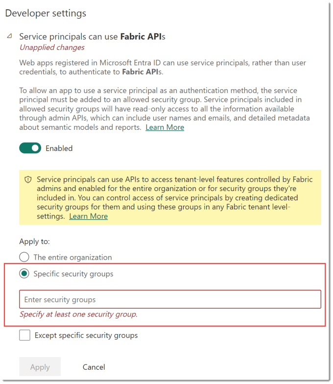
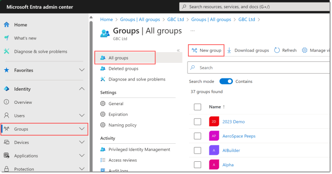
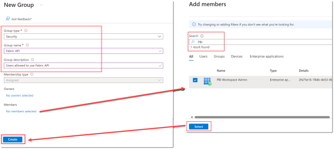
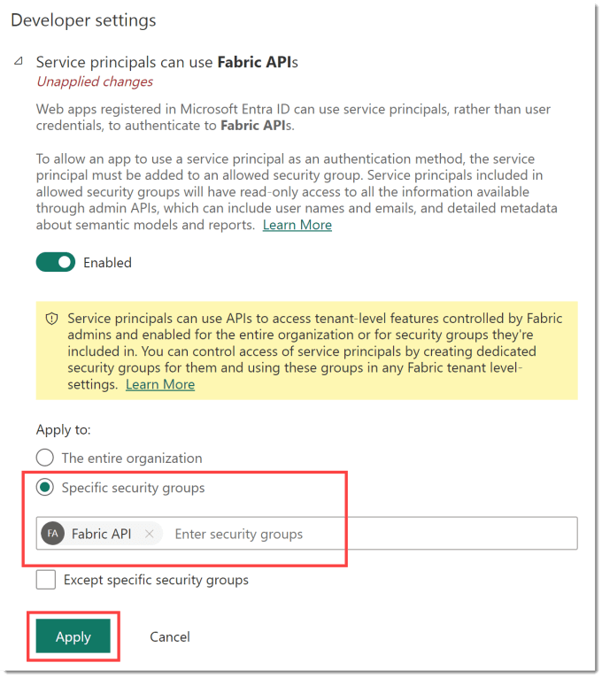

In the first 3 posts of this series we created Service Principal, stored the details in Azure key Vault and created a flow. We have one more step to do, we need to allow the use of Power BI Rest APIs in our tenancy and then we will be ready to actually set up the automation for creating workspaces.

This post is part of [Power Automate and Power BI Rest API series](https://hatfullofdata.blog/power-automate-and-power-bi-rest-api/)

## Find the Setting

This setting can be found in the Admin portal for Power BI under Tenant settings, you need to be a Power BI admin. If you search for Fabric API you’ll find it quickly. If you click the enabled toggle to on it will give you 2 options. The entire organization would allow the use of Power BI Rest APIs by anyone if they had the right credentials, this would not be good practice. So I recommend selecting Specific security groups. This means the service principal needs to be a member of a security group.

Tenant settings can be found at [https://app.powerbi.com/admin-portal/tenantSettings](https://app.powerbi.com/admin-portal/tenantSettings)

## Create Security Group

To create a security group you will need the right level of security in Entra, in many organisations you will not.  Go to [https://entra.microsoft.com/](https://entra.microsoft.com/) and click Groups on the left hand menu. Make sure you are looking at All Groups and then click New group.

The group type should be Security. Enter in a Group name, please follow any naming conventions you should be following. I highly recommend putting in a group description, future you will thank you. Click on No members selected to open the Add members pane. Search for the name of the service principal and tick next the name. Then click Select to close the pane.

No members will now be updated to 1 member, so you can now click Create.

## Back to the setting to allow the use of Power BI Rest APIs

Now we have the security group setup we can change the setting to allow the use of Power BI Rest APIs. Back into Power BI admin portal and find the setting.

Enable the setting and select Specific security group. Then add your security group into the box, the search is pretty good in my experience. The click Apply.

## Finally!

We have now ticked all the boxes, done all the prep to write a flow to create a workspace. The next post will be my final post in this series! (Well for now as I already have a few ideas for taking it further.)

## More Power BI Posts

- [Conditional Formatting Update](https://hatfullofdata.blog/power-bi-conditional-formatting-update/)

- [Data Refresh Date](https://hatfullofdata.blog/power-bi-data-refresh-date/)

- [Using Inactive Relationships in a Measure](https://hatfullofdata.blog/power-bi-inactive-relationships-in-a-measure/)

- [DAX CrossFilter Function](https://hatfullofdata.blog/power-bi-dax-crossfilter-function/)

- [COALESCE Function to Remove Blanks](https://hatfullofdata.blog/power-bi-coalesce-function-to-remove-blanks/)

- [Personalize Visuals](https://hatfullofdata.blog/power-bi-personalize-visuals/)

- [Gradient Legends](https://hatfullofdata.blog/power-bi-gradient-legends/)

- [Endorse a Dataset as Promoted or Certified](https://hatfullofdata.blog/power-bi-endorse-a-dataset/)

- [Q&A Synonyms Update](https://hatfullofdata.blog/power-bi-qa-synonyms-update/)

- [Import Text Using Examples](https://hatfullofdata.blog/power-bi-import-text-using-examples/)

- [Paginated Report Resources](https://hatfullofdata.blog/paginated-report-resources/)

- [Refreshing Datasets Automatically with Power BI Dataflows](https://hatfullofdata.blog/refreshing-datasets-automatically-with-dataflow/)

- [Charticulator](https://hatfullofdata.blog/charticulator-simple-custom-chart/)

- [Dataverse Connector – July 2022 Update](https://hatfullofdata.blog/power-bi-dataverse-connector-july-2022-update/)

- [Dataverse Choice Columns](https://hatfullofdata.blog/power-bi-dataverse-choices-and-choice-column/)

- [Switch Dataverse Tenancy](https://hatfullofdata.blog/power-bi-switch-dataverse-tenancy/)

- [Connecting to Google Analytics](https://hatfullofdata.blog/power-bi-connecting-to-google-analytics/)

- [Take Over a Dataset](https://hatfullofdata.blog/power-bi-take-over-a-dataset/)

- [Export Data from Power BI Visuals](https://hatfullofdata.blog/export-data-from-power-bi-visuals/)

- [Embed a Paginated Report](https://hatfullofdata.blog/power-bi-embed-a-paginated-report/)

- [Using SQL on Dataverse for Power BI](https://hatfullofdata.blog/using-sql-on-dataverse-for-power-bi/)

- [Power Platform Solution and Power BI Series](https://hatfullofdata.blog/power-platform-solution-and-power-bi-part-1/)

- [Creating a Custom Smart Narrative](https://hatfullofdata.blog/power-bi-creating-a-custom-smart-narrative/)

- [Power Automate Button in a Power BI Report](https://hatfullofdata.blog/power-automate-button-in-a-power-bi-report/)

## Power BI Series

- [SVG in Power BI series](https://hatfullofdata.blog/svg-in-power-bi-part-1-svg-basics/)

- [Power BI and Project Online series](https://hatfullofdata.blog/power-bi-connecting-to-project-online/)

- [Slicers series](https://hatfullofdata.blog/power-bi-slicers-introduction/)

- [Dataflow series](https://hatfullofdata.blog/power-bi-create-a-dataflow/)

- [Power BI SVG series](https://hatfullofdata.blog/svg-in-power-bi-part-1-svg-basics/)

- [Power Automate and Power BI Rest API series](https://hatfullofdata.blog/power-automate-and-power-bi-rest-api/)

- [Power BI and DevOps series](https://hatfullofdata.blog/devops-data-into-power-bi/)

