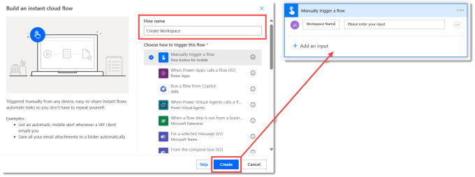
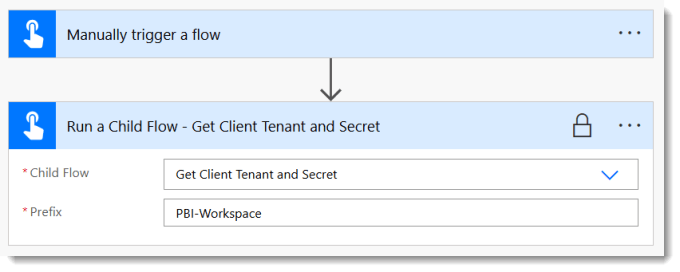
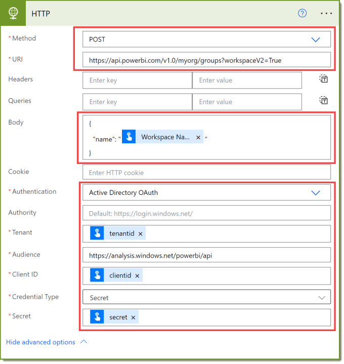
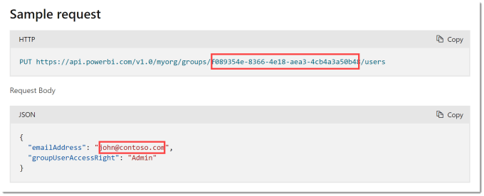
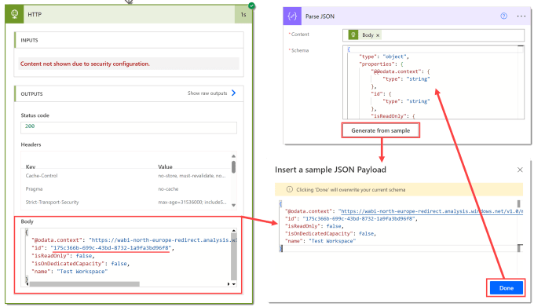
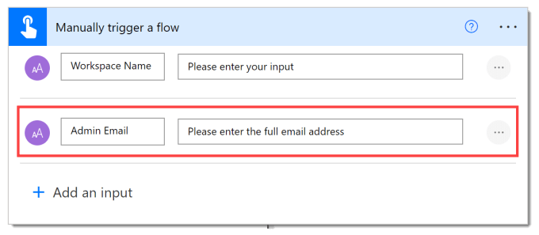
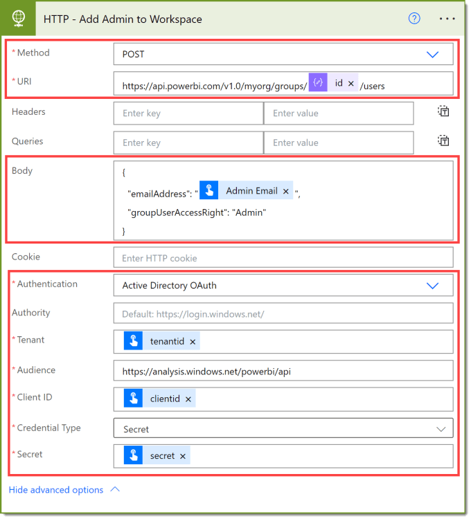
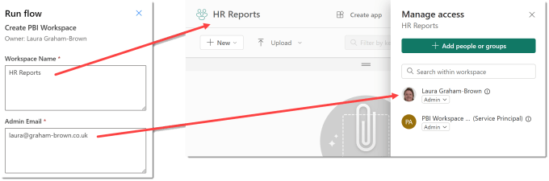

---
title: Power Automate – Create Power BI Workspace
description: This post will finally create the flow to automatically create the Power BI workspace making use of all the preparation in previous posts.
slug: power-automate-create-power-bi-workspace
date: 2024-06-21 20:18:44+0000
lastmod: 2025-02-14 11:07:31+0000
image: cover.png
categories:
    - Power Automate
    - Power BI
---

We’ve setup the service principal, saved the details securely in Azure Key Vault and used Power Automate to fetch them securely and finally setup the permissions to allow that service principal to use the rest api. This post will finally create the flow to automatically create Power BI workspace making use of all the preparation.

This post is part of [Power Automate and Power BI Rest API series](https://hatfullofdata.blog/power-automate-and-power-bi-rest-api/).

## Start the flow and get service principal details

There will be an instant flow using a manual trigger. Once the flow editor appears, expand the trigger and add a text input for the Workspace Name.



The first action will be to call the child flow that fetches the tenantid, clientid and secret. Select Get Client Tenant and Secret flow from the dropdown and then use PBI-Workspace as the prefix value.



## HTTP Call to automatically create Power BI Workspace

FInally we can do the action to create Power BI workspace, for this we add a HTTP action. I’m going to break this down into 3 parts, the URI, the body and the authentication.



From [https://learn.microsoft.com/en-us/rest/api/power-bi/groups/create-group#examples](https://learn.microsoft.com/en-us/rest/api/power-bi/groups/create-group#examples) we can see the HTTP starts with POST so we pick that as the method. It also gives us the URI. To save you going to fetch it here it is

```xml
https://api.powerbi.com/v1.0/myorg/groups?workspaceV2=True
```

The next part is the body. This is a very simple piece of JSON with only one field name. Get the value of name to come from the trigger input Workspace name.

```xml
{
  "name": ""
}
```

The final part is the authentication. Show the Advanced Options to see the boxes to fill in. Firstly Authentication is Active Directory OAuth. Then the Authority can be left blank. Next the Tenant, Client ID and Secret are dynamic values from running the child flow action. Finally the Audience should be the following

```xml
https://analysis.windows.net/powerbi/api
```

Your flow is now ready to test. Hopefully when you do this it all works and you get green ticks. But when you go to Power BI the workspace is not listed in workspaces you can see. This is because the workspace was created by the service account, so the service account is the admin, not you. So the next step is to add a workspace admin.

## Add Workspace Admin

This is going to require another HTTP call. So if we look at the second example show at [https://learn.microsoft.com/en-us/rest/api/power-bi/groups/update-group-user#examples](https://learn.microsoft.com/en-us/rest/api/power-bi/groups/update-group-user#examples) we can see we need 2 pieces of information, the workspace ID and the email address of the workspace admin.



The workspace ID must have been returned when we create Power BI workspace. If you look in the dynamic content it won’t be listed though so we need either code by hand or we use my favourite trick of Parse JSON.



### Get the Workspace ID

Go to the test run you did and expand the HTTP call that created the workspace. In the Outputs section there is a Body section which will contain the JSON that was returned. Copy this JSON as this will help complete the Parse JSON.

Then return to editing the flow and add a Parse JSON action. For the content use the Body returned by the HTTP action. JSON schemas are tricky to write by hand so you can generate it from what we copied. Click on the Generate from sample to open a dialog. Paste the output body we copied earlier and click Done. The Parse JSON step will now have a schema.

### Request the Admin Email

The flow might not be run by the requester of the workspace, so it makes sense to ask for the admin’s email. Add this as an extra input in the trigger.



### New HTTP Request to add User



Add a new HTTP action, and I recommend renaming it. (Yes that should happen to the first one as well!). Again its a POST method and the URI needs id from the Parse JSON step slotted in. The Body is a simple JSON again. Code for both of these can be copied from below. The authentication is exactly the same as the previous HTTP step.

#### URI

```xml
https://api.powerbi.com/v1.0/myorg/groups//users
```

#### Body

```xml
{
  "emailAddress": "",
  "groupUserAccessRight": "Admin"
}
```

## Conclusion to Create Power BI Workspace

You should now have a complete flow that when run asks for Workspace Name and Admin Email and creates a workspace with the admin added.



This is the MVP of the solution. There are obvious additions such as approvals, notifying the new admin and other various extras that should be included. They may get blogged, lets see.

## More Power Automate Posts

- [Creating Adaptive Cards](https://hatfullofdata.blog/microsoft-flow-creating-adaptive-cards/)

- [Refreshing Datasets Automatically with Power BI Dataflows](https://hatfullofdata.blog/refreshing-datasets-automatically-with-dataflow/)

- [Power Automate Child Flow](https://hatfullofdata.blog/power-automate-child-flow/)

- [Get data from a Power BI dataset](https://hatfullofdata.blog/power-automate-get-data-from-a-power-bi-dataset/)

- [Power Automate Button in a Power BI Report](https://hatfullofdata.blog/power-automate-button-in-a-power-bi-report/)

- [Write Me a Flow](https://hatfullofdata.blog/power-automate-write-me-a-flow/)

- [Power Automate and DevOps series](https://hatfullofdata.blog/connecting-power-automate-to-devops/)

- [Power Automate and Power BI Rest API series](https://hatfullofdata.blog/power-automate-and-power-bi-rest-api/)

- [Save a File to OneLake Lakehouse](https://hatfullofdata.blog/power-automate-save-a-file-to-onelake-lakehouse/)

- [Trigger Microsoft Fabric Data Pipeline using Power Automate](https://hatfullofdata.blog/trigger-microsoft-fabric-data-pipeline/)

## More Power BI Posts

- [Conditional Formatting Update](https://hatfullofdata.blog/power-bi-conditional-formatting-update/)

- [Data Refresh Date](https://hatfullofdata.blog/power-bi-data-refresh-date/)

- [Using Inactive Relationships in a Measure](https://hatfullofdata.blog/power-bi-inactive-relationships-in-a-measure/)

- [DAX CrossFilter Function](https://hatfullofdata.blog/power-bi-dax-crossfilter-function/)

- [COALESCE Function to Remove Blanks](https://hatfullofdata.blog/power-bi-coalesce-function-to-remove-blanks/)

- [Personalize Visuals](https://hatfullofdata.blog/power-bi-personalize-visuals/)

- [Gradient Legends](https://hatfullofdata.blog/power-bi-gradient-legends/)

- [Endorse a Dataset as Promoted or Certified](https://hatfullofdata.blog/power-bi-endorse-a-dataset/)

- [Q&A Synonyms Update](https://hatfullofdata.blog/power-bi-qa-synonyms-update/)

- [Import Text Using Examples](https://hatfullofdata.blog/power-bi-import-text-using-examples/)

- [Paginated Report Resources](https://hatfullofdata.blog/paginated-report-resources/)

- [Refreshing Datasets Automatically with Power BI Dataflows](https://hatfullofdata.blog/refreshing-datasets-automatically-with-dataflow/)

- [Charticulator](https://hatfullofdata.blog/charticulator-simple-custom-chart/)

- [Dataverse Connector – July 2022 Update](https://hatfullofdata.blog/power-bi-dataverse-connector-july-2022-update/)

- [Dataverse Choice Columns](https://hatfullofdata.blog/power-bi-dataverse-choices-and-choice-column/)

- [Switch Dataverse Tenancy](https://hatfullofdata.blog/power-bi-switch-dataverse-tenancy/)

- [Connecting to Google Analytics](https://hatfullofdata.blog/power-bi-connecting-to-google-analytics/)

- [Take Over a Dataset](https://hatfullofdata.blog/power-bi-take-over-a-dataset/)

- [Export Data from Power BI Visuals](https://hatfullofdata.blog/export-data-from-power-bi-visuals/)

- [Embed a Paginated Report](https://hatfullofdata.blog/power-bi-embed-a-paginated-report/)

- [Using SQL on Dataverse for Power BI](https://hatfullofdata.blog/using-sql-on-dataverse-for-power-bi/)

- [Power Platform Solution and Power BI Series](https://hatfullofdata.blog/power-platform-solution-and-power-bi-part-1/)

- [Creating a Custom Smart Narrative](https://hatfullofdata.blog/power-bi-creating-a-custom-smart-narrative/)

- [Power Automate Button in a Power BI Report](https://hatfullofdata.blog/power-automate-button-in-a-power-bi-report/)

## Power BI Series

- [SVG in Power BI series](https://hatfullofdata.blog/svg-in-power-bi-part-1-svg-basics/)

- [Power BI and Project Online series](https://hatfullofdata.blog/power-bi-connecting-to-project-online/)

- [Slicers series](https://hatfullofdata.blog/power-bi-slicers-introduction/)

- [Dataflow series](https://hatfullofdata.blog/power-bi-create-a-dataflow/)

- [Power BI SVG series](https://hatfullofdata.blog/svg-in-power-bi-part-1-svg-basics/)

- [Power Automate and Power BI Rest API series](https://hatfullofdata.blog/power-automate-and-power-bi-rest-api/)

- [Power BI and DevOps series](https://hatfullofdata.blog/devops-data-into-power-bi/)

