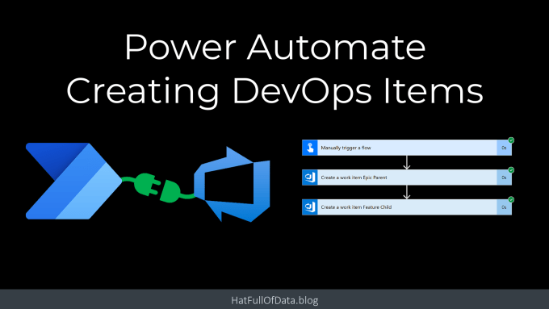
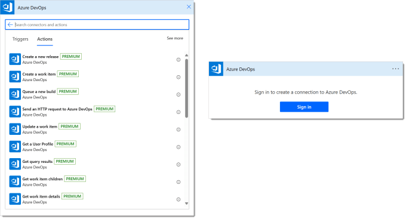
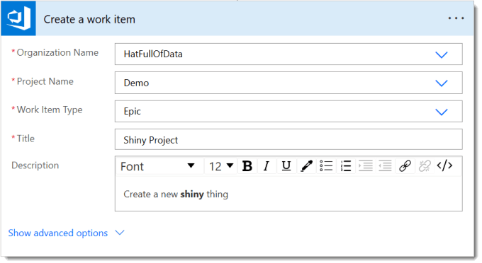
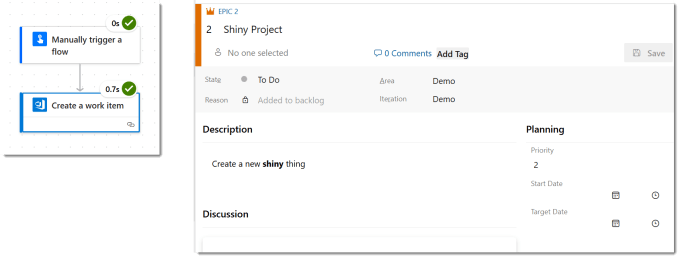
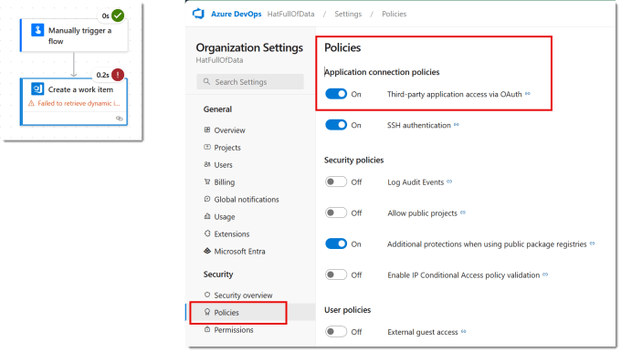
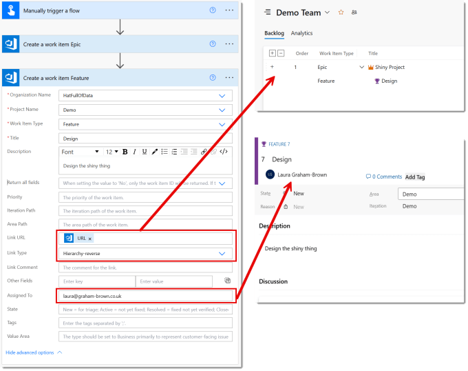
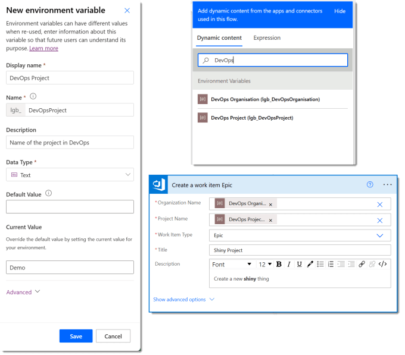

I know Azure DevOps from being on projects. Mostly for tracking tasks, sprints etc. I recently had to automate some item creation and editing across 1000s of tasks in DevOps. So I had to explore connecting Power Automate to DevOps for item creation and item editing. This is the first post I have in a long list of posts regarding DevOps with Power Automate and Power BI, welcome to my way of remembering how I did something.

## DevOps with Power Automate posts

- [Connecting Power Automate to Azure DevOps](https://hatfullofdata.blog/connecting-power-automate-to-devops/)

- [Updating Start and Due dates and other fields](https://hatfullofdata.blog/power-automate-update-fields-in-azure-devops/)

- [Using DevOps Rest API](https://hatfullofdata.blog/using-devops-rest-api-in-power-automate/)

- [Running a WIQL query](https://hatfullofdata.blog/running-a-wiql-devops-query-in-power-automate/)

- [Updating items without Notifications](https://hatfullofdata.blog/update-devops-without-notifications-with-power-automate/)

- [Updating a task on behalf of another person](https://hatfullofdata.blog/devops-updates-on-behalf-of-another-with-power-automate/)

## YouTube Version

## DevOps Connector

While editing a flow if you add action and search for DevOps you will find the Azure DevOps connector. If you look at the actions in the classic format[1](#65a785ed-7cea-41c5-b383-422365835ab1) you will notice its a premium connector, i.e. you need a premium license. If you have not used this connector before it will prompt you to login. It assumes your DevOps login matches your Power Automate login.

## Create an item

Let’s start with a simple action to create a work item in a project. We start by adding the action Create a work item.

The Organisation Name and the Project Name drop downs will contain the organisations and projects your login can see. (See further down about making this solution friendly). The Work Item Type drop down will contain all the types that the project allows from its process. The title is plain text and the Description is rich text, i.e. html.

When you test the flow you should get a work item created that matches the above.

## Troubleshoot Connecting Power Automate to DevOps

If the flow fails with an error regarding authorisation, you need to first check you are allowed to add an item in that project in DevOps. Then you need to check the organisation settings in DevOps. Look in Policies and make sure Third-party application access via OAuth is turned on.

## Advanced Options in Create an Item

The Create a work item action includes advanced options, really they are just optional options. Two of the options are Link URL and Link Type. In this example I used the URL from the previously created item and the Type of Hierarchy-reverse to make this item a child of the previous item.

Another option is the Assigned To field. I added my email so that when I look in the created item I see that it has been assigned to me.

The first option is Return all fields, which the default is blank. This means the action returns all the item details when it successfully creates the item.

## Making it Solution Aware

If this flow is part of a solution that is going to move from a development environment to test and production, you will need to point the DevOps actions to the different Organisation and Project values. Thankfully the text values of the Organisation Name, e.g. HatFullOfData can be used.

So I create 2 environment variables DevOps Organisation and DevOps Project. Then in the create a work item action, in Organisation Name and Project Name drop downs I select Custom Value and then the right value from Dynamic content.

And yes of course after making these changes I test the flow again.

## Conclusion on Connecting Power Automate to DevOps

For when you need to automate the creation of items, this is great. It does not replace importing an Excel file to create a whole plan but it does give an extra set of options to consider.

## More Power Automate Posts

- [Creating Adaptive Cards](https://hatfullofdata.blog/microsoft-flow-creating-adaptive-cards/)

- [Refreshing Datasets Automatically with Power BI Dataflows](https://hatfullofdata.blog/refreshing-datasets-automatically-with-dataflow/)

- [Power Automate Child Flow](https://hatfullofdata.blog/power-automate-child-flow/)

- [Get data from a Power BI dataset](https://hatfullofdata.blog/power-automate-get-data-from-a-power-bi-dataset/)

- [Power Automate Button in a Power BI Report](https://hatfullofdata.blog/power-automate-button-in-a-power-bi-report/)

- [Write Me a Flow](https://hatfullofdata.blog/power-automate-write-me-a-flow/)

- [Power Automate and DevOps series](https://hatfullofdata.blog/connecting-power-automate-to-devops/)

- [Power Automate and Power BI Rest API series](https://hatfullofdata.blog/power-automate-and-power-bi-rest-api/)

- [Save a File to OneLake Lakehouse](https://hatfullofdata.blog/power-automate-save-a-file-to-onelake-lakehouse/)

- [Trigger Microsoft Fabric Data Pipeline using Power Automate](https://hatfullofdata.blog/trigger-microsoft-fabric-data-pipeline/)

Foot Notes

- Yes in the new Power Automate experience, at the time of publishing this post, there are no premium labels on connectors or actions [↩︎](#65a785ed-7cea-41c5-b383-422365835ab1-link)

