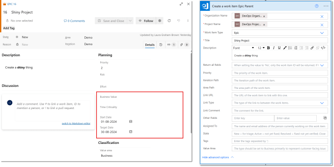
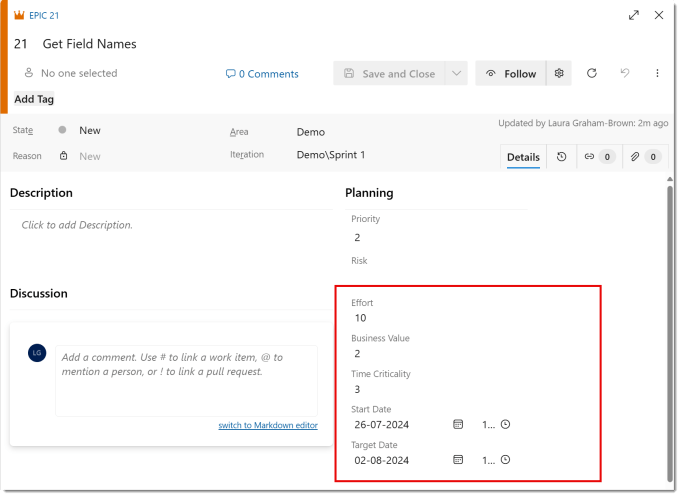
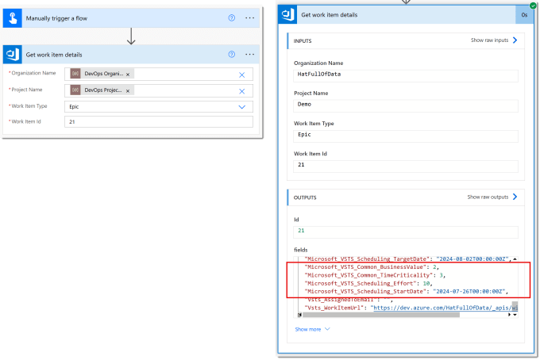
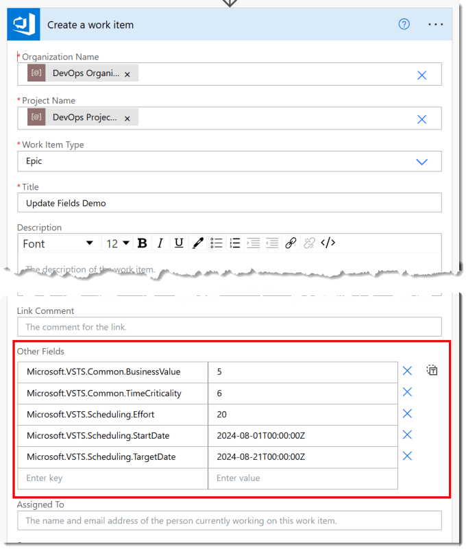
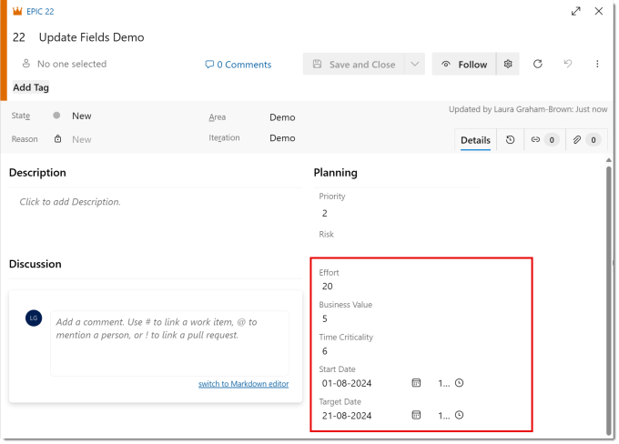
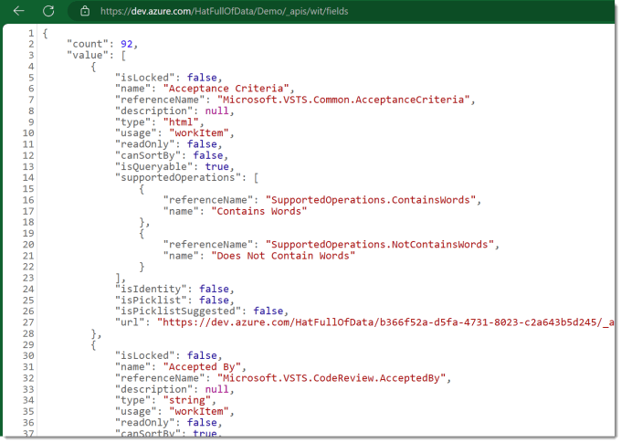

In a previous post we created items in DevOps. Although the Power Automate create item action had lots of fields, it did not have all the fields. This post shows you how to find the names for those fields and update fields in Azure DevOps using Power Automate.

## DevOps with Power Automate posts

- [Connecting Power Automate to Azure DevOps](https://hatfullofdata.blog/connecting-power-automate-to-devops/)

- [Updating Start and Due dates and other fields](https://hatfullofdata.blog/power-automate-update-fields-in-azure-devops/)

- [Using DevOps Rest API](https://hatfullofdata.blog/using-devops-rest-api-in-power-automate/)

- [Running a WIQL query](https://hatfullofdata.blog/running-a-wiql-devops-query-in-power-automate/)

- [Updating items without Notifications](https://hatfullofdata.blog/update-devops-without-notifications-with-power-automate/)

- [Updating a task on behalf of another person](https://hatfullofdata.blog/devops-updates-on-behalf-of-another-with-power-automate/)

## YouTube Version

Its coming 🙂

## The Problem

If you compare the fields available in a standard Epic item in DevOps with the fields available in Power Automate create work item action you will notice some fields are missing. The obvious missing ones being Start Date and Target Date and other fields like Business Value etc and any custom fields you’ve added will not be there so we need to update fields in Azure DevOps.



The observant ones amongst you will have noticed the Other Fields option in the Power Automate action. It wants a key for your field which is the name of the field. And guess what that name is not going to be StartDate. So our first job is finding that name.

## Finding Field Names v1

This is the first method and I think the simplest method. Start by creating an item in DevOps that has values in the fields you would like the names of. I’ve populated Effort, Business Value, Time Criticality, Start Date and Target Date.



Then in a Power Automate instant flow I add an action to get the work item details of that item, notice it is number 21. In the Get work item details I populate Org[1](#a040a142-03b1-4e20-a10b-8fe2427f8d11), Project, Type=”Epic” and Id=21. Then I run that flow and look at the outputs from that step.



If you scroll through the fields you will eventually find Business Value etc with their full field names. You need to replace the _ with . as I assume JSON objects to dots in field names. Note down the ones you need.

## Create Work Item and Update Fields in Azure DevOps

Now we have the field names we can create a work item and populate those fields. Note the date formats are YYYY-MM-DDThh:mm:ssZ.



When this flow is run, it creates an item and will successfully update fields in Azure DevOps.



The Update a work item action has exactly the same Other fields option so you can use the same technique.

## Find Field Names v2

Azure DevOps can be accessed via a Rest API[2](#6ef2c091-087e-46c5-8e21-2bba1d5c5562) and this includes the list of fields available in a project. There is quite good documentation for this which can be found at [https://learn.microsoft.com/en-us/rest/api/azure/devops/wit/fields/list](https://learn.microsoft.com/en-us/rest/api/azure/devops/wit/fields/list) . From the first code block on that post remove the GET and populate your org and project names. Then in a browser navigate to that url and it will return lots of JSON showing the definition of all the fields.

Copy CodeCopiedUse a different Browser
```xml
https://dev.azure.com/{organization}/{project}/_apis/wit/fields
```



Then search for the fields you want and look for the referenceName and use that. As my project got complex I saved this data and then used Power Query to make a simple list of fields (perhaps a resource I should make public).

## Conclusion on Update Fields in Azure DevOps

The Other Fields section in Create and Update work item actions gives us the option to update items however we want to. Some fields of course are read only and updating some fields will update other fields, for example if you change the state to Closed it will then populate the Closed date field.

## More Power Automate Posts

- [Creating Adaptive Cards](https://hatfullofdata.blog/microsoft-flow-creating-adaptive-cards/)

- [Refreshing Datasets Automatically with Power BI Dataflows](https://hatfullofdata.blog/refreshing-datasets-automatically-with-dataflow/)

- [Power Automate Child Flow](https://hatfullofdata.blog/power-automate-child-flow/)

- [Get data from a Power BI dataset](https://hatfullofdata.blog/power-automate-get-data-from-a-power-bi-dataset/)

- [Power Automate Button in a Power BI Report](https://hatfullofdata.blog/power-automate-button-in-a-power-bi-report/)

- [Write Me a Flow](https://hatfullofdata.blog/power-automate-write-me-a-flow/)

- [Power Automate and DevOps series](https://hatfullofdata.blog/connecting-power-automate-to-devops/)

- [Power Automate and Power BI Rest API series](https://hatfullofdata.blog/power-automate-and-power-bi-rest-api/)

- [Save a File to OneLake Lakehouse](https://hatfullofdata.blog/power-automate-save-a-file-to-onelake-lakehouse/)

- [Trigger Microsoft Fabric Data Pipeline using Power Automate](https://hatfullofdata.blog/trigger-microsoft-fabric-data-pipeline/)

#### Footnotes

- I’ve used environment variables to populate these as my flow is in a solution and I want to be able to move the solution to other environments or tenancies!  [↩︎](#a040a142-03b1-4e20-a10b-8fe2427f8d11-link)
- Another blog post is coming to cover using Azure DevOps Rest api in Power Automate, I promise! [↩︎](#6ef2c091-087e-46c5-8e21-2bba1d5c5562-link)

