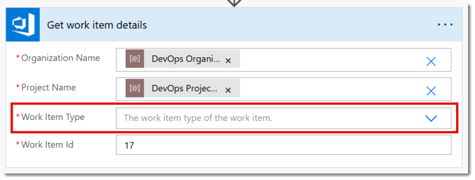
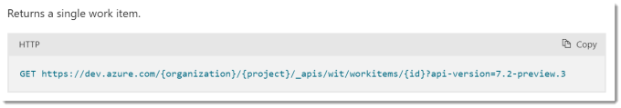
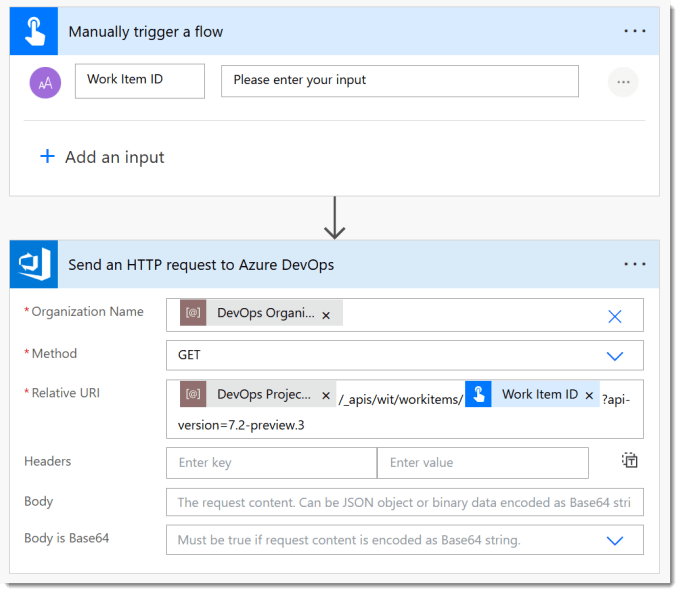
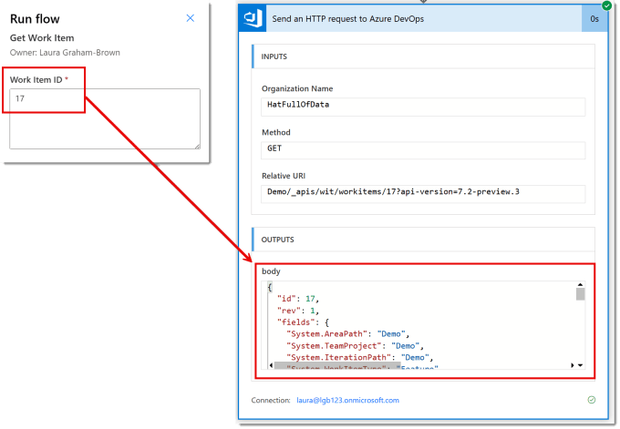
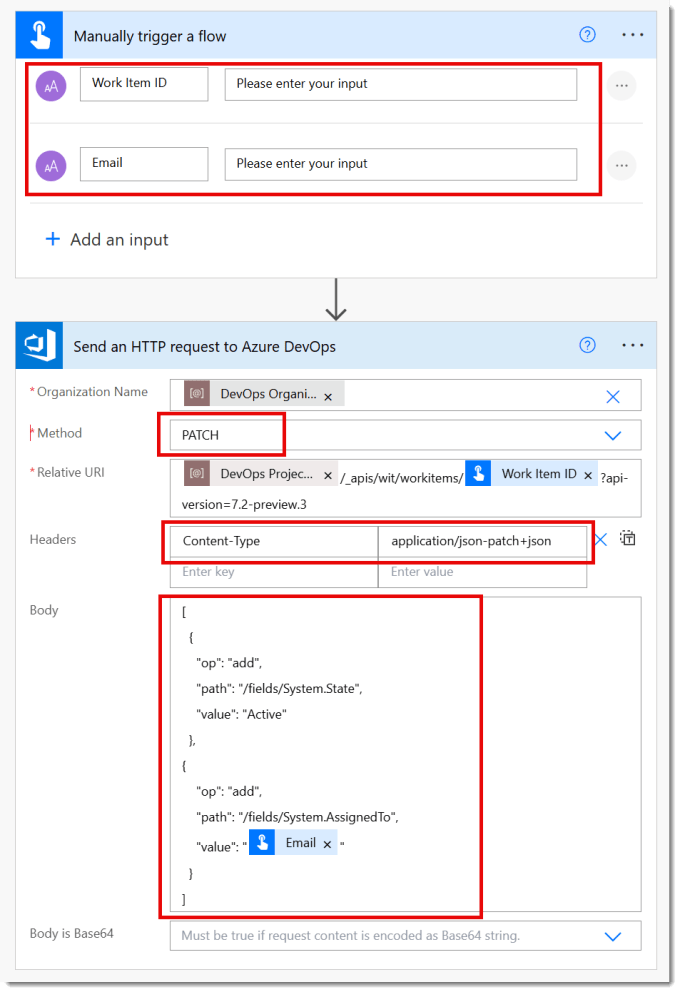

DevOps REST API is a well documented API that we can easily use in Power Automate to perform a huge range of actions. The connector includes an action to make it easy. The API documentation can be found at

[https://learn.microsoft.com/en-us/rest/api/azure/devops](https://learn.microsoft.com/en-us/rest/api/azure/devops?wt.mc_id=DX-MVP-5003563)

In this post we will take some simple examples to get you started. This is the third post in the DevOps and Power Automate series.

## DevOps with Power Automate posts

- [Connecting Power Automate to Azure DevOps](https://hatfullofdata.blog/connecting-power-automate-to-devops/)

- [Updating Start and Due dates and other fields](https://hatfullofdata.blog/power-automate-update-fields-in-azure-devops/)

- [Using DevOps Rest API](https://hatfullofdata.blog/using-devops-rest-api-in-power-automate/)

- [Running a WIQL query](https://hatfullofdata.blog/running-a-wiql-devops-query-in-power-automate/)

- [Updating items without Notifications](https://hatfullofdata.blog/update-devops-without-notifications-with-power-automate/)

- [Updating a task on behalf of another person](https://hatfullofdata.blog/devops-updates-on-behalf-of-another-with-power-automate/)

## YouTube Version

Its coming honest!

## Get Task Details using DevOps REST API

Power Automate includes an action to get the details of a Work Item. When we look we can see it has 4 required fields. Organization name, Project Name and Work Item Id are easy. We will have them. I had problems with Work Item Type, I didn’t always have that. So I looked to DevOps REST API for an alternative.



If we look in the documentation and then search for Get Work Item, you will find the syntax for fetching the details of one work item. The URL needs three pieces of information, shown in the {} brackets, organization, project and id. So no Work item type is required.



[https://learn.microsoft.com/en-us/rest/api/azure/devops/wit/work-items/get-work-item](https://learn.microsoft.com/en-us/rest/api/azure/devops/wit/work-items/get-work-item?wt.mc_id=DX-MVP-5003563)

We start with an instant flow. Then we add the a parameter to the trigger of the work item id. Then we add the action Send an HTTP request to Azure DevOps. The Organisation we can use our environment variable (or from the drop down). The method is GET. The Relative URI is everything after the organisation in the url we got from the documentation.

Copy CodeCopiedUse a different Browser
```xml
{project}/_apis/wit/workitems/{id}?api-version=7.2-preview.3
```



When we run the flow, we get prompted to enter the number of a work item id. When it completes, we get returned the JSON of that work item details. If you need to extract information from that JSON, you will probably need a Parse JSON action. (Another post!)



## Update a Work Item using DevOps REST API

We can update an item using the REST API. For this example the flow will update a given task to have the state Active and be assigned to the given email. So, we add Work Item ID and Email as two parameters to the trigger.



Then we add a Send an HTTP request to Azure DevOps action. The Organisation is the same as before, the method is now Patch as we are updating data. The Relative URI is exactly the same as before. In the headers we need to add Content-Type and application/json-patch+json

In the Body we need to add a JSON object that includes the fields we want to update. For this we need to know the field names, see the previous post in the series for ways to find them. It is just text so we can insert dynamic content, e.g. the email address. The above example picture and code below shows changing the State to Active and assigning it to the Email address

Copy CodeCopiedUse a different Browser
```xml
[
  {
    "op": "add",
    "path": "/fields/System.State",
    "value": "Active"
  },
{
    "op": "add",
    "path": "/fields/System.AssignedTo",
    "value": "@{triggerBody()['text_1']}"
  }
]
```

## Conclusion

Rest API is a very powerful way to work with Azure DevOps and the action in Power Automate does make it very easy to use. It is worth having a test project to try out some of the options. Other posts will look at using Rest API to make changes without notifications and on behalf of another person. Also a bulk delete process, which needs a post of its own due to a few oddities.

## More Power Automate Posts

- [Creating Adaptive Cards](https://hatfullofdata.blog/microsoft-flow-creating-adaptive-cards/)

- [Refreshing Datasets Automatically with Power BI Dataflows](https://hatfullofdata.blog/refreshing-datasets-automatically-with-dataflow/)

- [Power Automate Child Flow](https://hatfullofdata.blog/power-automate-child-flow/)

- [Get data from a Power BI dataset](https://hatfullofdata.blog/power-automate-get-data-from-a-power-bi-dataset/)

- [Power Automate Button in a Power BI Report](https://hatfullofdata.blog/power-automate-button-in-a-power-bi-report/)

- [Write Me a Flow](https://hatfullofdata.blog/power-automate-write-me-a-flow/)

- [Power Automate and DevOps series](https://hatfullofdata.blog/connecting-power-automate-to-devops/)

- [Power Automate and Power BI Rest API series](https://hatfullofdata.blog/power-automate-and-power-bi-rest-api/)

- [Save a File to OneLake Lakehouse](https://hatfullofdata.blog/power-automate-save-a-file-to-onelake-lakehouse/)

- [Trigger Microsoft Fabric Data Pipeline using Power Automate](https://hatfullofdata.blog/trigger-microsoft-fabric-data-pipeline/)

