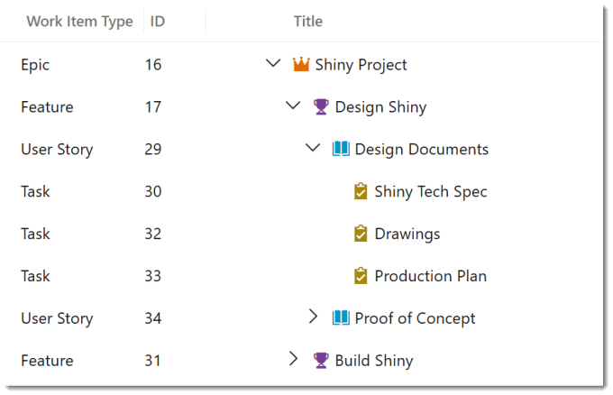
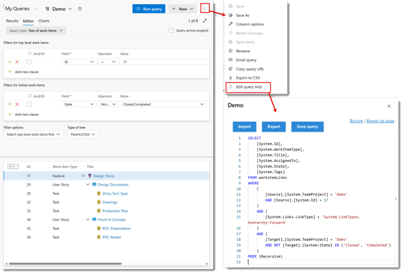
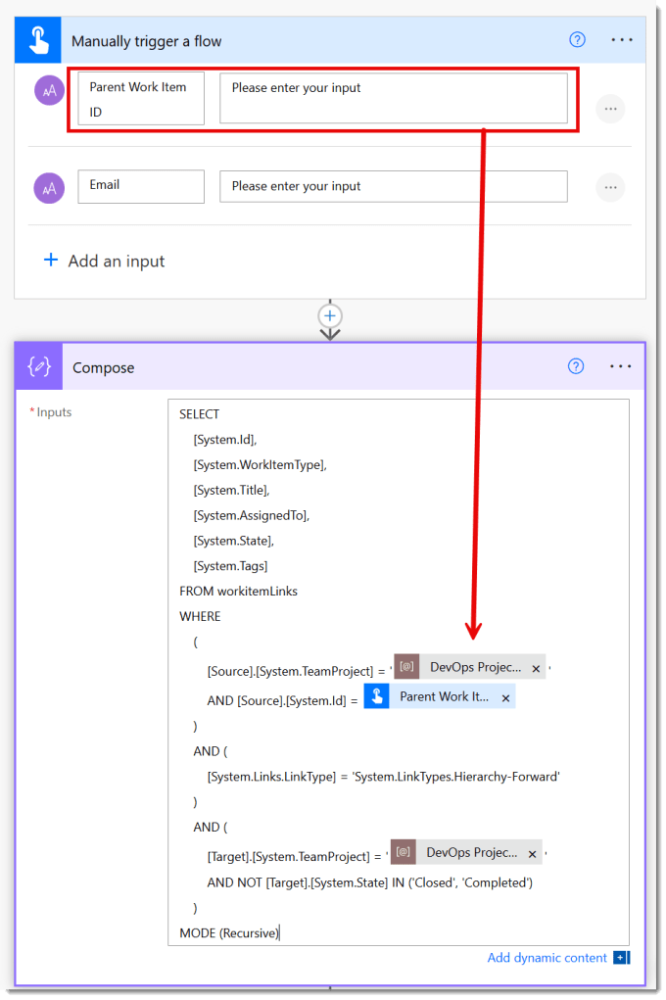
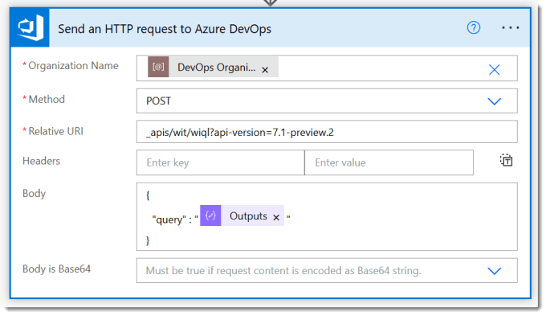
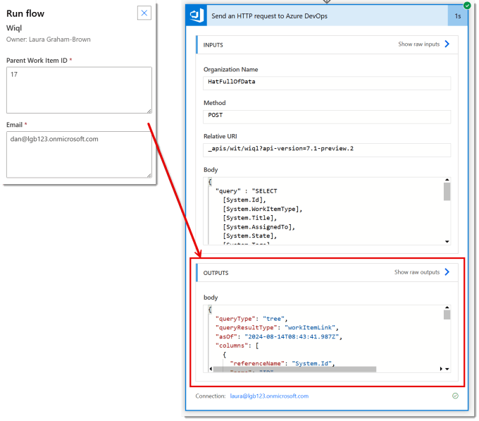
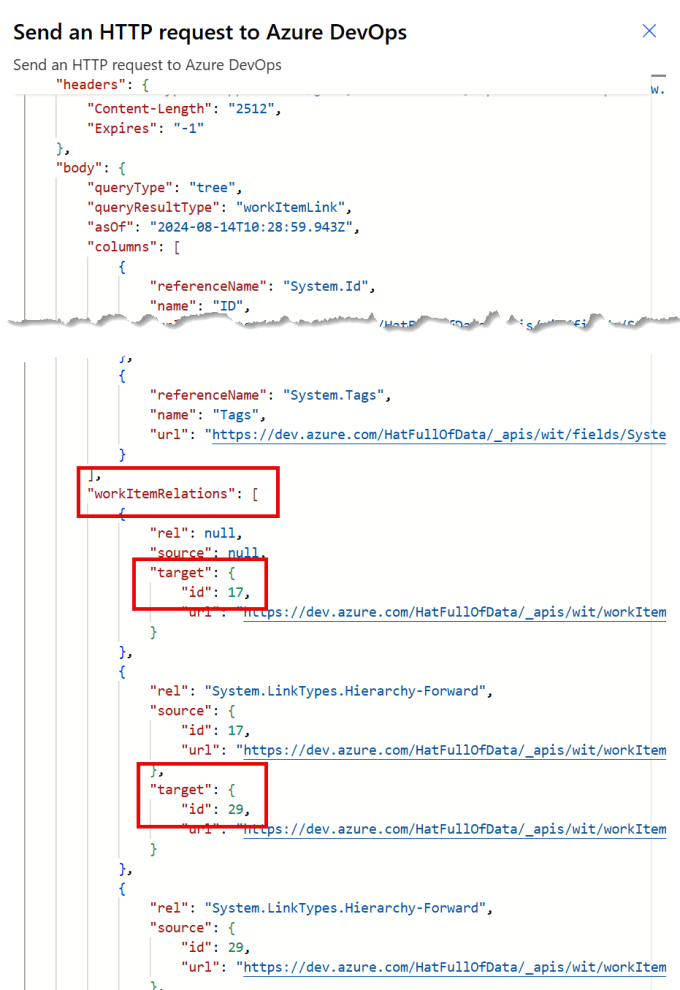
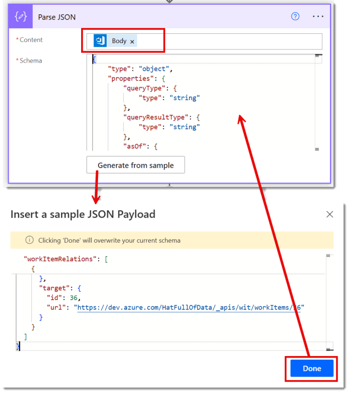
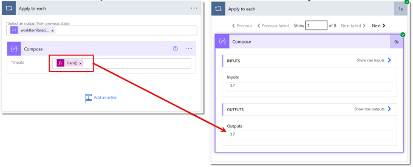
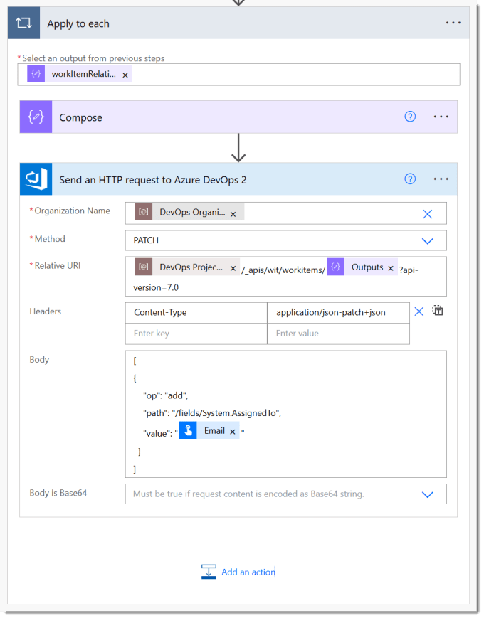
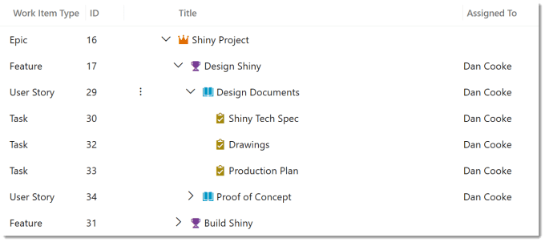

---
title: Running a Wiql DevOps query in Power Automate
description: Wiql is the language used to define the queries in Azure DevOps. Power Automate can use a REST API to execute the wiql.
slug: running-a-wiql-devops-query-in-power-automate
date: 2024-08-14 11:55:17+0000
lastmod: 2025-02-14 10:14:37+0000
image: cover.png
categories:
    - DevOps
    - Power Automate
---

Wiql stands for Work Item Query Language and is the language used to define the queries in Azure DevOps. Its has a very similar syntax to SQL. Power Automate can use a REST API send a query to DevOps to execute the query. This post post is part of the Power Automate and DevOps series.

## DevOps with Power Automate posts

- [Connecting Power Automate to Azure DevOps](https://hatfullofdata.blog/connecting-power-automate-to-devops/)

- [Updating Start and Due dates and other fields](https://hatfullofdata.blog/power-automate-update-fields-in-azure-devops/)

- [Using DevOps Rest API](https://hatfullofdata.blog/using-devops-rest-api-in-power-automate/)

- [Running a WIQL query](https://hatfullofdata.blog/running-a-wiql-devops-query-in-power-automate/)

- [Updating items without Notifications](https://hatfullofdata.blog/update-devops-without-notifications-with-power-automate/)

- [Updating a task on behalf of another person](https://hatfullofdata.blog/devops-updates-on-behalf-of-another-with-power-automate/)

The full reference can be found at [https://learn.microsoft.com/en-us/azure/devops/boards/queries/wiql-syntax?view=azure-devops](https://learn.microsoft.com/en-us/azure/devops/boards/queries/wiql-syntax?view=azure-devops&wt.mc_id=DX-MVP-5003563)

## Writing the Query

You can write it by hand, and I’m sure some people do. I use the query tools in DevOps to build the query and then view the Wiql code. For this post the example we are going to is to assign all the items in a hierarchy to one person. For example all the items in the Design Shiny feature.



### Wiql Editor

Before we can work with WIQL we need to install the extension Wiql Playground in the organisation. You will need to be an organisation admin to do this. Head to the marketplace for Visual Studio, found here

[Extensions for Visual Studio family of products | Visual Studio Marketplace](https://marketplace.visualstudio.com/azuredevops)

Search for wiql and click on the Wiql Editor. When the extension information page opens click on Get it free. Then on the next page, select the right organisation and click Download. It will now appear under boards in your project.


### Construct Query

Now in Queries construct the query. I am not here to teach you building queries in DevOps, there is a great post to get you started here [https://learn.microsoft.com/en-us/azure/devops/boards/queries/using-queries](https://learn.microsoft.com/en-us/azure/devops/boards/queries/using-queries?wt.mc_id=DX-MVP-5003563). My query is a tree of work items, matching the top item first and only has 2 criteria of the top item is ID 17 and the child item is not closed or completed.



Once you have your query working and you have saved it you can view the Wiql. Click on the three dots in the top right. Then from the menu select Edit query wiql. This will open a pane containing the code that you can copy to your clipboard.

Note you have to save after any changes for the changes to be in the Wiql code.

## Running the Wiql in Power Automate

Now we have the Wiql code we can write the flow. The flow will have the parameters of the Parent Work Item ID and the email address to assign all the tasks to. We will then use a compose action to the Parent Work Item ID and Project name into the Wiql.



The next step is to run the query. The documentation for the REST API call can be found here [https://learn.microsoft.com/en-us/rest/api/azure/devops/wit/wiql/query-by-wiql](https://learn.microsoft.com/en-us/rest/api/azure/devops/wit/wiql/query-by-wiql?wt.mc_id=DX-MVP-5003563) The method is Post and the URI will be the same for all Wiql

```xml
_apis/wit/wiql?api-version=7.1-preview.2
```

The body is JSON with only one field query with the output from the compose action.



When we run the flow and enter in the Parent ID 17 and the email Dan@lgb123.onmicrosoft.com it executes and returns us the data.



## Handling the Output of the HTTP call

In the successful action we can click on Show raw output in the Outputs section to open a pane and explore the Json output. Scroll past the headers and then in the body section, past columns to find workItemRelations. This will list all the work items returned by the query, not their details, just the id and url in the target section.



To make this easy to work with we need to use a Parse JSON so copy all the output JSON and return to editing the flow. Add a Parse JSON step and add the Body returned by the HTTP to the Content. Next we need to add a schema, this can be generated. Click on Generate from sample. Then paste in the JSON you copied and click Done. And a schema will be added.



The output schema is now known to the flow. So we can use the output to loop through all the items and update the work items.

## Looping through workItemRelations

We can loop through the workItemRelations using an Apply to each action. The piece of information I want from each item is the target – id. So I add a compose and add the following expression

```xml
item()?['target']?['id']
```

I would then test to make sure you get the number of items you expect and that the compose does return the ids you expect



Finally we can add a step to assign each task to the email given in the parameter. I use a Send HTTP method rather than the Update a Work Item so I can as explained in a future post turn off notifications.



We can then run the flow and check the results in DevOps and see the tasks have been assigned.



## Conclusion

this was one example of using Wiql inside Power Automate. I have used it to duplicate hierarchies and delete a hierarchy. The skill comes in being able to write the Wiql to achieve what you need.

## More Power Automate Posts

- [Creating Adaptive Cards](https://hatfullofdata.blog/microsoft-flow-creating-adaptive-cards/)

- [Refreshing Datasets Automatically with Power BI Dataflows](https://hatfullofdata.blog/refreshing-datasets-automatically-with-dataflow/)

- [Power Automate Child Flow](https://hatfullofdata.blog/power-automate-child-flow/)

- [Get data from a Power BI dataset](https://hatfullofdata.blog/power-automate-get-data-from-a-power-bi-dataset/)

- [Power Automate Button in a Power BI Report](https://hatfullofdata.blog/power-automate-button-in-a-power-bi-report/)

- [Write Me a Flow](https://hatfullofdata.blog/power-automate-write-me-a-flow/)

- [Power Automate and DevOps series](https://hatfullofdata.blog/connecting-power-automate-to-devops/)

- [Power Automate and Power BI Rest API series](https://hatfullofdata.blog/power-automate-and-power-bi-rest-api/)

- [Save a File to OneLake Lakehouse](https://hatfullofdata.blog/power-automate-save-a-file-to-onelake-lakehouse/)

- [Trigger Microsoft Fabric Data Pipeline using Power Automate](https://hatfullofdata.blog/trigger-microsoft-fabric-data-pipeline/)

