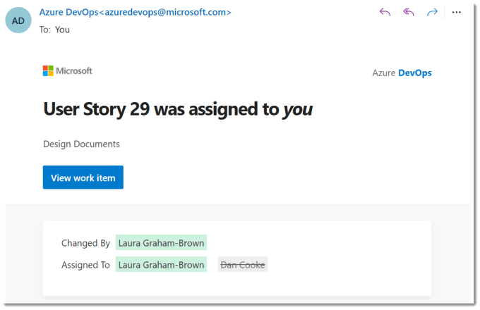
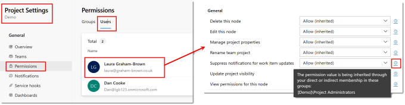
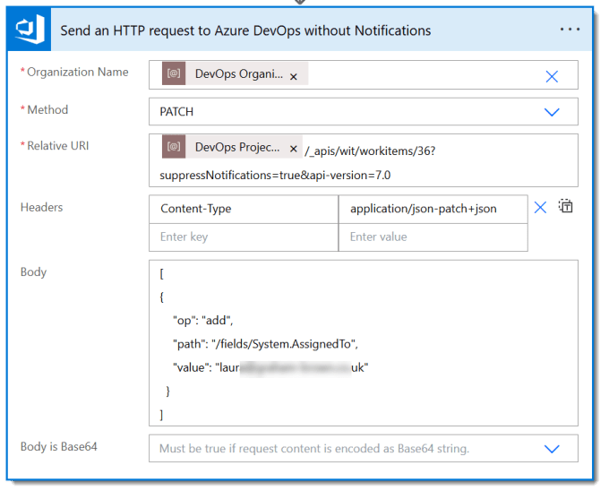
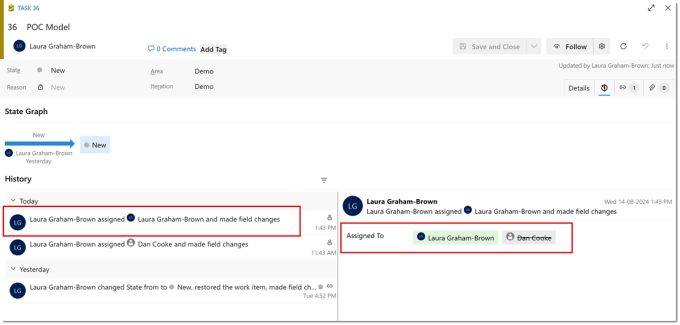

---
title: Update DevOps without Notifications with Power Automate
description: When a work item is assigned to you, you are sent a notification. In this post we show how Power Automate can update without notifications
slug: update-devops-without-notifications
date: 2024-08-16 07:52:49+0000
lastmod: 2025-02-14 10:14:48+0000
image: cover.png
categories:
    - DevOps
    - Power Automate
---

When a work item is assigned to you, by default you are sent a notification. Notifications can also be sent regarding updates to your items. Now imagine creating over 10 thousand tasks automatically and assigning them to people. I recently did this on a projects and potentially each person was going to get 100s of emails. So I needed Power Automate to assign the tasks without notifications. This post is part of the Power Automate and DevOps series.



## DevOps with Power Automate posts

- [Connecting Power Automate to Azure DevOps](https://hatfullofdata.blog/connecting-power-automate-to-devops/)

- [Updating Start and Due dates and other fields](https://hatfullofdata.blog/power-automate-update-fields-in-azure-devops/)

- [Using DevOps Rest API](https://hatfullofdata.blog/using-devops-rest-api-in-power-automate/)

- [Running a WIQL query](https://hatfullofdata.blog/running-a-wiql-devops-query-in-power-automate/)

- [Updating items without Notifications](https://hatfullofdata.blog/update-devops-without-notifications-with-power-automate/)

- [Updating a task on behalf of another person](https://hatfullofdata.blog/devops-updates-on-behalf-of-another-with-power-automate/)

## YouTube Version

They are on the backlog!

## Permissions for updates without notifications

Updating DevOps without notifications is not something that everyone should be able to do. Or at least the admins will want to be able to control who can do it.



In the Project settings, click on Permissions. Then click on Users to list your users. When you click on a person you get to see all their permissions. They can be Allow, Deny or Not Set for all the different actions. (inherited) means it is set by being a member of a group. If you hover your cursor over the (i) you will get a description telling you which membership the permission as inherited from. A Deny overrides an allow, so you might need to manually override the inherited permission.

The permission we are interested in is Suppress notifications for work item updates.

## Updating without Notifications

Now we have the permission we can test it out in an update. This can only be done on updates done by a REST API call. If you look on [https://learn.](https://learn.microsoft.com/en-us/rest/api/azure/devops/wit/work-items/update?)[microsoft.com/en-us/rest/api/azure/devops/wit/work-items/update](https://learn.microsoft.com/en-us/rest/api/azure/devops/wit/work-items/update?wt.mc_id=DX-MVP-5003563) there is a URI parameter suppressNotifications which is a boolean.

URI parameters get added after the ? and are separated by &. So the code to update item 36 without notifications would be

```xml
{project}/_apis/wit/workitems/36?suppressNotifications=true&api-version=7.0
```



## Item History

Suppressing the notifications does prevent automated updates filling inboxes with emails that will just get deleted. It does not however supress the history of the item being updated. So who did the update and when is still recorded.



## More Power Automate Posts

- [Creating Adaptive Cards](https://hatfullofdata.blog/microsoft-flow-creating-adaptive-cards/)

- [Refreshing Datasets Automatically with Power BI Dataflows](https://hatfullofdata.blog/refreshing-datasets-automatically-with-dataflow/)

- [Power Automate Child Flow](https://hatfullofdata.blog/power-automate-child-flow/)

- [Get data from a Power BI dataset](https://hatfullofdata.blog/power-automate-get-data-from-a-power-bi-dataset/)

- [Power Automate Button in a Power BI Report](https://hatfullofdata.blog/power-automate-button-in-a-power-bi-report/)

- [Write Me a Flow](https://hatfullofdata.blog/power-automate-write-me-a-flow/)

- [Power Automate and DevOps series](https://hatfullofdata.blog/connecting-power-automate-to-devops/)

- [Power Automate and Power BI Rest API series](https://hatfullofdata.blog/power-automate-and-power-bi-rest-api/)

- [Save a File to OneLake Lakehouse](https://hatfullofdata.blog/power-automate-save-a-file-to-onelake-lakehouse/)

- [Trigger Microsoft Fabric Data Pipeline using Power Automate](https://hatfullofdata.blog/trigger-microsoft-fabric-data-pipeline/)

