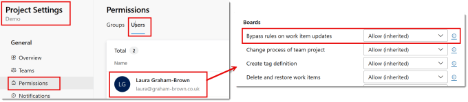
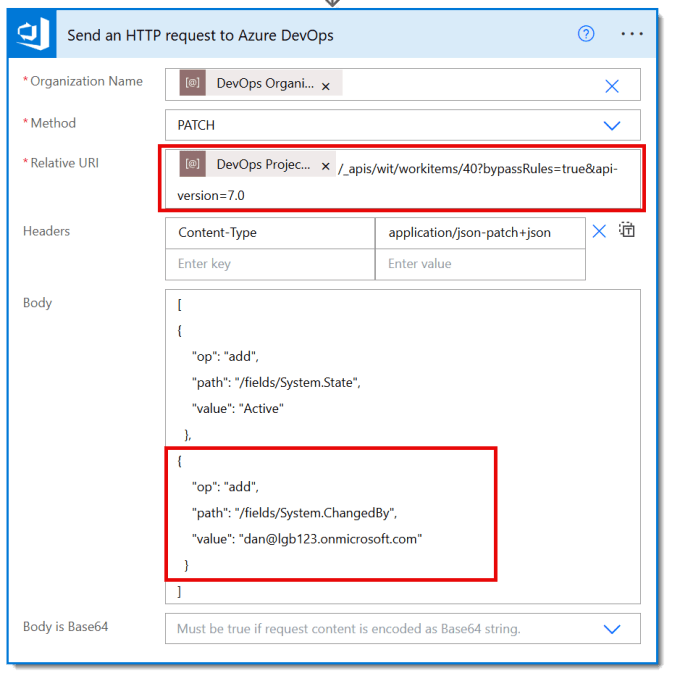
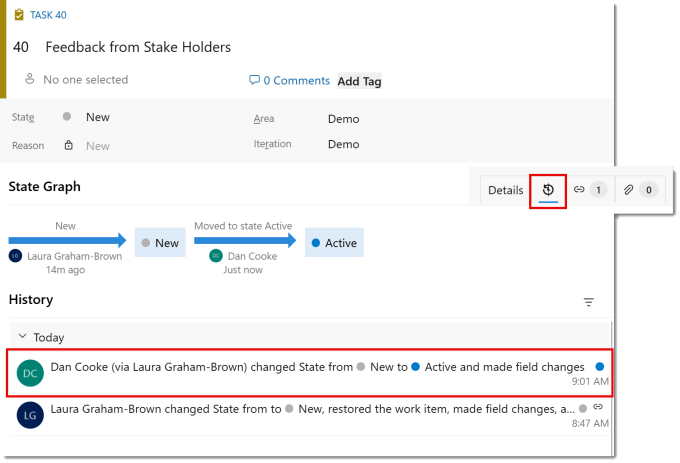
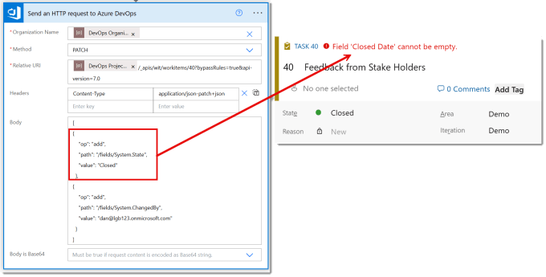

I had a need to use automation to do DevOps updates on behalf of another person so when the DevOps adoption metrics were done we the stats were slightly more accurate. This can only be done using REST API and will need permissions. This post is part of the DevOps and Power Automate series.

## DevOps with Power Automate posts

- [Connecting Power Automate to Azure DevOps](https://hatfullofdata.blog/connecting-power-automate-to-devops/)

- [Updating Start and Due dates and other fields](https://hatfullofdata.blog/power-automate-update-fields-in-azure-devops/)

- [Using DevOps Rest API](https://hatfullofdata.blog/using-devops-rest-api-in-power-automate/)

- [Running a WIQL query](https://hatfullofdata.blog/running-a-wiql-devops-query-in-power-automate/)

- [Updating items without Notifications](https://hatfullofdata.blog/update-devops-without-notifications-with-power-automate/)

- [Updating a task on behalf of another person](https://hatfullofdata.blog/devops-updates-on-behalf-of-another-with-power-automate/)

## YouTube Version

It’s on the backlog!

## Permission required to makes updates on behalf of another

The trick to being able update on behalf of another is to update the ChangedBy field to another persons email address. This is not normally allowed, it breaks the rules. So the permission we need is to bypass the rules and make illegal updates.

Permissions are managed in Project Settings, you then click on permissions. Click on Users at the top and then click on the user being used in the flow to show their permissions. Under Boards check the permission for Bypass rules on work item updates. This needs to be set to Allow.

## Make Updates on behalf of another

Now we have permission is ignore the rules we can test out a flow. In the REST API documentation for updating an item [https://learn.microsoft.com/en-us/rest/api/azure/devops/wit/work-items/update](https://learn.microsoft.com/en-us/rest/api/azure/devops/wit/work-items/update?wt.mc_id=DX-MVP-5003563) you will see there is a boolean parameter bypassRules. This can be added to the relative URI using & to separate the parameters.

In the body section I have added an update to the ChangedBy field. This update updates the State to active and performs it on behalf of Dan. In the task history we can see the update and see I did it on behalf of Dan.

## Word of caution

By passing the rules, it also means that the updates behind the scenes that happen are turned off. If we change the state to closed using the same technique the we get an error when we open the work item.

So make sure you have checked the updates you are doing and include all the fields you need to update, even the hidden ones.

Second word of warning is no checks are done on the updates. So you can assign a task to an email address that doesn’t have access, or update to a state that is not valid. So treat this one with caution.

## Conclusion

Updates on behalf of another is a very powerful trick. But should be treated with extra caution and it has made me double check permissions on a ew projects so access to by passing the rules is limited.

## More Power Automate Posts

- [Creating Adaptive Cards](https://hatfullofdata.blog/microsoft-flow-creating-adaptive-cards/)

- [Refreshing Datasets Automatically with Power BI Dataflows](https://hatfullofdata.blog/refreshing-datasets-automatically-with-dataflow/)

- [Power Automate Child Flow](https://hatfullofdata.blog/power-automate-child-flow/)

- [Get data from a Power BI dataset](https://hatfullofdata.blog/power-automate-get-data-from-a-power-bi-dataset/)

- [Power Automate Button in a Power BI Report](https://hatfullofdata.blog/power-automate-button-in-a-power-bi-report/)

- [Write Me a Flow](https://hatfullofdata.blog/power-automate-write-me-a-flow/)

- [Power Automate and DevOps series](https://hatfullofdata.blog/connecting-power-automate-to-devops/)

- [Power Automate and Power BI Rest API series](https://hatfullofdata.blog/power-automate-and-power-bi-rest-api/)

- [Save a File to OneLake Lakehouse](https://hatfullofdata.blog/power-automate-save-a-file-to-onelake-lakehouse/)

- [Trigger Microsoft Fabric Data Pipeline using Power Automate](https://hatfullofdata.blog/trigger-microsoft-fabric-data-pipeline/)

