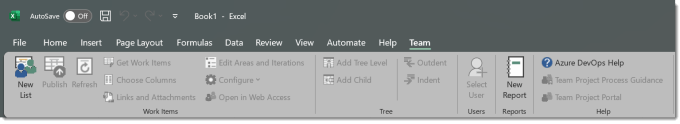
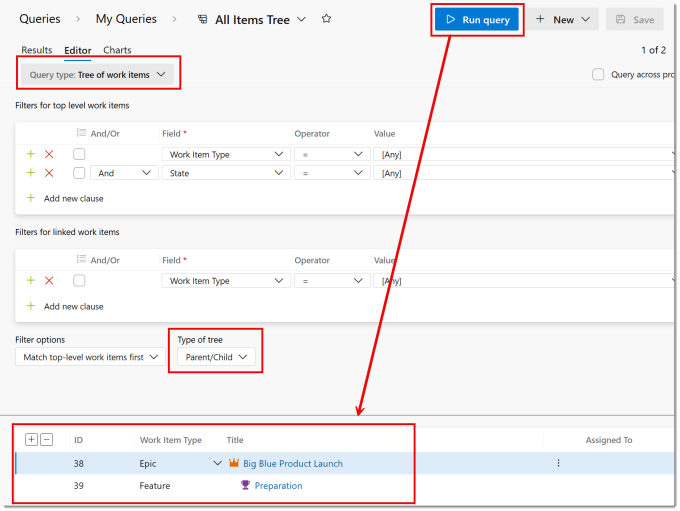
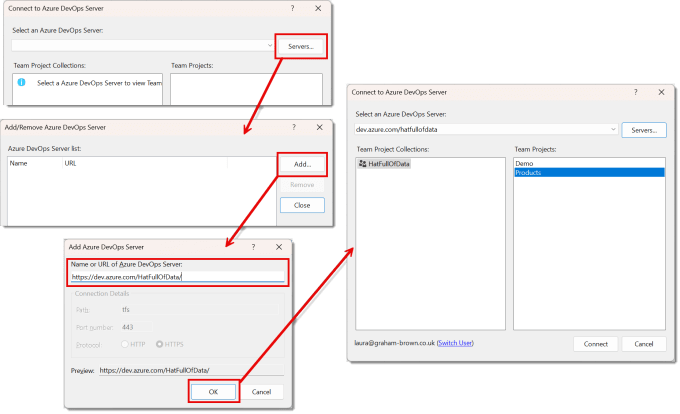
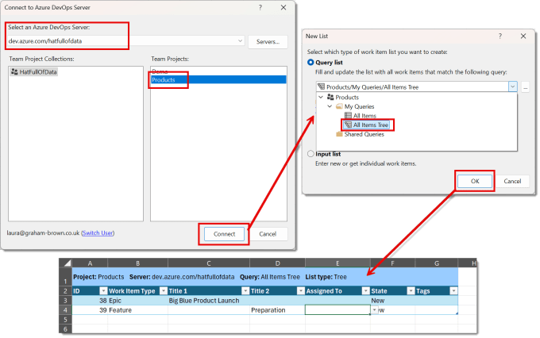
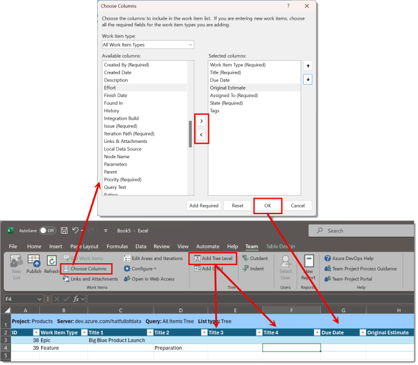
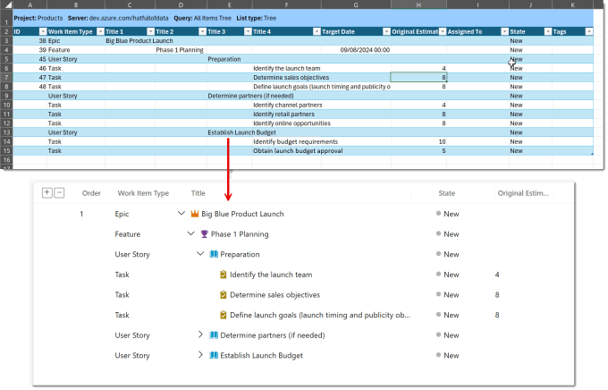

One of the easiest ways to edit a project in Azure DevOps is to connect Excel to the project. This post walks you through connecting to a project and updating the DevOps items in Excel. Its mostly for selfish reasons as I need to remember how to do this.

Microsoft also has a post about this at [https://learn.microsoft.com/en-us/azure/devops/boards/backlogs/office/bulk-add-modify-work-items-excel](https://learn.microsoft.com/en-us/azure/devops/boards/backlogs/office/bulk-add-modify-work-items-excel?wt.mc_id=DX-MVP-5003563)

## Add Excel Extension

This needs an Excel extension added from the Visual Studio site. You need to download Azure DevOps Office Integration 2019 from here and execute

[Download Visual Studio Tools – Install Free for Windows, Mac, Linux (microsoft.com)](https://visualstudio.microsoft.com/downloads/#azure-devops-office-integration-2019)

Once you have done this, in Excel you will have a Team ribbon.

## Create a Tree Query

If you want to edit many items including child and parent hierarchy, then the easiest way is to write a tree query in DevOps that loads the right tasks and then use that to pull the right tasks into Excel. In DevOps under Boards select Queries. Then select New Query. Change query type to Tree of work items and type of tree to Parent/Child. Select the right filters to pull the items you want and then save your query. Save and run the query to make sure you get a hierarchy of tasks. In my example I wanted all the items in the project.

## Connect to a DevOps Project

On the Team ribbon, click on New List. If this is the first time you’ve connected you need to add a server first.

### Adding a Server

Click on the Servers button. Then in the next dialog, click on Add. Into the next dialog enter in the url to the organisation, for example https://dev.azure.com/HatFullOfData/. Click OK to finish adding the server, you will be prompted to login. Click Close to return to the original dialog.

### Connecting to a project

You start from the connect to Azure DevOps dialog, which will open from adding a server or opened by clicking on New List on the Team ribbon on a new sheet. Select the server and select the right project and click connect. Select your tree query from the drop down and click OK The tasks from the project should load as a table into Excel.

The table format needs some explaining. Title 1 is the name of the highest level tasks and Title 2 etc are children of the Title 1 task above it. You can add another level of hierarchy by clicking on Add Tree Level from the Team ribbon. You can also add other DevOps columns by clicking Choose Columns and using the middle buttons to add or remove columns in the Choose columns dialog.

## Adding and Publishing DevOps items in Excel

Items can be added to the table just typing in new rows. The ID column leave blank, the Title 1 – 4 fill in making sure you understand the hierarchy. Some fields such as Target Date are read only for some Work Item Types. When you want to see the results in DevOps click on Publish. Then open DevOps to see the work items.

## Conclusion

I needed to create a project plan in DevOps from a list of tasks I had in a text file ready for a demo. There were 80 tasks and I knew I could it them quicker in Excel than I could in DevOps because I am more familiar with Excel. I also wanted to note down how I then loaded those tasks into DevOps from Excel.

Other related series include:

## DevOps with Power Automate posts

- [Connecting Power Automate to Azure DevOps](https://hatfullofdata.blog/connecting-power-automate-to-devops/)

- [Updating Start and Due dates and other fields](https://hatfullofdata.blog/power-automate-update-fields-in-azure-devops/)

- [Using DevOps Rest API](https://hatfullofdata.blog/using-devops-rest-api-in-power-automate/)

- [Running a WIQL query](https://hatfullofdata.blog/running-a-wiql-devops-query-in-power-automate/)

- [Updating items without Notifications](https://hatfullofdata.blog/update-devops-without-notifications-with-power-automate/)

- [Updating a task on behalf of another person](https://hatfullofdata.blog/devops-updates-on-behalf-of-another-with-power-automate/)

