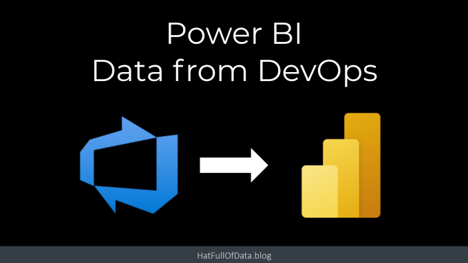
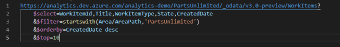
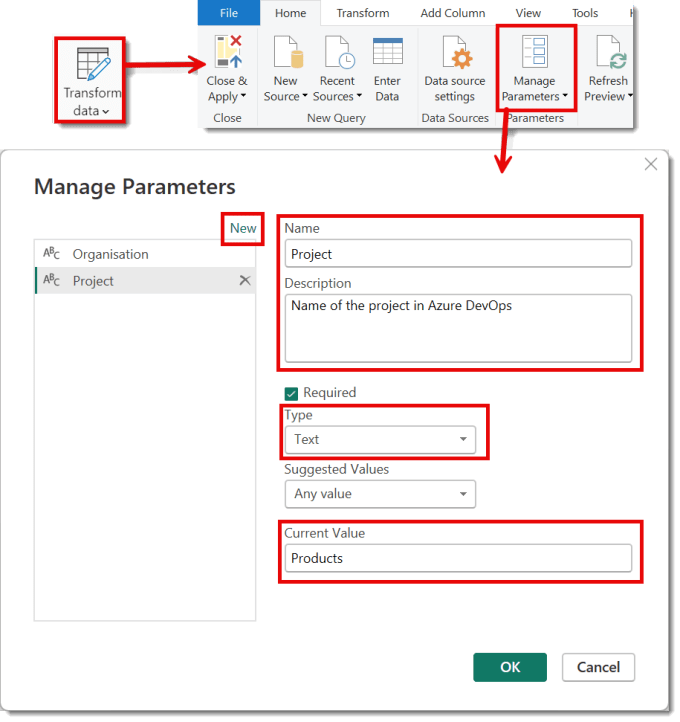
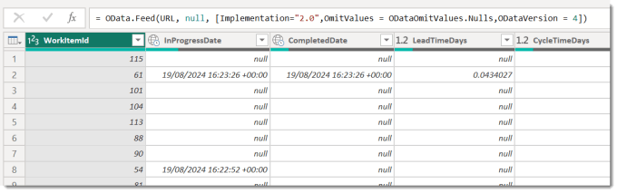
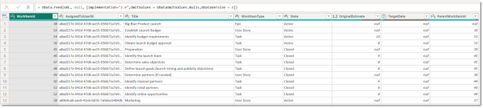
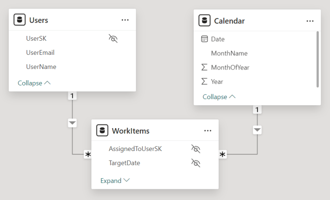
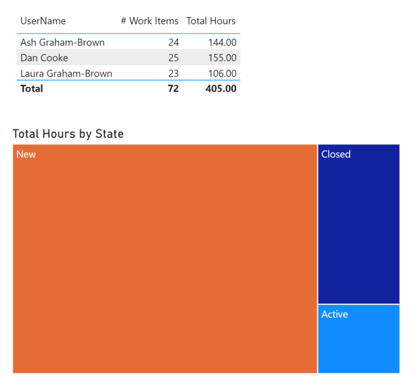

---
title: Get DevOps Data into Power BI
description: Azure DevOps is full of data that management want to to report on. Adding a Power BI report is an obvious way to do this. This post is my take on how I would build the reports.
slug: devops-data-into-power-bi
date: 2024-08-27 09:09:57+0000
lastmod: 2025-02-14 10:58:01+0000
image: cover.png
categories:
    - DevOps
    - Power BI
---

Azure DevOps is full of data that management want to to report on. Adding a Power BI report is an obvious way to do this. There are plenty of sample reports and Microsoft posts giving you guidance how to get DevOps data into Power BI. This post is my take on how I would build the reports. My focus is making them easy to extend and easy to point at a different organisation and project.

## Power BI and DevOps Series

This post is part of a series:

- [Get DevOps Data into Power BI](https://hatfullofdata.blog/devops-data-into-power-bi/)

- [Add Parent Child Hierarchy using DAX Patterns](https://hatfullofdata.blog/devops-parent-child-hierarchy-in-power-bi/)

- [Inherited Value in a Parent Child pattern](https://hatfullofdata.blog/inherited-value-in-a-parent-child-pattern/)

- Add conditional formatting icons the easy way

## YouTube Version

[](https://youtu.be/DAHEv2YoTP8)

## Microsoft References for DevOps Data into Power BI

- [https://learn.microsoft.com/en-us/azure/devops/report/powerbi/odataquery-connect](https://learn.microsoft.com/en-us/azure/devops/report/powerbi/odataquery-connect?wt.mc_id=DX-MVP-5003563)Great post showing you to use Visual Studio Code to write the query, test it and then use it in Power BI

- [https://learn.microsoft.com/en-us/azure/devops/report/powerbi/sample-odata-overview](https://learn.microsoft.com/en-us/azure/devops/report/powerbi/sample-odata-overview?wt.mc_id=DX-MVP-5003563)Lots of sample reports

## OData Queries

We get DevOps Data into Power BI using an OData query. From the first Microsoft link above it shows the query is made up of different parts. The first part is a path and then extras that select columns, filter the data and sort the data.



The simplest form though is just the URL, that will bring through all the columns and all the rows of data. We will start with that.

## Simplest Query for Work Items

```xml
https://analytics.dev.azure.com/{Organisation}/{Project}/_odata/v3.0-preview/WorkItems?
```

The path includes the organisation and the project names. So we start in Power Query, by clicking on Transform data on the Home ribbon in Power BI. Then click on Manage Parameters to open a dialog. You need to add 2 parameters, Organisation and Project. Click on New to start a new parameter, enter in a name and description (yes add that description, future you will thank you), select type text and enter in the current value for the Organisation and the Project.



We could now use Get Data and select OData and build the string… But that is hard work and not easy to read! So I’ve written a template to walk you through. Click on New Source and select blank query. Click on Advanced Editor and paste in the code below.

```xml
let
    // Path using 2 parameters
    Path = "https://analytics.dev.azure.com/" & Organisation & "/" & Project & "/_odata/v3.0-preview/WorkItems?",
    
    // URL made up of parts
    URL = Path,
    
    // Do the OData query
    Source = OData.Feed(URL, null, [Implementation="2.0",OmitValues = ODataOmitValues.Nulls,ODataVersion = 4])
in
    Source
```

The Path line uses the 2 parameters and points to the WorkItems. The URL line looks redundant now but will make more sense when the query has more parts. The Source line uses the URL and includes the flags recommended by the link at the top of this post to prevent throttling.

When you click OK and set up the connection if required you should get a table of data with lots of columns.



## Selecting the columns

The above query gives us more columns than we want. Rather than removing the columns in Power Query we can add a select line to the query which will make the OData query faster. So we need to pick the columns we want while we can see them all. I selected and put them into a comma separated string to make up a $select string to add to the Power Query

```xml
let
    // Path using 2 parameters and select columns
    Path = "https://analytics.dev.azure.com/" & Organisation & "/" & Project & "/_odata/v3.0-preview/WorkItems?",
    Select = "$select=WorkItemID,Title,WorkItemType,State,TargetDate,ParentWorkItemID,OriginalEstimate,AssignedToUserSK",

    // URL made up of parts
    URL = Path & Select,
    
    // Do the OData query
    Source = OData.Feed(URL, null, [Implementation="2.0",OmitValues = ODataOmitValues.Nulls,ODataVersion = 4])
in
    Source
```

When you finish editing the query you will get a table of the work items from DevOps.



You could add more parts to the query for filtering and sorting if required.

## User and Calendar Table

DevOps has other tables including a user list and a calendar. These can be pulled through to Power BI using the same pattern.

### Users

```xml
let
    // Path using 2 parameters and select columns
    Path = "https://analytics.dev.azure.com/" & Organisation & "/" & Project & "/_odata/v3.0-preview/Users?",
    Select = "$select=UserSK,UserName,UserEmail",

    // URL made up of parts    
    URL = Path & Select,

    // Do the OData query
    Source = OData.Feed(URL, null, [Implementation="2.0",OmitValues = ODataOmitValues.Nulls,ODataVersion = 4])
in
    Source
```

### Calendar

This includes a filter for the Year to be greater than or equal to, ge, 2023.

```xml
let
    // Path using 2 parameters and select columns
    Path = "https://analytics.dev.azure.com/" & Organisation & "/" & Project & "/_odata/v3.0-preview/Dates?",
    Select = "$select=Date,MonthName,MonthOfYear,Year",
    Filter = "&$filter=Year ge 2023",

    // URL made up of parts    
    URL = Path & Select & Filter,

    // Do the OData query
    Source = OData.Feed(URL, null, [Implementation="2.0",OmitValues = ODataOmitValues.Nulls,ODataVersion = 4])
in
    Source
```

## Some Modelling

Once the queries are written and loaded into Power BI desktop we are ready to do some modelling. I’m keeping it very light as I have another post coming that will implement the Parent Child hierarchy needed.

### Relationships

The relationship model is only three tables, fact table WorkItems and the 2 dimension tables Users and Calendar. The relationships are

TableColumnRelationshipTableColumnUsersUserSK1 to ManyWorkItemsAssignedToUserSKCalendarDate1 to ManyWorkItemsTargetDate



### Measures

I only created two measures. The first was for the total hours in the original estimate column. If we had included completed and remaining hours I would have created measures for them as well. The second one was for the count of items

```xml
Total Hours = SUM(WorkItems[OriginalEstimate])

# Work Items = COUNTROWS(WorkItems)
```

## Create Visuals

I kept it simple. Not all the tasks had Target dates so we could not do much via dates. So I had total hours and number of tasks and Users and Item States. I created a table and a tree map visual.



## Conclusion on DevOps Data into Power BI

The above model is limited, I can’t see the structure of the project, I can’t rollup the tasks into user stories etc. It does have the data in it to get there though. The next post on adding the Parent-Child hierarchy will help.

## More Power BI Posts

- [Conditional Formatting Update](https://hatfullofdata.blog/power-bi-conditional-formatting-update/)

- [Data Refresh Date](https://hatfullofdata.blog/power-bi-data-refresh-date/)

- [Using Inactive Relationships in a Measure](https://hatfullofdata.blog/power-bi-inactive-relationships-in-a-measure/)

- [DAX CrossFilter Function](https://hatfullofdata.blog/power-bi-dax-crossfilter-function/)

- [COALESCE Function to Remove Blanks](https://hatfullofdata.blog/power-bi-coalesce-function-to-remove-blanks/)

- [Personalize Visuals](https://hatfullofdata.blog/power-bi-personalize-visuals/)

- [Gradient Legends](https://hatfullofdata.blog/power-bi-gradient-legends/)

- [Endorse a Dataset as Promoted or Certified](https://hatfullofdata.blog/power-bi-endorse-a-dataset/)

- [Q&A Synonyms Update](https://hatfullofdata.blog/power-bi-qa-synonyms-update/)

- [Import Text Using Examples](https://hatfullofdata.blog/power-bi-import-text-using-examples/)

- [Paginated Report Resources](https://hatfullofdata.blog/paginated-report-resources/)

- [Refreshing Datasets Automatically with Power BI Dataflows](https://hatfullofdata.blog/refreshing-datasets-automatically-with-dataflow/)

- [Charticulator](https://hatfullofdata.blog/charticulator-simple-custom-chart/)

- [Dataverse Connector – July 2022 Update](https://hatfullofdata.blog/power-bi-dataverse-connector-july-2022-update/)

- [Dataverse Choice Columns](https://hatfullofdata.blog/power-bi-dataverse-choices-and-choice-column/)

- [Switch Dataverse Tenancy](https://hatfullofdata.blog/power-bi-switch-dataverse-tenancy/)

- [Connecting to Google Analytics](https://hatfullofdata.blog/power-bi-connecting-to-google-analytics/)

- [Take Over a Dataset](https://hatfullofdata.blog/power-bi-take-over-a-dataset/)

- [Export Data from Power BI Visuals](https://hatfullofdata.blog/export-data-from-power-bi-visuals/)

- [Embed a Paginated Report](https://hatfullofdata.blog/power-bi-embed-a-paginated-report/)

- [Using SQL on Dataverse for Power BI](https://hatfullofdata.blog/using-sql-on-dataverse-for-power-bi/)

- [Power Platform Solution and Power BI Series](https://hatfullofdata.blog/power-platform-solution-and-power-bi-part-1/)

- [Creating a Custom Smart Narrative](https://hatfullofdata.blog/power-bi-creating-a-custom-smart-narrative/)

- [Power Automate Button in a Power BI Report](https://hatfullofdata.blog/power-automate-button-in-a-power-bi-report/)

## Power BI Series

- [SVG in Power BI series](https://hatfullofdata.blog/svg-in-power-bi-part-1-svg-basics/)

- [Power BI and Project Online series](https://hatfullofdata.blog/power-bi-connecting-to-project-online/)

- [Slicers series](https://hatfullofdata.blog/power-bi-slicers-introduction/)

- [Dataflow series](https://hatfullofdata.blog/power-bi-create-a-dataflow/)

- [Power BI SVG series](https://hatfullofdata.blog/svg-in-power-bi-part-1-svg-basics/)

- [Power Automate and Power BI Rest API series](https://hatfullofdata.blog/power-automate-and-power-bi-rest-api/)

- [Power BI and DevOps series](https://hatfullofdata.blog/devops-data-into-power-bi/)

