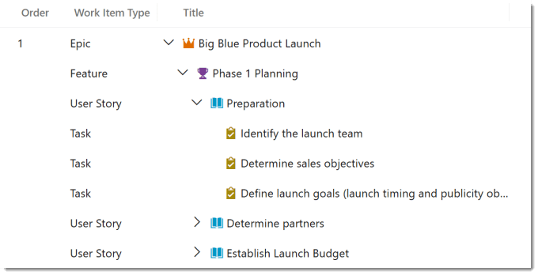
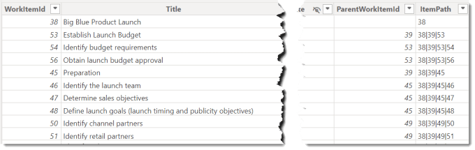
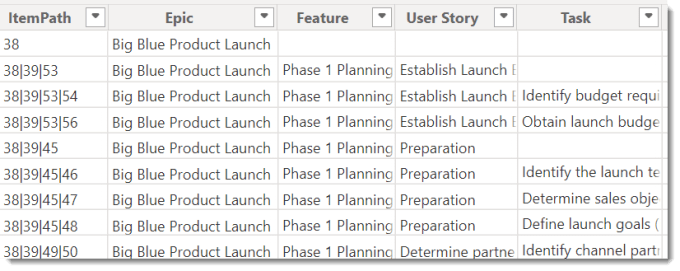
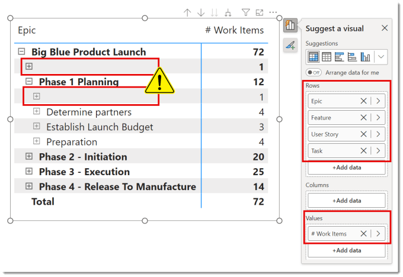
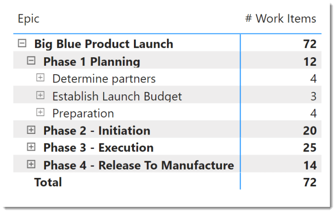

---
title: DevOps Parent Child Hierarchy in Power BI
description: Azure DevOps is built around the pattern than items have child items and so a backlog view will show the items in a hierarchy. When the work items some into Power BI that is not shown. So this gives me the chance to use one of my favourite resources, DAX Patterns and their Parent-Child pattern.
slug: devops-parent-child-hierarchy-in-power-bi
date: 2024-09-02 08:27:43+0000
lastmod: 2025-02-14 10:57:35+0000
image: cover.png
categories:
    - DevOps
    - Power BI
---

Azure DevOps is built around the pattern than items have child items and so a backlog view will show the items in a hierarchy. When the work items some into Power BI that is not shown. So this gives me the chance to use one of my favourite resources from SQLBI, DAX Patterns and their Parent-Child pattern.



I am using the Agile process so the hierarchy is Epic – Feature – User Story – Task. I have made sure my project includes all the layers correctly. You can work around oddities but for this post we will assume all layers of the items are as we expect.

## Power BI and DevOps Series

This post is part of a series:

- [Get DevOps Data into Power BI](https://hatfullofdata.blog/devops-data-into-power-bi/)

- [Add Parent Child Hierarchy using DAX Patterns](https://hatfullofdata.blog/devops-parent-child-hierarchy-in-power-bi/)

- [Inherited Value in a Parent Child pattern](https://hatfullofdata.blog/inherited-value-in-a-parent-child-pattern/)

- Add conditional formatting icons the easy way

## DAX Patterns – Parent Child Hierarchy


DAX patterns comes in multiple formats, a book, a website and videos. They are written by SQLBI and have saved me hours and hours. For this post we are going to adapt the Parent-Child pattern to DevOps data. I am going to use the report built in the previous post in this series. The pattern is fully explained here [https://www.daxpatterns.com/parent-child-hierarchies](https://www.daxpatterns.com/parent-child-hierarchies)

## Adding the Path

The pattern uses a function called path. This function takes an row id and the parent row id and walks up the path until it reaches a row with no parent. Work Items in DevOps have WorkItemID and ParentWorkItemID. So following the instructions we add a column to the WorkItems table.

```xml
ItemPath = PATH(WorkItems[WorkItemId],WorkItems[ParentWorkItemId])
```



The ItemPath gives us the list of IDs in the hierarchy above the current row. It does requires the path to be complete so it might not work if you have filtered out some of the items.

## Adding DevOps Hierarchy Level Columns

From the above post these are the Level 1 to Level 4 columns, we just need to swap out the right column names. We also know the the names of our levels from DevOps so we can use slightly more meaningful names, Level 1 = Epic, Level 2 = Feature etc. Add the 4 columns using the pattern below, copied straight from the SQLBI post.

```xml
Epic = 
VAR LevelNumber = 1
VAR LevelKey = PATHITEM ( WorkItems[ItemPath], LevelNumber, INTEGER )
VAR LevelName = LOOKUPVALUE ( WorkItems[Title], WorkItems[WorkItemId], LevelKey )
VAR Result = LevelName
RETURN
    Result
```



## Adding a Matrix

The quickest way to see the hierarchy in action is to add a matrix visual. Into the rows we put the levels of the hierarchy to whatever levels we want. Into the values I put # Work Items. It looks great we can expand the different levels and see the 72 work items split out into features etc.



But we get blank rows at the top of each section. Not to worry of course our friends at SQLBI have a solution.

## Fixing the measures

In order for this to work we need to compare the maximum path length with the level being displayed. The path length we add as a column Depth to Work Items and then add a measure MaxRowDepth. Then using ISINSCOPE function we calculate the display depth in a measure called ItemBrowseDepth.

### Column Added to WorkItems table

```xml
Depth = PATHLENGTH( WorkItems[ItemPath] )
```

### 2 Measures Added to WorkItems table

```xml
MaxRowDepth = MAX( WorkItems[Depth] )

ItemBrowseDepth =
    ISINSCOPE ( WorkItems[Epic] ) 
    + ISINSCOPE ( WorkItems[Feature] )
    + ISINSCOPE ( WorkItems[User Story] )
    + ISINSCOPE ( WorkItems[Task] )
```

Now we can add measures that use these values to decide if to display the row or not. The logic being we only show rows where the browse depth is less than or equal to the max row depth. So I fix the # Work Items using the example from the SQLBI Pattern.

```xml
# Work Items =
VAR Val = COUNTROWS ( WorkItems )
VAR ShowRow = [ItemBrowseDepth] 

This now fixes the matrix to not show blank rows



## Conclusion on Parent Child Hierarchy

This makes the DevOps data easy to report on. The measures roll up the data to the different levels so the total hours can be calculated etc. Handling DevOps plans with missing layers is hard work, I’ve done it where some User Stories were children of the Epic. That made the pattern clunky so I’d probably push back now and insist the DevOps plan was kept clean.

## More Power BI Posts

- [Conditional Formatting Update](https://hatfullofdata.blog/power-bi-conditional-formatting-update/)

- [Data Refresh Date](https://hatfullofdata.blog/power-bi-data-refresh-date/)

- [Using Inactive Relationships in a Measure](https://hatfullofdata.blog/power-bi-inactive-relationships-in-a-measure/)

- [DAX CrossFilter Function](https://hatfullofdata.blog/power-bi-dax-crossfilter-function/)

- [COALESCE Function to Remove Blanks](https://hatfullofdata.blog/power-bi-coalesce-function-to-remove-blanks/)

- [Personalize Visuals](https://hatfullofdata.blog/power-bi-personalize-visuals/)

- [Gradient Legends](https://hatfullofdata.blog/power-bi-gradient-legends/)

- [Endorse a Dataset as Promoted or Certified](https://hatfullofdata.blog/power-bi-endorse-a-dataset/)

- [Q&A Synonyms Update](https://hatfullofdata.blog/power-bi-qa-synonyms-update/)

- [Import Text Using Examples](https://hatfullofdata.blog/power-bi-import-text-using-examples/)

- [Paginated Report Resources](https://hatfullofdata.blog/paginated-report-resources/)

- [Refreshing Datasets Automatically with Power BI Dataflows](https://hatfullofdata.blog/refreshing-datasets-automatically-with-dataflow/)

- [Charticulator](https://hatfullofdata.blog/charticulator-simple-custom-chart/)

- [Dataverse Connector – July 2022 Update](https://hatfullofdata.blog/power-bi-dataverse-connector-july-2022-update/)

- [Dataverse Choice Columns](https://hatfullofdata.blog/power-bi-dataverse-choices-and-choice-column/)

- [Switch Dataverse Tenancy](https://hatfullofdata.blog/power-bi-switch-dataverse-tenancy/)

- [Connecting to Google Analytics](https://hatfullofdata.blog/power-bi-connecting-to-google-analytics/)

- [Take Over a Dataset](https://hatfullofdata.blog/power-bi-take-over-a-dataset/)

- [Export Data from Power BI Visuals](https://hatfullofdata.blog/export-data-from-power-bi-visuals/)

- [Embed a Paginated Report](https://hatfullofdata.blog/power-bi-embed-a-paginated-report/)

- [Using SQL on Dataverse for Power BI](https://hatfullofdata.blog/using-sql-on-dataverse-for-power-bi/)

- [Power Platform Solution and Power BI Series](https://hatfullofdata.blog/power-platform-solution-and-power-bi-part-1/)

- [Creating a Custom Smart Narrative](https://hatfullofdata.blog/power-bi-creating-a-custom-smart-narrative/)

- [Power Automate Button in a Power BI Report](https://hatfullofdata.blog/power-automate-button-in-a-power-bi-report/)

## Power BI Series

- [SVG in Power BI series](https://hatfullofdata.blog/svg-in-power-bi-part-1-svg-basics/)

- [Power BI and Project Online series](https://hatfullofdata.blog/power-bi-connecting-to-project-online/)

- [Slicers series](https://hatfullofdata.blog/power-bi-slicers-introduction/)

- [Dataflow series](https://hatfullofdata.blog/power-bi-create-a-dataflow/)

- [Power BI SVG series](https://hatfullofdata.blog/svg-in-power-bi-part-1-svg-basics/)

- [Power Automate and Power BI Rest API series](https://hatfullofdata.blog/power-automate-and-power-bi-rest-api/)

- [Power BI and DevOps series](https://hatfullofdata.blog/devops-data-into-power-bi/)

