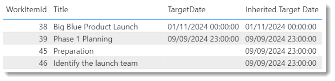

---
title: Inherited Value in a Parent Child Pattern
description: There are times it is useful to calculate an inherited value from parent item to child. The target date of a feature to be passed down to the child user story and then onto the child tasks.
slug: inherited-value-in-a-parent-child-pattern
date: 2024-09-23 08:03:22+0000
lastmod: 2025-02-14 10:50:44+0000
image: cover.png
categories:
    - DevOps
    - Power BI
---

In the previous post in this series we created a Parent Child hierarchy using a Dax Pattern from SQLBI. There are times it is useful to calculate an inherited value from parent item to child. The assigned to person on a User Story to be passed onto the child tasks that are not assigned to anyone, the target date of a feature to be passed down to the child user story and then onto the child tasks. The child items need to be completed before the parent target date.

## Power BI and DevOps Series

This post is part of a series:

- [Get DevOps Data into Power BI](https://hatfullofdata.blog/devops-data-into-power-bi/)

- [Add Parent Child Hierarchy using DAX Patterns](https://hatfullofdata.blog/devops-parent-child-hierarchy-in-power-bi/)

- [Inherited Value in a Parent Child pattern](https://hatfullofdata.blog/inherited-value-in-a-parent-child-pattern/)

- Add conditional formatting icons the easy way

## The Logic

We are going to add this as a calculated column into the work items table. If you were doing this by hand you would go through the items in the path column in reverse, looking up each target date until you found a non-blank one. In DAX we do this by creating a table of the WorkItemIDs in the path and looking up their target dates. Then we filter to only rows with target dates and take the first one.

## Inherited Value DAX

Lets work through an example.

WorkItem 46 has an ItemPath of 38|39|45|46, which means it has a Path length of 4. So we start by using GENERATESERIES to create a column 1-4

```xml
GENERATESERIES(  1 , PATHLENGTH( WorkItems[ItemPath] ), 1 )
```

Value1234

We put that inside a GENERATE function and use PATHITEMREVERSE to get the work item ids from the path and then LOOKUP to use that WorkItemID to get the TargetDate of each item. GENERATE function and nested VARs is one of my favourite combinations.

```xml
VAR tabWorkItems = 
    GENERATE(
        GENERATESERIES(  1 , PATHLENGTH( WorkItems[ItemPath] ), 1 ),
        VAR tableRow = [Value]
        VAR _WorkItemID = VALUE( PATHITEMREVERSE( WorkItems[ItemPath] , tableRow ) )
        VAR _TargetDate = LOOKUPVALUE( WorkItems[TargetDate] , WorkItems[WorkItemId] , _WorkItemID )
        RETURN ROW ( 
            "WorkItemID",_WorkItemID,
            "TargetDate",_TargetDate
        )
    )
```

ValueWorkItemIDTargetDate1462453392024-09-094382024-11-1

Then we filter the table to rows with a TargetDate and take the first row ordered by Value. This gives us one row of data.

```xml
VAR tabFiltered =
    TOPN( 
        1,
        FILTER(tabWorkItems,[TargetDate]>BLANK()),
        [Value],ASC
    )
```

ValueWorkItemIDTargetDate3392024-09-09

Finally we use MINX to extract the TargetDate of that single row. The final calculated column DAX looks like this.

```xml
Inherited Target Date = 
// Create a table of Value, WorkitemID and TargetDate
VAR tabWorkItems = 
    GENERATE(
        GENERATESERIES(  1 , PATHLENGTH( WorkItems[ItemPath] ), 1 ),
        VAR tableRow = [Value]
        VAR _WorkItemID = VALUE( PATHITEMREVERSE( WorkItems[ItemPath] , tableRow ) )
        VAR _TargetDate = LOOKUPVALUE( WorkItems[TargetDate] , WorkItems[WorkItemId] , _WorkItemID )
        RETURN ROW ( 
            "WorkItemID",_WorkItemID,
            "TargetDate",_TargetDate
        )
    )
// Take the first row of the filtered to non-blank
VAR tabFiltered =
    TOPN( 
        1,
        FILTER(tabWorkItems,[TargetDate]>BLANK()),
        [Value],ASC
    )
// Return the Target Date
VAR Result = MINX( tabFiltered , [TargetDate] )
RETURN Result
```



## Inherited Value Conclusion

The Parent Child pattern is very useful and adding in the inherited values adds extra possibilities. I wanted to be able to identify the child items that were making the parent items late.

## References

This post builds on the last post in this series and using the SQLBI Parent Child found at [https://www.daxpatterns.com/parent-child-hierarchies/](https://www.daxpatterns.com/parent-child-hierarchies/).

## More Power BI Posts

- [Conditional Formatting Update](https://hatfullofdata.blog/power-bi-conditional-formatting-update/)

- [Data Refresh Date](https://hatfullofdata.blog/power-bi-data-refresh-date/)

- [Using Inactive Relationships in a Measure](https://hatfullofdata.blog/power-bi-inactive-relationships-in-a-measure/)

- [DAX CrossFilter Function](https://hatfullofdata.blog/power-bi-dax-crossfilter-function/)

- [COALESCE Function to Remove Blanks](https://hatfullofdata.blog/power-bi-coalesce-function-to-remove-blanks/)

- [Personalize Visuals](https://hatfullofdata.blog/power-bi-personalize-visuals/)

- [Gradient Legends](https://hatfullofdata.blog/power-bi-gradient-legends/)

- [Endorse a Dataset as Promoted or Certified](https://hatfullofdata.blog/power-bi-endorse-a-dataset/)

- [Q&A Synonyms Update](https://hatfullofdata.blog/power-bi-qa-synonyms-update/)

- [Import Text Using Examples](https://hatfullofdata.blog/power-bi-import-text-using-examples/)

- [Paginated Report Resources](https://hatfullofdata.blog/paginated-report-resources/)

- [Refreshing Datasets Automatically with Power BI Dataflows](https://hatfullofdata.blog/refreshing-datasets-automatically-with-dataflow/)

- [Charticulator](https://hatfullofdata.blog/charticulator-simple-custom-chart/)

- [Dataverse Connector – July 2022 Update](https://hatfullofdata.blog/power-bi-dataverse-connector-july-2022-update/)

- [Dataverse Choice Columns](https://hatfullofdata.blog/power-bi-dataverse-choices-and-choice-column/)

- [Switch Dataverse Tenancy](https://hatfullofdata.blog/power-bi-switch-dataverse-tenancy/)

- [Connecting to Google Analytics](https://hatfullofdata.blog/power-bi-connecting-to-google-analytics/)

- [Take Over a Dataset](https://hatfullofdata.blog/power-bi-take-over-a-dataset/)

- [Export Data from Power BI Visuals](https://hatfullofdata.blog/export-data-from-power-bi-visuals/)

- [Embed a Paginated Report](https://hatfullofdata.blog/power-bi-embed-a-paginated-report/)

- [Using SQL on Dataverse for Power BI](https://hatfullofdata.blog/using-sql-on-dataverse-for-power-bi/)

- [Power Platform Solution and Power BI Series](https://hatfullofdata.blog/power-platform-solution-and-power-bi-part-1/)

- [Creating a Custom Smart Narrative](https://hatfullofdata.blog/power-bi-creating-a-custom-smart-narrative/)

- [Power Automate Button in a Power BI Report](https://hatfullofdata.blog/power-automate-button-in-a-power-bi-report/)

## Power BI Series

- [SVG in Power BI series](https://hatfullofdata.blog/svg-in-power-bi-part-1-svg-basics/)

- [Power BI and Project Online series](https://hatfullofdata.blog/power-bi-connecting-to-project-online/)

- [Slicers series](https://hatfullofdata.blog/power-bi-slicers-introduction/)

- [Dataflow series](https://hatfullofdata.blog/power-bi-create-a-dataflow/)

- [Power BI SVG series](https://hatfullofdata.blog/svg-in-power-bi-part-1-svg-basics/)

- [Power Automate and Power BI Rest API series](https://hatfullofdata.blog/power-automate-and-power-bi-rest-api/)

- [Power BI and DevOps series](https://hatfullofdata.blog/devops-data-into-power-bi/)

