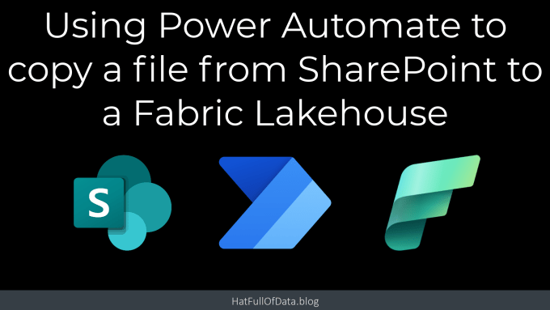
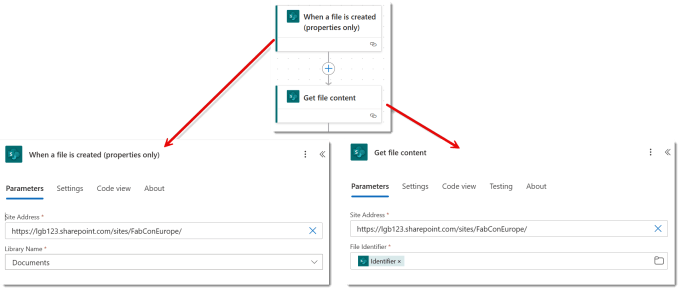
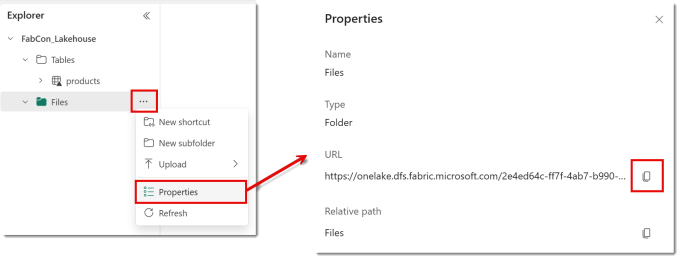
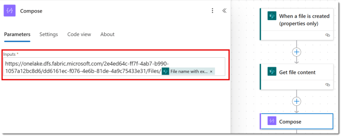
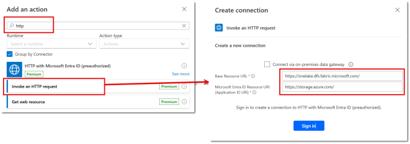
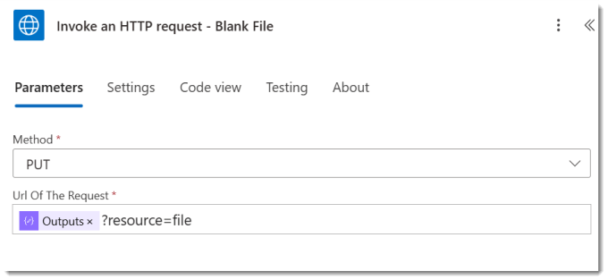
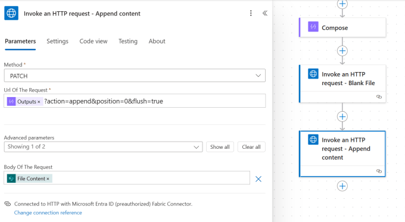
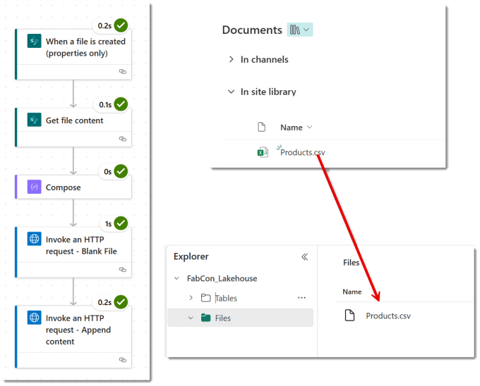

Currently there is no Microsoft Fabric connector in Power Automate. When we want Power Automate to save a file to OneLake Lakehouse, we need to use a workaround. This post walks through the demo I did for the Microsoft Fabric European Conference 2024. You need to be aware that this uses a premium connector!

## YouTube Version



## Getting the File Content

Before we can save a file anywhere we need the file content we are going to save. For this post I am going to work with the flow triggering from a new file in a SharePoint library and getting the file content action.



From the SharePoint connector triggers, select the When a file is created (properties only) and populate the site address and library name. Next add a SharePoint action, Get file content. Populate the Site Address same as the trigger. For the File Identifier, select Identifier from the dynamic content from the trigger.

## Lakehouse Folder URL

Next we need to know the url of the Lakehouse folder where we want the file to go. This can be found in the Lakehouse by clicking on the three dots next to the required folder and from the menu selecting properties. This will open the properties pane on the right hand side. Click the copy button next to the URL.



To make life easy for ourselves we put this into a compose step followed by name of the file that triggered the flow. This is in the dynamic content from the trigger and is called File name with extension. Please note there is a / before the file name.



## Create the file in the LakeHouse

### Set up the connection

We are going to use the HTTP with Microsoft Entra ID (preauthorised) action to interact with the Lakehouse to create the file. When you add the new action search for http and then scroll down to find the right action.



If this is the first time you’ve used this action you will need to set-up the connection. Also if this is the first time you’ve connected to the Lakehouse in this way you need to setup a new connection. It asks for two URLS. Once connected you are ready to save a File to OneLake Lakehouse

Copy CodeCopiedUse a different Browser
```xml
https://onelake.dfs.fabric.microsoft.com/
```

Copy CodeCopiedUse a different Browser
```xml
https://storage.azure.com/
```

### Create Blank File

The first stage is to save a file to OneLake Lakehouse that is empty. This is a simple PUT action with a parameter of ?resource=file after the path created in the compose. So select PUT for the method. In the URL of the request but the Output from the compose and add on ?resource=file. I also renamed the action.



### Append Content

Finally the last action is to append the file content from SharePoint onto the file. Change the Method to PATCH. The Url of the request is the output from the compose followed by three parameters (copy from below). Expand the Advanced parameters and into the body of the request select File Content from the dynamic content.



Copy CodeCopiedUse a different Browser
```xml
?action=append&position=0&flush=true
```

## Test Save a File to OneLake Lakehouse

Save your flow and add a file to your SharePoint library and wait a minute or 2 for the flow to trigger. A file should appear in your Lake House.



## Conclusion

There are plenty of business cases of use cases to be able to store a file into OneLake. Various legacy systems email daily exports which will need to be saved and processed in the LakeHouse. When / If we get a Fabric connector I look forward to making this post as redundant!

## More Power Automate Posts

- [Creating Adaptive Cards](https://hatfullofdata.blog/microsoft-flow-creating-adaptive-cards/)

- [Refreshing Datasets Automatically with Power BI Dataflows](https://hatfullofdata.blog/refreshing-datasets-automatically-with-dataflow/)

- [Power Automate Child Flow](https://hatfullofdata.blog/power-automate-child-flow/)

- [Get data from a Power BI dataset](https://hatfullofdata.blog/power-automate-get-data-from-a-power-bi-dataset/)

- [Power Automate Button in a Power BI Report](https://hatfullofdata.blog/power-automate-button-in-a-power-bi-report/)

- [Write Me a Flow](https://hatfullofdata.blog/power-automate-write-me-a-flow/)

- [Power Automate and DevOps series](https://hatfullofdata.blog/connecting-power-automate-to-devops/)

- [Power Automate and Power BI Rest API series](https://hatfullofdata.blog/power-automate-and-power-bi-rest-api/)

- [Save a File to OneLake Lakehouse](https://hatfullofdata.blog/power-automate-save-a-file-to-onelake-lakehouse/)

- [Trigger Microsoft Fabric Data Pipeline using Power Automate](https://hatfullofdata.blog/trigger-microsoft-fabric-data-pipeline/)

