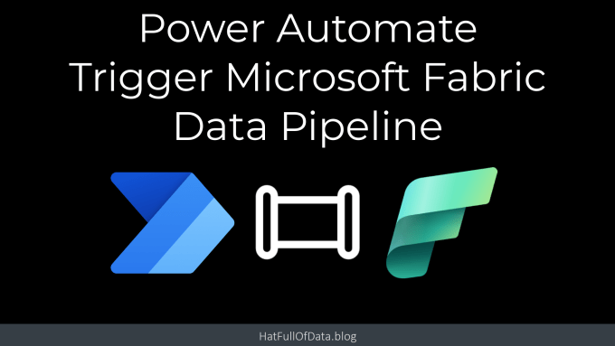
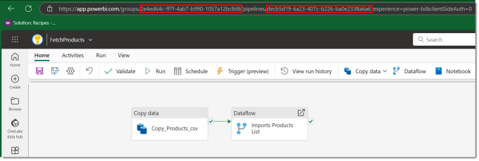
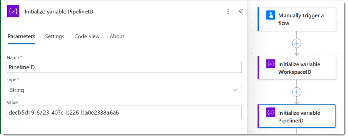
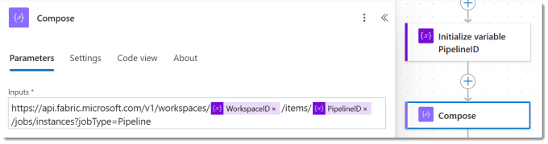
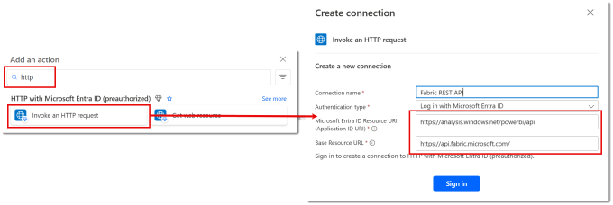
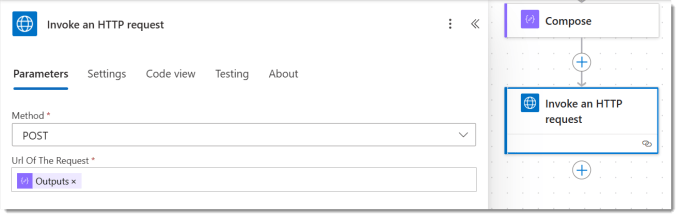
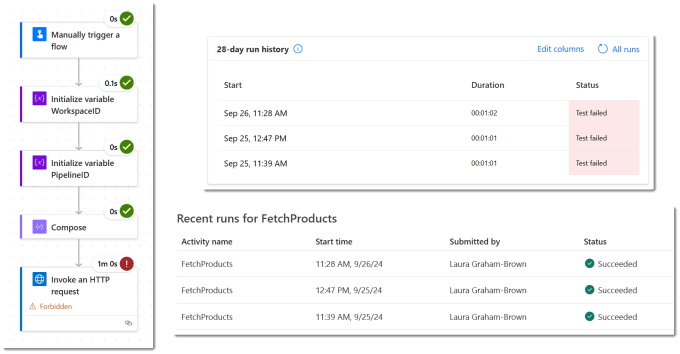

Microsoft Fabric Data Pipelines can be scheduled to happen at regular times. What happens when you want trigger Microsoft Fabric data pipelines to run as a reaction to an event? For example someone pressing a button in an app. For this we can use Power Automate to start a pipeline using a http request.

## Fixed

This post has incorrect details for the connector. These have now been fixed.

## YouTube Version

[](https://youtu.be/9-aNXqDQaZE)

## Workspace and Pipeline GUIDs

The flow is going to use a http action that uses a URL that includes GUIDs for both the workspace and the data pipeline. Open the data pipeline that will be triggered. Look at the URL in the browser. The Workspace GUID is the string after /groups/ and the data pipeline GUID is the string after /pipelines/.



## Start Flow and Add Variables

Now we have the required GUIDS we can start writing the flow. For this example we are going to use a manually triggered flow. Then we add an actions to initialise variables WorkspaceID and PipelineID and select Type of string and put in the values from the previous step.



## URL of the Trigger Microsoft Fabric Data Pipeline request

Next I recommend you use a compose step to calculate the URL for the HTTP call. Interestingly the api uses workspaces rather than groups. Make sure you have the corrects /s and no spaces between. If you have called your variables WorkspaceID and PipelineID you can just copy the code below into a Compose action.

Copy CodeCopiedUse a different Browser
```xml
https://api.fabric.microsoft.com/v1/workspaces/@{variables('WorkspaceID')}/items/@{variables('PipelineID')}/jobs/instances?jobType=Pipeline
```



The above url including all the flags is documented by Microsoft here – [https://learn.microsoft.com/en-us/fabric/data-factory/pipeline-rest-api#run-on-demand-item-job](https://learn.microsoft.com/en-us/fabric/data-factory/pipeline-rest-api#run-on-demand-item-job?wt.mc_id=DX-MVP-5003563)

## HTTP Request

For this action we are going to use HTTP with Microsoft Entra ID (preauthorized) connection’s Invoke an HTTP request action. Search for HTTP and scroll down till you find it.



If this is the first time you’ve used this action you will need to setup the connection to connect to this api you will need to set it up. The two urls required are below, sometimes they appear the other way around.

#### Base Resource URL

Copy CodeCopiedUse a different Browser
```xml
https://api.fabric.microsoft.com/
```

#### Microsoft Entra ID Resource URI

Copy CodeCopiedUse a different Browser
```xml
https://analysis.windows.net/powerbi/api
```

Once you have the connection sorted you can enter in the details of the request. The Method is POST and the Url of the request is the output from the compose step.



## Testing Trigger Microsoft Fabric Data Pipeline Flow

The flow requires no inputs so can just be run. When the flow runs it appears to fail, but if you check the data pipeline run history you will see it was triggered just fine.



If you look in the documentation found at [https://learn.microsoft.com/en-us/fabric/data-factory/pipeline-rest-api#run-on-demand-item-job](https://learn.microsoft.com/en-us/fabric/data-factory/pipeline-rest-api#run-on-demand-item-job). There is a note that says “There is no body returned currently”. Eventually it will return the job id of the pipeline run, so I am guessing because that is not returned Power Automate assumes it failed.

## Conclusion

Data pipelines are the orchestration tool of Microsoft Fabric so being able to connect it to the Power Platform orchestration tool makes perfect sense. I look forward to the day I can mark this post as redundant and there is a Power Automate connector with an obvious action for this.

## More Power Automate Posts

- [Creating Adaptive Cards](https://hatfullofdata.blog/microsoft-flow-creating-adaptive-cards/)

- [Refreshing Datasets Automatically with Power BI Dataflows](https://hatfullofdata.blog/refreshing-datasets-automatically-with-dataflow/)

- [Power Automate Child Flow](https://hatfullofdata.blog/power-automate-child-flow/)

- [Get data from a Power BI dataset](https://hatfullofdata.blog/power-automate-get-data-from-a-power-bi-dataset/)

- [Power Automate Button in a Power BI Report](https://hatfullofdata.blog/power-automate-button-in-a-power-bi-report/)

- [Write Me a Flow](https://hatfullofdata.blog/power-automate-write-me-a-flow/)

- [Power Automate and DevOps series](https://hatfullofdata.blog/connecting-power-automate-to-devops/)

- [Power Automate and Power BI Rest API series](https://hatfullofdata.blog/power-automate-and-power-bi-rest-api/)

- [Save a File to OneLake Lakehouse](https://hatfullofdata.blog/power-automate-save-a-file-to-onelake-lakehouse/)

- [Trigger Microsoft Fabric Data Pipeline using Power Automate](https://hatfullofdata.blog/trigger-microsoft-fabric-data-pipeline/)

