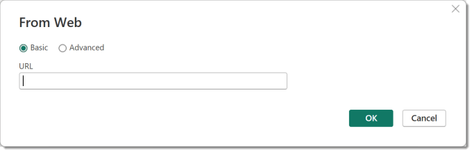
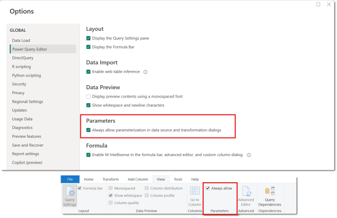
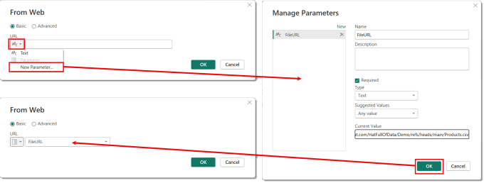

---
title: Power Query – Creating New Parameters
description: Good practice is to use parameters for these values so your query is reusable etc. And its always our intention to go and create the new parameter later.
slug: power-query-creating-new-parameters
date: 2025-01-06 11:52:37+0000
lastmod: 2025-02-13 12:07:01+0000
image: cover.png
categories:
    - Excel
    - Power BI
    - Power Query
---

When fetching data into Power Query you need to use values to point you to the write the data, for example name of a database server or path to a csv file. Good practice is to use parameters for these values so your query is reusable etc. And its always our intention to go and create the new parameter later.

## Missing New Parameter Option

So lets take the simplest option of connecting to a csv file on the web. I have my path so I click get data and select Web. For those that want to play along here is the path to the file I’m using.

```xml
https://raw.githubusercontent.com/HatFullOfData/Demo/refs/heads/main/Products.csv
```

The dialog that appears has a box for the URL but is missing the drop down on the left that will allow me to select New Parameter. If I had already created a parameter it gives me the option but not if I have no parameters. Bizarre functionality.



## Always Allow Parameters

The fix for this is to allow parameterization in data source dialogs. This can be done in the Power BI desktop options or on Power Query View ribbon for Power BI and Excel.



Once this is ticked when you now go to Get Data we get a drop down next to the text box. Now we can select New Parameter and enter in the details of the new parameter. When we click OK it returns to the first dialog with the new parameter selected.



As a side note I recommend that you always give parameters a Type rather than leaving it on Any. There are a few features such as Power BI deployment pipelines that will not work with parameters of type Any.

## Conclusion

This is a really small feature, possibly doesn’t need a whole blog post. But that little drop down making the creating a new parameter that few clicks easier means I am more likely to follow my own advice and use parameters from the start.

## More Power Query Posts

- [Custom Handwritten Function](https://hatfullofdata.blog/power-query-handwritten-function/)

- [Multi-step Function](https://hatfullofdata.blog/power-query-multi-step-function/)

- [Replace Values for Whole Table](https://hatfullofdata.blog/power-query-replace-values-for-whole-table/)

- [AI Insights Error](https://hatfullofdata.blog/power-query-ai-insights-error/)

- [VBA to Edit a Parameter Value](https://hatfullofdata.blog/excel-power-query-vba-to-edit-a-parameter-value/)

- [Dynamic Data Source and Web.Contents()](https://hatfullofdata.blog/power-query-dynamic-data-source-and-web-content/)

- [Get Previous Row Data](https://hatfullofdata.blog/power-query-get-previous-row-data/)

- [Creating New Parameters](https://hatfullofdata.blog/power-query-creating-new-parameters/)

- [Fixing Missing Columns Dynamically](https://hatfullofdata.blog/power-query-fixing-missing-columns-dynamically/)

- [Handling Null Values Properly](https://hatfullofdata.blog/power-query-handling-null-values/)

