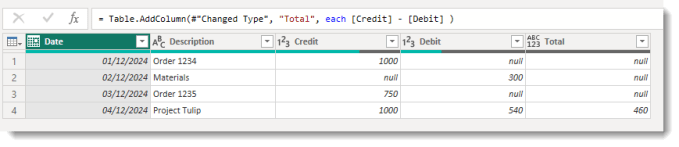
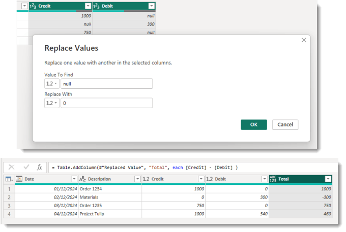
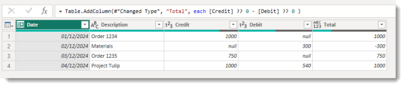

This post is about handling null values in Power Query calculations. If you do a calculation in Power Query that involves a null value the answer returned is null. In the example below we get nulls for the first three rows because either Credit or Debit values are null. On the fourth row we get the answer 460 because Credit and Debit contain values.



Copy CodeCopiedUse a different Browser
```xml
= Table.AddColumn(#"Changed Type", "Total", each [Credit] - [Debit] )
```

This post gives you 2 methods on how handle them. I personally prefer method 2, but each to their own.

## Method 1 – Replace Null Values

The most common method recommended is to replace null values with a value that works, so in the above example a 0. So before I add the above calculation I highlight both the Credit and Debit columns. Then I click replace values on the Transform ribbon.



The above works and is simple to explain and document. It does have the side effect that the average Credit and average Debit are now altered and filters to find just credits or debits will have to be different. It also takes 2 steps. The averages issue is the one that most people dislike.

## Method 2 – Using the Coalesce operator with Null Values

Coalesce functions, DAX has one, return the first non-null value. In Power Query there is a coalesce operator ??. So Credit ?? 0 will return the credit value unless it is null and then will return 0.

So we can change our calculation to put ?? 0 after the column values and make it not return nulls. The Credit and Debit columns still have their original values for averages etc. It also is done within one step.



Copy CodeCopiedUse a different Browser
```xml
= Table.AddColumn(#"Changed Type", "Total", each [Credit] ?? 0 - [Debit] ?? 0 )
```

## Conclusion

Power Query M is one of my favourite languages but its weird. So these posts are for purely selfish reasons to remind me how to do things. ?? is a really simple operator that solves so many problems and Microsoft give it 2 lines! [https://learn.microsoft.com/en-us/powerquery-m/m-spec-operators](https://learn.microsoft.com/en-us/powerquery-m/m-spec-operators). It could of course be chained to Column1 ?? Column2 ?? Column3 will give the the first non-null value from the three columns, and return null if they are all null.

## More Power Query Posts

- [Custom Handwritten Function](https://hatfullofdata.blog/power-query-handwritten-function/)

- [Multi-step Function](https://hatfullofdata.blog/power-query-multi-step-function/)

- [Replace Values for Whole Table](https://hatfullofdata.blog/power-query-replace-values-for-whole-table/)

- [AI Insights Error](https://hatfullofdata.blog/power-query-ai-insights-error/)

- [VBA to Edit a Parameter Value](https://hatfullofdata.blog/excel-power-query-vba-to-edit-a-parameter-value/)

- [Dynamic Data Source and Web.Contents()](https://hatfullofdata.blog/power-query-dynamic-data-source-and-web-content/)

- [Get Previous Row Data](https://hatfullofdata.blog/power-query-get-previous-row-data/)

- [Creating New Parameters](https://hatfullofdata.blog/power-query-creating-new-parameters/)

- [Fixing Missing Columns Dynamically](https://hatfullofdata.blog/power-query-fixing-missing-columns-dynamically/)

- [Handling Null Values Properly](https://hatfullofdata.blog/power-query-handling-null-values/)

