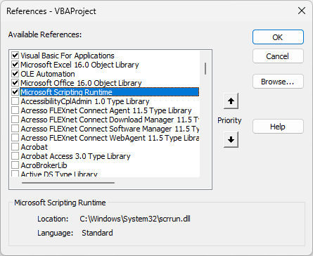

---
title: VBA – Using Dictionaries to improve searching
description: In VBA programming, dictionaries are invaluable tools that allow you to store key-value pairs efficiently. Checking a list of values to see if it contains a value is a regular requirement in many projects. The obvious solution in VBA is the values in an array and loop through till you find or don’t find the value. On a recent project,...
slug: vba-using-dictionaries-to-improve-searching
date: 2025-03-08 20:41:16+0000
lastmod: 2025-03-08 20:41:19+0000
categories:
    - VBA
---

In VBA programming, dictionaries are invaluable tools that allow you to store key-value pairs efficiently.    Checking a list of values to see if it contains a value is a regular requirement in many projects. The obvious solution in VBA is the values in an array and loop through till you find or don’t find the value. On a recent project, I was reminded that another solution is to use dictionaries, which have the exist method that quickly returns a true or false.

## VBA Project References

Dictionaries are part of the Microsoft Scripting Runtime library which is not loaded by default. Within VBA in your Office app, in the Tools menu select References. From the list of available references tick Microsoft Scripting Runtime.



Once the library is loaded you can now declare a variable as a dictionary.

```xml
Dim dictNames as Scripting.Dictionary
```

## Initialising the Dictionary

Dictionaries need initialising before you can use them. This can be done in the declaration of the variable or as a separate statement. I personally prefer the separate statement, means I get to chose when the variable is created.

```xml
' === Part of the declaration
Dim dictNames As New Scripting.Dictionary
    
' === Separate statement to initialise
Dim dictNames As Scripting.Dictionary
Set dictNames = New Scripting.Dictionary
```

## Adding Items to Dictionaries

Dictionary entries have 2 parts, key and item. The key is used when checking to see if a dictionary entry exists and the item value is returned by using the key. So if all you are using the dictionary for is to have a searchable list the item value could be the same as the key or a constant.

```xml
' === Add a dictionary entry
dictNames.Add Key:="Adam", Item:="0"
```

## Checking for an item in a dictionary

Once you have values in the dictionary you can check if a key value exists in the dictionary. The Exists method returns a Boolean based on if it can find the key value.

```xml
' === Check for a key in the dictionary
If dictNames.Exists(Key:="Adam") Then
    MsgBox "Adam is in the list"
Else
    MsgBox "Adam is not in the list"
End If
```

## Compare a dictionaries to an arrays

The data analyst in me wanted to check how each method compared. I expected the arrays method of looping through till you found or didn’t find would be slower. Both methods are fast so by doing 10,000 searches on a list 4,000 long with 25% of not found values the dictionary method won, but if the values were all found it was very close. Speed is not the only concern though when coding.

The winner for me was the dictionary code was simpler, which reduces the technical debt of VBA code often written and maintained by business developers. The code below is to check if the value in strName is in an array or in a dictionary.

```xml
' === Array Method
For i = LBound(arrNames) To UBound(arrNames)
    If arrNames(i) = strName Then
        blnFound = True
        Exit For
    End If
Next i

' === Dictionary Method
blnFound = dictNames.Exists(strName)
```

## Conclusion

VBA is not leaving soon, however much every IT department would like it to vanish. Just because most VBA programmers are not professional coders, it doesn’t mean VBA can’t be written well. Adding references to helpful libraries is good practice and will help in the long term. If there is concern for future coders understanding dictionaries add links in the comments of your code to the references below.

## References

Microsoft’s documentation is limited but can be found here [https://learn.microsoft.com/en-us/office/vba/language/reference/user-interface-help/dictionary-object](https://learn.microsoft.com/en-us/office/vba/language/reference/user-interface-help/dictionary-object)

Paul Kelly has written a better blog with examples – [https://excelmacromastery.com/vba-dictionary/](https://excelmacromastery.com/vba-dictionary/)

## VBA Posts

- [VBA to Edit a Power Query Parameter Value](https://hatfullofdata.blog/excel-power-query-vba-to-edit-a-parameter-value/)

