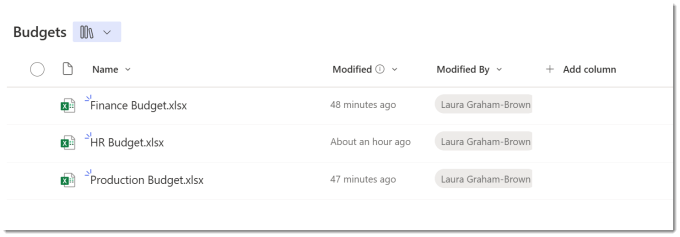
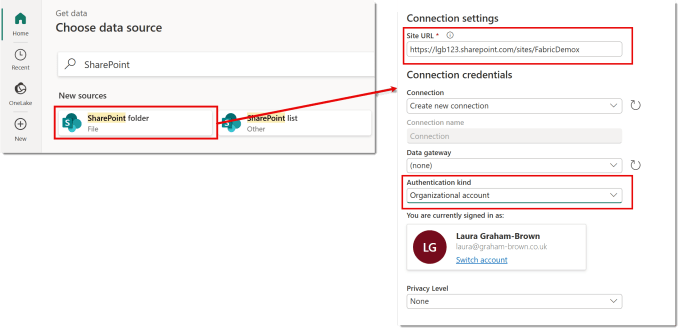
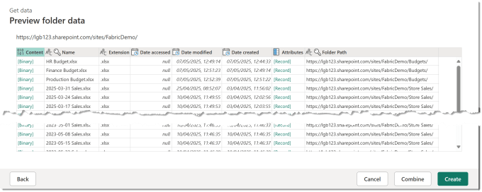
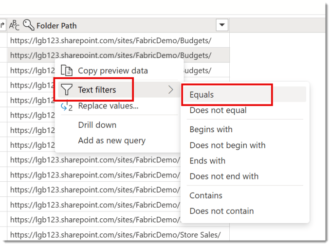
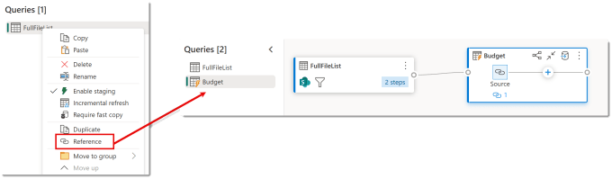
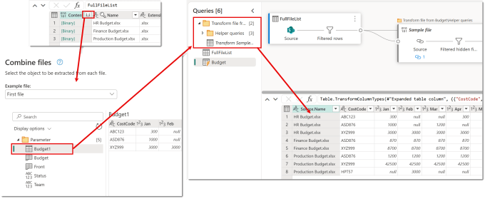
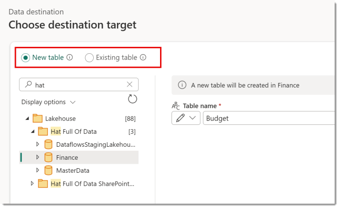
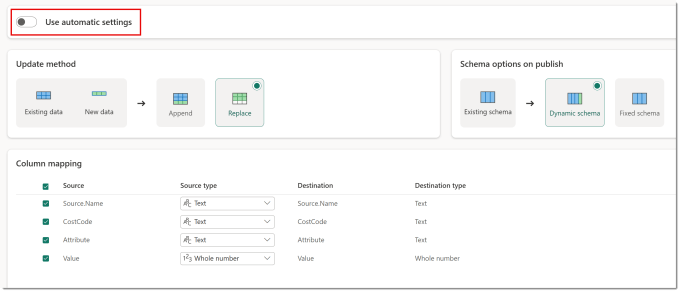

SharePoint folder has been a connector into Power Query for Excel, Power BI Desktop and dataflows for quite a while. This post is to cover the basics before I write another post to explain a more complex scenario. This post will use GEN2 Dataflows in Microsoft Fabric. Power Query can take files on a SharePoint site and from a selected sheet, table or named range append the contents to one big table. This post explains what you should be aware of when doing this.

## SharePoint and Microsoft Fabric

SharePoint is no database but we keep putting data there so here are my findings and notes from working with SharePoint libraries and lists in Microsoft Fabric.

- [Ingest a SharePoint folder of Excel Files](https://hatfullofdata.blog/sharepoint-folder-into-microsoft-fabric/)

- [Fixing the broken query](https://hatfullofdata.blog/first-refresh-it-broke-laurabrokeit/)

## SharePoint Library

I have a SharePoint library on a site called Budgets. It contains 3 files which are all the same format, 2 tabs, 1 table and 2 named regions.

The URL to the library is  https://lgb123.sharepoint.com/sites/FabricDemo/Budgets/Forms/AllItems.aspx . From this I can work out the URL to the SharePoint site is https://lgb123.sharepoint.com/sites/FabricDemo/Budgets/ You can always test it by making sure the site url takes you to the front page.

## Connecting to SharePoint Folder

In a GEN2 Dataflow, from the Home ribbon select Get Data and then more. If SharePoint folder isn’t showing in the dialog that appears, search for SharePoint. Then select SharePoint folder. Then enter in your site URL. Please note the full library url will not work.

If this is the first time you’ve connected to this SharePoint site you will need to set up the connection. All you need to do is change the Authentication kind to Organizational account and make sure you are signed in. Click Next to move onto the Preview folder data. If you have more than one library or folders it will show too many files, don’t worry we will fix this.

Click Create, rather than Combine so we can control which files get combined.

## Filtering to the right SharePoint Folder

In my example I have multiple SharePoint libraries in the same site, so the initial list returned contains too many files. There is a column called Folder Path. I find a row that contains the value I want, right click on the value. Then select Text filters – Equals. This will add a filter a step to the query to filter to only files in that path.

Even if your current site only has one document library so currently this step is not required, I would add it anyway. Then when anyone adds files a new library it will not break your query.

## Combining the Files

In order to make future additions to these queries easier and to reduce repeated work happening I would rename the query so far to FullFileList or similar and the right click on the query and select Reference. Rename the new query to something suitable, in my case it was Budget. The diagram will now show the two queries connected.

The next stage is to do the combining. Make sure the Content column has a data type of Binary. Then click the button in the top corner of the Content column to start the file combination. After a few seconds the Combine Files will appear requesting you to select which sheet, table or named range you are combining.

Once you click Combine it will create the Helper queries and related queries and will combine the files. You then will have a query with the first column Source.Name and the rest the data from the selected item.

## Adding a Destination

There might be other transformation steps you need to add before your data is ready. I’ve added an unpivot to my data, but that would a complete post on its own. Finally we get to add a destination to save the data to. If you are going to a Lakehouse, Warehouse or Database you should be aware of option available to you.

The first option is if you are saving to an existing table or creating a new table.

When you click next the second option is available. Turning off Use automatic settings will give you the options. Is the update an append or a replace? Is the schema dynamic or fixed, ie if your query adds a new column what happens? I’ve picked replace, the default option but as the SharePoint folder grows I might look to more clever file filters so that only new data is selected and therefore can be appended.

## Conclusion

Uploading multiple Excel files will always be a requirement. So its worth knowing what Power Query can do for us in a dataflow to do that. There are probably more capacity efficient methods which need exploring.

