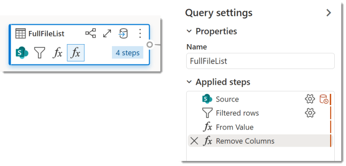
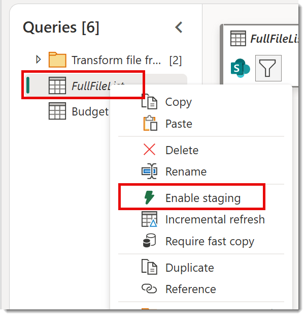

I set up my dataflow and it was working great. Then it broke on the refresh. Here is how I fixed it.

## SharePoint and Microsoft Fabric

SharePoint is no database but we keep putting data there so here are my findings and notes from working with SharePoint libraries and lists in Microsoft Fabric.

- [Ingest a SharePoint folder of Excel Files](https://hatfullofdata.blog/sharepoint-folder-into-microsoft-fabric/)

- [Fixing the broken query](https://hatfullofdata.blog/first-refresh-it-broke-laurabrokeit/)

## Previously

In the previous post we ingested a SharePoint folder into a table in a Lakehouse. That is a well known process and nothing new except for one thing. I split the process into two stages, firstly the FullFileList which contained the list of files and the binary content of the files and then a separate query to combine data from those files. Power Query created Helper queries to perform the combining. Then it broke.


## It Broke

It all appears to work fine. Then I try a refresh and it fails. On going back to look at the dataflow I see that there are 2 extra steps in FullFileList that have been added by Microsoft Fabric.



Copy CodeCopiedUse a different Browser
```xml
let
  Source = SharePoint.Files("https://lgb123.sharepoint.com/sites/FabricDemo/", [ApiVersion = 15]),
  #"Filtered rows" = Table.SelectRows(Source, each [Folder Path] = "https://lgb123.sharepoint.com/sites/FabricDemo/Budgets/"),
  #"From Value" = Table.FromValue(#"Filtered rows"),
  #"Remove Columns" = Table.RemoveColumns(#"From Value", Table.ColumnsOfType(#"From Value", {type table, type record, type list, type nullable binary, type binary, type function}))
in
  #"Remove Columns"
```

The last step Remove Columns, removes all columns of type table, record, list, binary or function. So this removes the Content column that is binary and therefore the queries doing the combine of the Content column all fail. Hence it broke.

## It Broke in the Staging

To improve performance and reliability, Dataflow Gen2 uses staging items to store intermediate data during data transformation

The above quote is from [https://learn.microsoft.com/en-us/fabric/data-factory/data-in-staging-artifacts](https://learn.microsoft.com/en-us/fabric/data-factory/data-in-staging-artifacts?wt.mc_id=DX-MVP-5003563) It stores the intermediate queries, so FullFileList would have been stored as a table in the staginglakehouse or stagingwarehouse. So Fabric is adding the step to remove the binary column so staging can work.

## Turn Off Staging

When I right click on the FullFileList query in the query list the menu includes Enable Staging, by default it is turned on, indicated with a tick. So I click on Enable staging to remove the tick and turn it off. I publish the dataflow and wait. Yes! the refresh works, I test it multiple times.



## Conclusion

I am curious as to how turning off staging will impact the dataflow. So I will be keeping an eye on this one. But this appears to be the fix we need to get it working again for now. I will do my enquiries and retests to see if this is still needed.

