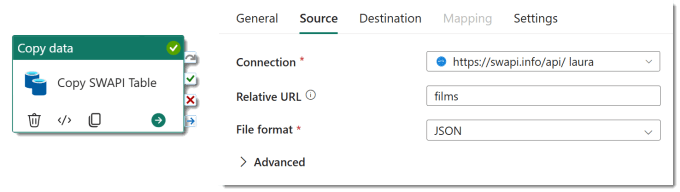
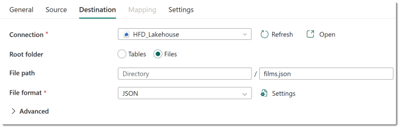
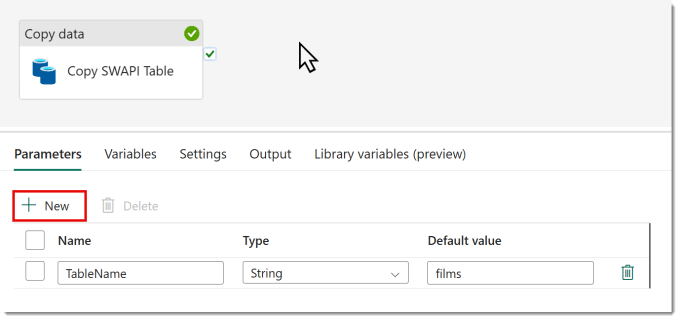
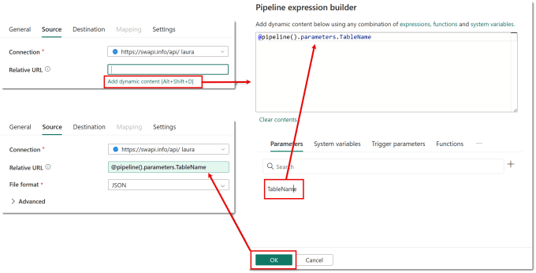
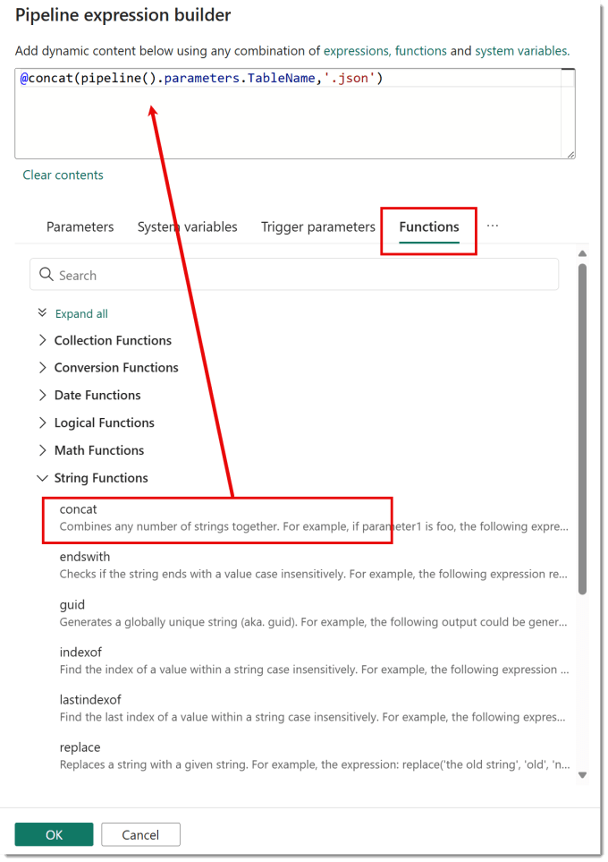
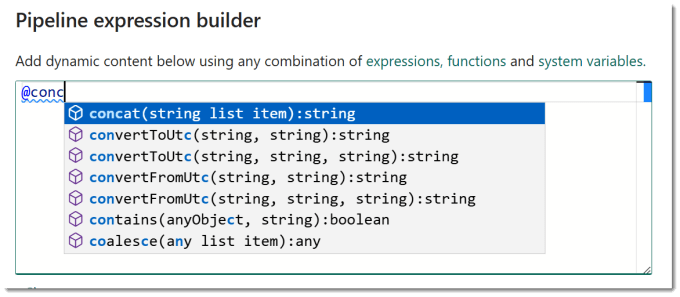
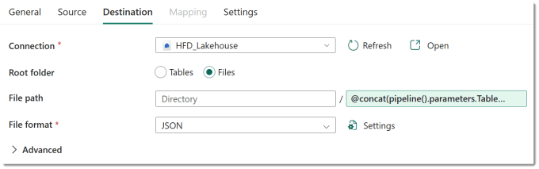
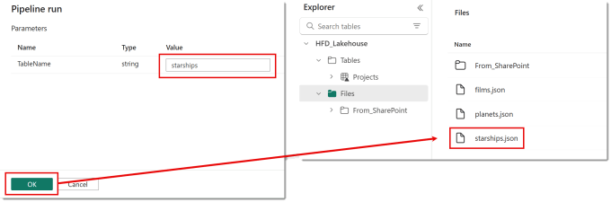

One of the skills of creating good solutions on any platform is building reusable modules. For a part to be reusable we reduce the hard coding and pass in parameters. This is true for data pipelines. So this post post covers creating a data pipeline with parameters.

## Initial Scenario

In order to demonstrate how to create a data pipeline with parameters we need a simple data pipeline as a demo. For this post we are going to use the Star Wars api called SWAPI. The details of the api can be found at [https://swapi.info/](https://swapi.info/). Its a very simple api that allows anonymous connections and returns data in a JSON format.

In our pipeline we add a copy data activity. For the Source, the connection is a http connection to https://swapi.info/api/ and the relative URL is the table name, in this case films. And the file format is JSON.

For the destination the connection is to a Lakehouse. The Root folder is files with the file path being the table name + .json so in this case films.json. To match the source the file format is JSON.

The issue with the above is the “films” is hard coded. If this pipeline is going to be reusable for other tables from this api we need to move the “films” into a parameter.

## Adding Parameters to the Data Pipeline

In the data pipeline click on the grey background around the activities to make sure no activity is selected. In the bottom panel you should now see options including Parameters. Click on the + New to add a parameter. Then add a name, select a type and give a default value.

Multiple parameters can be added. When the data pipeline is run the parameters can be updated. You now have a data pipeline with parameters you just need to use them in activities.

## Using Parameters in Activities

We now need to edit the copy data activity to use the TableName parameter rather than the hard coded films. Edit the copy data action and on the source tab clear the Relative URL value. Click on the Add dynamic content or Alt+Shift+D. Then in the panel, under Parameters click the parameter, in this case TableName. This puts the formula in the expression builder. Then click OK to put the expression back into the Relative URL.

The above example was using the parameter straight. For the file name in the destination we need to concatenate “.json” onto the table name. In the expression builder Functions such as concat can be found in the Functions tab and in the right category group.

If you know the function name that you want to use there is intellisense and typing in “@conc” will give you a list of matching functions to use.

Clicking OK will add the expression to the filename box.

## Testing the Data Pipeline with Parameters

When the pipeline is run manually a panel appears prompting for the parameter values. Enter in the values and click OK. When the pipeline completes the run successfully we can see in the lakehouse the new file has been created.

## Conclusion

I first learnt best programming techniques over 30 years ago. It included concepts I still use and teach today. This is one of them. Of course the pipeline could be more complex, include more parameters and more activities but the concept is still the same, make things reusable by creating data pipeline with parameters.

