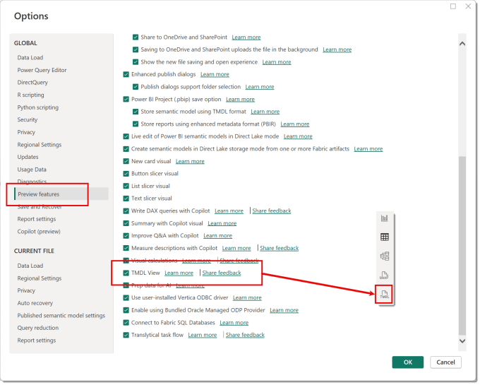
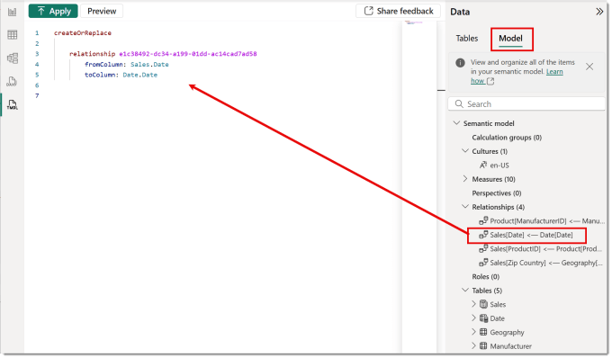
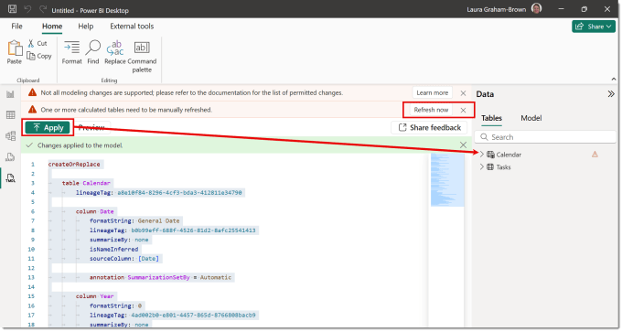

TMDL is short for Tabular Model Definition Language in Power BI desktop. It allows us to script definitions and changes to a Power BI model. In this post I use TMDL to quickly create a calendar for a report that includes column options such as sort by, formatting and hidden columns.

## Calendar Table

Nearly every report I create includes a calendar table. Every Power BI introduction course I run I send delegates to SQLBI site to grab the code for a simple calendar. Using a few example exercises I explain column sorting for the months, hiding the columns used for sorting and formatting the date columns. Tasks we all do every new report.

Just to be clear the code I usually use comes from one of these links, in this post I’ve used the second one.

- [https://www.sqlbi.com/articles/creating-a-simple-date-table-in-dax/](https://www.sqlbi.com/articles/creating-a-simple-date-table-in-dax/)

- [https://www.sqlbi.com/articles/using-generate-and-row-instead-of-addcolumns-in-dax/](https://www.sqlbi.com/articles/using-generate-and-row-instead-of-addcolumns-in-dax/)

## Turning on TMDL View

At the point of publishing this post (Jun 2025) TMDL view is still in preview so it need be turned on. From the File tab select, Options and settings and then Options to open the dialog. Then under Preview features put a tick next to TMDL view. This will add a new button on the top left views menu.



## TMDL View

This view allows you to define tables, columns, relationships and measures. You can drag a Power BI item into the view from the data pane to see the definition. Bu this post is not to teach TMDL but to show one use of it. More information can be found at [https://learn.microsoft.com/en-us/power-bi/transform-model/desktop-tmdl-view](https://learn.microsoft.com/en-us/power-bi/transform-model/desktop-tmdl-view?wt.mc_id=DX-MVP-5003563)



## Adding the Calendar

Another use is to use code to create a calendar table. I created the original code by creating  calendar in a report and making all the adjustments I would usually do and then dragged the calendar table onto the TMDL window. So now the code includes the adjustments mentioned at the start of this post. Then I go to  a report without a calendar and paste in the code below in the TMDL view. Then click Apply. The table will appear in the Data pane but possibly with red exclamation mark. There also might be a message stating a calculated table needs refreshing. If that appears click the Refresh now button that appears.



Copy CodeCopiedUse a different Browser
```xml
createOrReplace

	table Calendar
		lineageTag: a8e10f84-8296-4cf3-bda3-412811e34790

		column Date
			formatString: General Date
			lineageTag: b0b99eff-688f-4526-81d2-8afc25541413
			summarizeBy: none
			isNameInferred
			sourceColumn: [Date]

			annotation SummarizationSetBy = Automatic

		column Year
			formatString: 0
			lineageTag: 4ad002b0-e801-4457-865d-8766808bacb9
			summarizeBy: none
			isNameInferred
			sourceColumn: [Year]

			annotation SummarizationSetBy = User

		column 'Month Number'
			isHidden
			formatString: 0
			lineageTag: e14ae615-2ba5-4e4a-ad44-ff0fcb4fb3ed
			summarizeBy: none
			isNameInferred
			sourceColumn: [Month Number]

			annotation SummarizationSetBy = User

		column Month
			lineageTag: e9c8caaf-f192-4478-86bd-d811116a5ac1
			summarizeBy: none
			isNameInferred
			sourceColumn: [Month]
			sortByColumn: 'Month Number'

			annotation SummarizationSetBy = Automatic

		column 'Year Month Number'
			isHidden
			formatString: 0
			lineageTag: 9c81640a-3399-4b97-87dd-884390419cb4
			summarizeBy: none
			isNameInferred
			sourceColumn: [Year Month Number]

			annotation SummarizationSetBy = User

		column 'Year Month'
			lineageTag: a2d59320-d499-43cf-a365-44c1f33b8ed4
			summarizeBy: none
			isNameInferred
			sourceColumn: [Year Month]
			sortByColumn: 'Year Month Number'

			annotation SummarizationSetBy = Automatic

		partition Calendar = calculated
			mode: import
			source =
					
					VAR MinYear = 2025
					VAR MaxYear = 2025
					VAR BaseCalendar =
					    CALENDAR ( DATE ( MinYear, 1, 1 ), DATE ( MaxYear, 12, 31 ) )
					RETURN
					    GENERATE (
					        BaseCalendar,
					        VAR BaseDate = [Date]
					        VAR YearDate = YEAR ( BaseDate )
					        VAR MonthNumber = MONTH ( BaseDate )
					        VAR MonthName = FORMAT ( BaseDate, "mmmm" )
					        VAR YearMonthName = FORMAT ( BaseDate, "mmm yy" )
					        VAR YearMonthNumber = YearDate * 12 + MonthNumber - 1
					        RETURN ROW (
					            "Year", YearDate,
					            "Month Number", MonthNumber,
					            "Month", MonthName,
					            "Year Month Number", YearMonthNumber,
					            "Year Month", YearMonthName
					        )
					    )

		annotation PBI_Id = 0bd3b6910f2844c8b21afe01ffb36109
```

The report now has a calendar table matching your original calendar.

## Conclusion

Being able to use TMDL will allow me to build a library of code snippets to quickly build the report elements I regularly build. This is an exciting extra tool for the toolbox. I have already started a github library of snippets I think will be useful. Not ready to make that public yet but I will.

## More Power BI Posts

- [Conditional Formatting Update](https://hatfullofdata.blog/power-bi-conditional-formatting-update/)

- [Data Refresh Date](https://hatfullofdata.blog/power-bi-data-refresh-date/)

- [Using Inactive Relationships in a Measure](https://hatfullofdata.blog/power-bi-inactive-relationships-in-a-measure/)

- [DAX CrossFilter Function](https://hatfullofdata.blog/power-bi-dax-crossfilter-function/)

- [COALESCE Function to Remove Blanks](https://hatfullofdata.blog/power-bi-coalesce-function-to-remove-blanks/)

- [Personalize Visuals](https://hatfullofdata.blog/power-bi-personalize-visuals/)

- [Gradient Legends](https://hatfullofdata.blog/power-bi-gradient-legends/)

- [Endorse a Dataset as Promoted or Certified](https://hatfullofdata.blog/power-bi-endorse-a-dataset/)

- [Q&A Synonyms Update](https://hatfullofdata.blog/power-bi-qa-synonyms-update/)

- [Import Text Using Examples](https://hatfullofdata.blog/power-bi-import-text-using-examples/)

- [Paginated Report Resources](https://hatfullofdata.blog/paginated-report-resources/)

- [Refreshing Datasets Automatically with Power BI Dataflows](https://hatfullofdata.blog/refreshing-datasets-automatically-with-dataflow/)

- [Charticulator](https://hatfullofdata.blog/charticulator-simple-custom-chart/)

- [Dataverse Connector – July 2022 Update](https://hatfullofdata.blog/power-bi-dataverse-connector-july-2022-update/)

- [Dataverse Choice Columns](https://hatfullofdata.blog/power-bi-dataverse-choices-and-choice-column/)

- [Switch Dataverse Tenancy](https://hatfullofdata.blog/power-bi-switch-dataverse-tenancy/)

- [Connecting to Google Analytics](https://hatfullofdata.blog/power-bi-connecting-to-google-analytics/)

- [Take Over a Dataset](https://hatfullofdata.blog/power-bi-take-over-a-dataset/)

- [Export Data from Power BI Visuals](https://hatfullofdata.blog/export-data-from-power-bi-visuals/)

- [Embed a Paginated Report](https://hatfullofdata.blog/power-bi-embed-a-paginated-report/)

- [Using SQL on Dataverse for Power BI](https://hatfullofdata.blog/using-sql-on-dataverse-for-power-bi/)

- [Power Platform Solution and Power BI Series](https://hatfullofdata.blog/power-platform-solution-and-power-bi-part-1/)

- [Creating a Custom Smart Narrative](https://hatfullofdata.blog/power-bi-creating-a-custom-smart-narrative/)

- [Power Automate Button in a Power BI Report](https://hatfullofdata.blog/power-automate-button-in-a-power-bi-report/)

## Power BI Series

- [SVG in Power BI series](https://hatfullofdata.blog/svg-in-power-bi-part-1-svg-basics/)

- [Power BI and Project Online series](https://hatfullofdata.blog/power-bi-connecting-to-project-online/)

- [Slicers series](https://hatfullofdata.blog/power-bi-slicers-introduction/)

- [Dataflow series](https://hatfullofdata.blog/power-bi-create-a-dataflow/)

- [Power BI SVG series](https://hatfullofdata.blog/svg-in-power-bi-part-1-svg-basics/)

- [Power Automate and Power BI Rest API series](https://hatfullofdata.blog/power-automate-and-power-bi-rest-api/)

- [Power BI and DevOps series](https://hatfullofdata.blog/devops-data-into-power-bi/)

