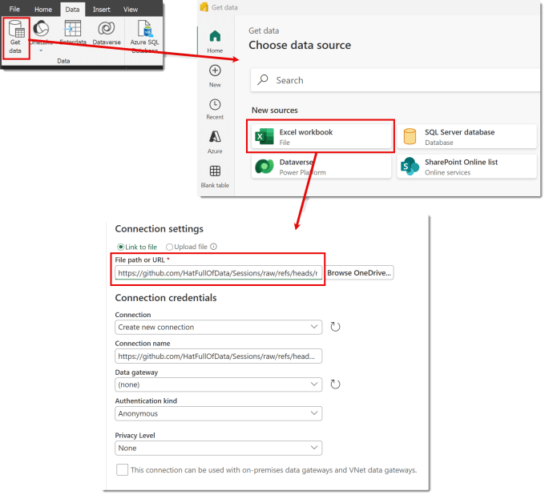
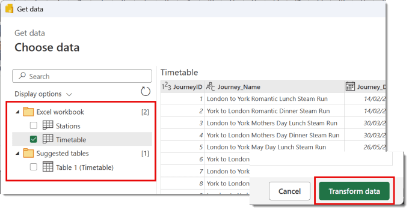
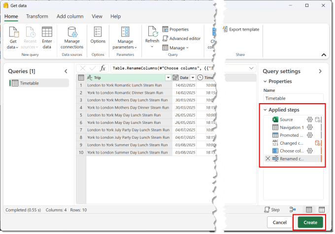
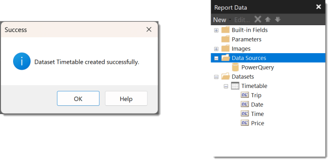
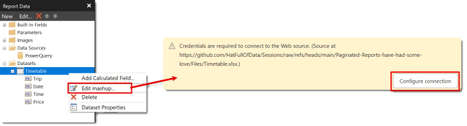
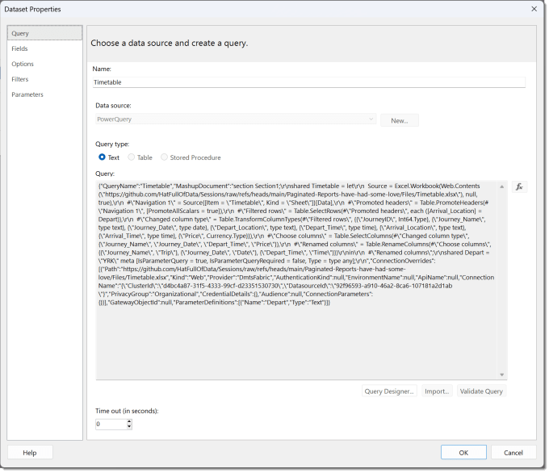

In March 2024 Microsoft added Power Query as a source for Paginated Reports. This means a paginated report can connect to any data source that Power Query can connect to. This post walks through the process with a few gotchas to be aware of.

## Paginated Reports have had some Love

This post is part of the series covering my session titled Paginated Reports have had some Love. The resources for this series can be found at [https://github.com/HatFullOfData/Sessions/tree/main/Paginated-Reports-have-had-some-love](https://github.com/HatFullOfData/Sessions/tree/main/Paginated-Reports-have-had-some-love)

- [Power Query as a Source](https://hatfullofdata.blog/paginated-reports-power-query-as-a-source/)

- Create a report online

- Dynamic Subscribing

## Get Data

As with most reporting the first task is connect to the data using Power Query as a source. Inside a report in Report Builder, click on the data ribbon. Click on Get data to launch the Choose data source dialog. From here you can search and find lots of different data sources. For this post we are going to use an Excel workbook, so click on that.

When the connection settings dialog opens enter the File path or URL for the Excel file. There is a button to browse OneDrive, bad idea in my opinion but that is a different post! Please note you need to select the correct Authentication type. I’ve used Anonymous as my file is public on GitHub, you will need Organization Account for OneDrive or SharePoint.

Then click Next.

The next dialog, Choose Data, asks you to select the tables or sheets. Once you have ticked at least one you can then click Transform data to move to the Power Query window.

## Power Query Editor

When the Power Query window opens you can add steps as per normal such as choosing columns etc. After you add all the transformations you need, click Create to add it to the report.

## Power Query as a source in Explorer

When the data loads into the report it comes in 2 parts. Under data sources is Power Query and in datasets are the individual queries. Unlike other data sources such as a database each dataset will be a brand new query.

## Editing the Query

When you need to edit the query, right click on the query and select Edit Mashup. It will always request you configure the connection. No Idea why but clicking the Configure Connection fixes the issue.

## A few Gotchas

### Multiple Queries

Each query can only return a single table. So when you have multiple queries, which one does it return? It returns the last one in the list of queries. It has nothing to do with marking a query for loading or not loading.

### Refresh or not?

When you publish the report there is no semantic model. There is just a report. So every time the report is opened the Power Query executes. So lets keep those queries tidy and efficient.

### Parameters

Parameters make Paginated Reports reusable and a powerful tool for the analyst. Power Query parameters though do not connect to the parameters in Report Builder. The Dataset properties show the M code, kind of. Its not editable so we can’t embed the Report Builder parameters. The only way to perform a filter is using the Filters in dataset properties which has the disadvantage that it filters after pulling all the data in.

## Power Query as a Source Conclusion

I love Power Query, second to SQL, every data handler in the Microsoft stack should know it. But I don’t believe it brings any benefit putting it in report builder when I can do more from a semantic model. The gotchas aren’t a real problem on their own but they add up. So my recommendation would be to build the semantic model in Power BI desktop or in Microsoft Fabric and connect to that. That is a separate blog post, link up above.

